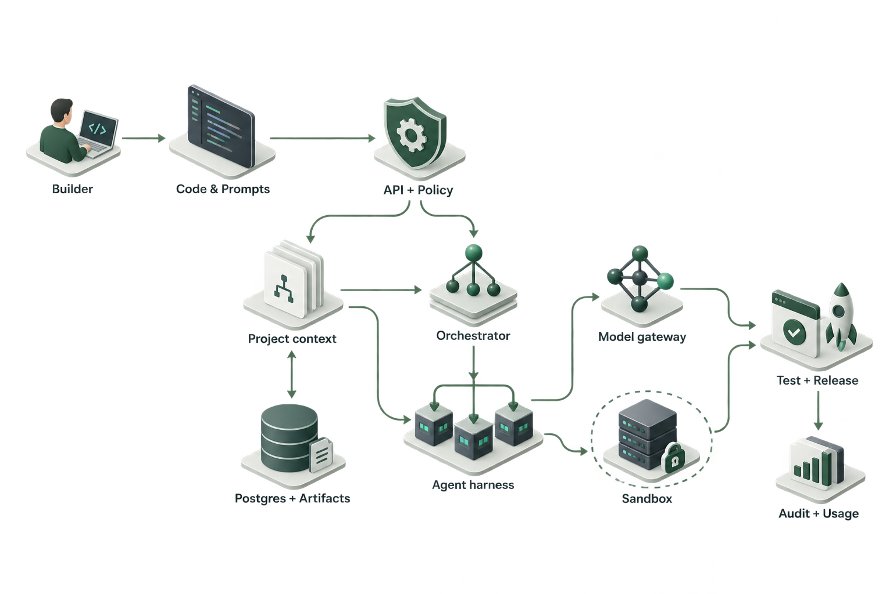
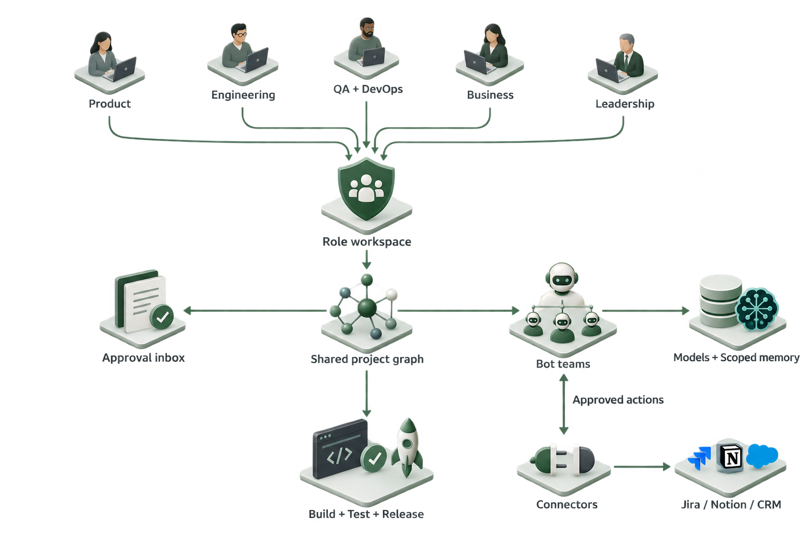
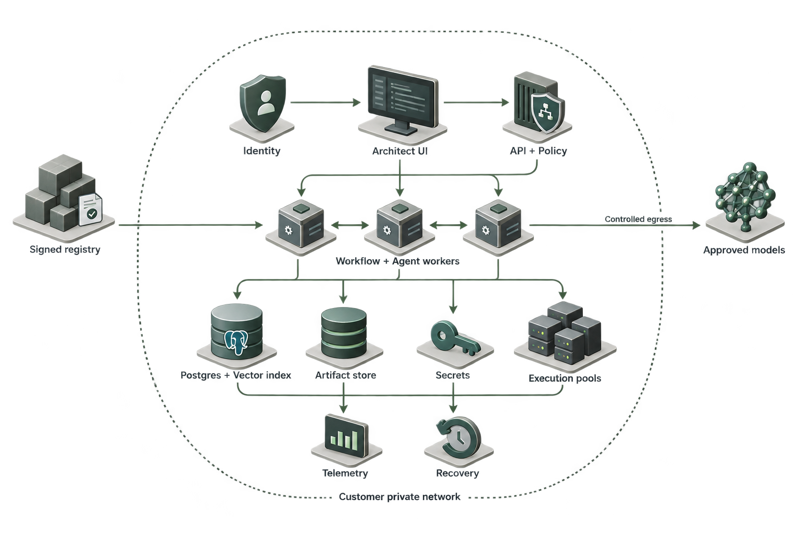
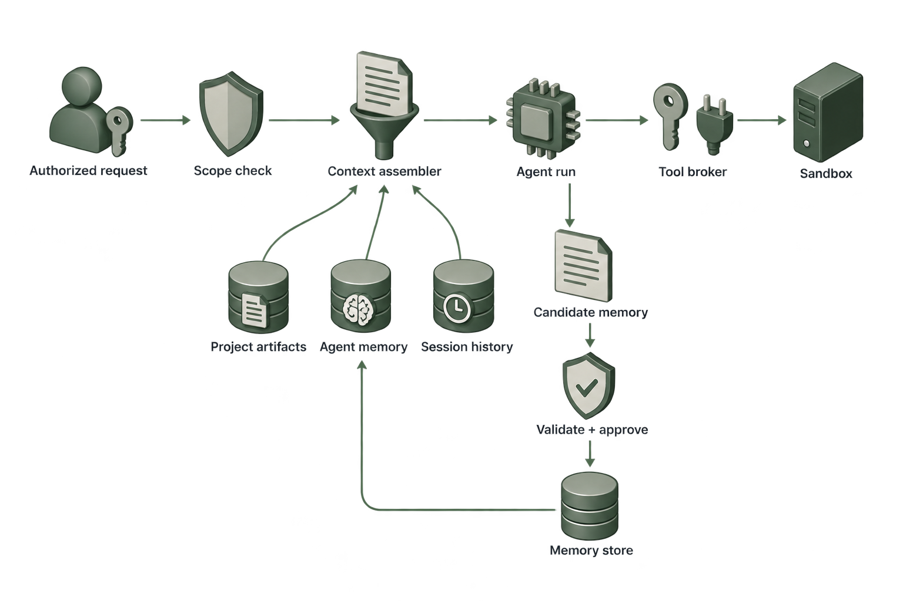

# Architect: Architecture, HLD & LLD

Darsh Dave | Product Manager assignment | 27 September 2026

## Reading guide and scope

This document presents the architecture of the working prototype and a proposed technical design for the product roadmap. It covers Architect 2.0, 3.0 and 4.0. HLD means high-level design: system boundaries, responsibilities and data movement. LLD means low-level design: records, interfaces, state transitions and recovery rules.

**Implementation snapshot:** repository commit `72c923c`. The architecture submission is a documentation addition, not an implementation of the proposed runtime. The website Architecture and HLD & LLD tabs are intentionally deferred until approval.

**Status vocabulary:** Current = supported by the inspected code; Prototype = a saved configuration or interactive demonstration, not an external action; Proposed = the target design described here. A feature appearing in the appendix establishes architectural traceability, not proof of production completion.

There are 109 proposed feature packages: 40 enhancements and 69 new packages. Architect 2.0 introduces 65, 3.0 introduces 42 more (107 cumulative), and 4.0 introduces 2 more (109 cumulative). The 422 inherited interaction records are a separate measurement and must not be added to 109. Appendices preserve all package IDs, all inherited interaction IDs and all 228 documented cross-product handoffs.

## Product roadmap and architectural boundaries

| Edition | User need | Architectural increment | Current delivery |
| --- | --- | --- | --- |
| 2.0 | Individuals and developers build, inspect and own an application | Project context; developer workspace; agent and model configuration; quality and release workflows | React application, authenticated persistence, bounded AI generation and interactive workflows |
| 3.0 | A company carries decisions from feedback through delivery | Company membership; role views; shared artifacts; bot teams; business connectors; approval and metric definitions | Shared company data/access code plus role and business workflow prototypes |
| 4.0 | A company controls where its platform and execution run | Private control plane; customer identity, network, secrets, worker placement and lifecycle | Hosted configuration prototype and container scaffolding; no customer-cloud installation verified |

All three hosted editions currently share one codebase and one Supabase account/data foundation, with three frontend deployments selected by `VITE_EDITION`. Separate origins do not mean an automatically shared browser session: each origin authenticates and retrieves the same authorized data. The assignment is a fourth, static deployment.

A real private 4.0 installation is a different trust boundary: its database and identity must be customer-controlled, not silently connected to the public demo database. An explicit, audited migration can transfer permitted projects. Shared-schema compatibility is the continuity mechanism, not unrestricted cross-instance data sharing.

## Current system: what actually runs

The browser loads a React 19 / TypeScript / Vite application from Vercel. Supabase handles Google/email authentication and Postgres persistence. The client uses Supabase HTTP APIs; the server AI endpoints are Node functions. OpenRouter is called only from the server. Provider keys are not shipped to the browser. GoDaddy supplies DNS records pointing the custom domains to Vercel; Google Cloud configures the OAuth client, not a separate app runtime.

Current request sequence: user signs in; the API validates the bearer token with Supabase; validates input and model constraints; fetches the free-model catalog; reserves usage through a database function; calls OpenRouter; returns text, model, usage and request ID. The app stores accepted output and project state. Generation is synchronous, not a durable background job, and there is no autonomous multi-agent executor in this path.

| Current responsibility | Code evidence | Boundary |
| --- | --- | --- |
| Editions and views | apps/platform/src/lib/edition.ts; App.tsx | One application with edition-specific navigation |
| Personal projects | src/lib/cloud.ts; supabase/schema.sql | Owner-scoped JSON workspace and optimistic revision checks |
| Company membership | supabase/company-schema.sql; CompanyAccess.tsx | Company roster, invitation and workspace routines; broader granular policy is proposed |
| Model requests | api/generate.js; api/_lib/core.mjs | Modes app, plan, chat, support; authenticated requests; free models only |
| Project context | src/lib/builderState.ts | Brief, PRD/TRD, HTML, attachments and workflow serialized within a bounded context |
| Preview isolation | src/lib/preview.ts; Studio.tsx | Browser iframe with restrictive CSP; not a server sandbox |
| Agent playground | Workbench.tsx | Configured role/goal, project brief and six recent messages; prompt-only simulation |
| Home support | SupportChat.tsx; support-knowledge.json | Signed-in AI guide; demo saved responses; no account actions or human inbox |
| Infrastructure | InfrastructureStudio.tsx; PrivateLifecycle.tsx; Dockerfile | Configuration and lifecycle prototypes; not provisioned cloud resources |

Current personal workspace rows are capped at 1.2 MB JSON and company workspace rows at 2.4 MB. These are prototype storage choices, not the target normalized schema. Current quota SQL allows 10 requests per account per UTC day, 40 globally, and a 15-second interval. A provider failure can consume a reserved attempt. These limits describe this code snapshot, not a commercial pricing promise.

The current builder bounds context at about 39,000 characters; the API accepts up to 40,000 context characters and 12,000 prompt characters. Truncation preserves a smaller serialized excerpt; it is not semantic retrieval or summarization. Generated previews are self-contained HTML with inline scripts and styles. CSP blocks network requests; sandbox isolation does not make this a full framework runtime. Large code generation and repository execution require the proposed execution plane.

**Known implementation gaps:** real GitHub OAuth/clone/sync/PR execution; a repository-backed IDE; durable agent jobs; tool execution through Lyzr; long-term memory retrieval; external connector actions; provisioning; real release orchestration; enterprise SSO and granular department policies. These are not claimed live. The container scaffold also needs packaging validation: core.mjs imports the support knowledge JSON from src/lib, while the runtime image currently copies api but not that source path. An installable 4.0 release must fix and smoke-test that dependency before distribution.

## HLD: Architect 2.0

**Figure 1. Proposed developer platform.** The visual illustrates responsibility flow, not a literal deployment topology. All worker, repository and durable-memory services in this target are proposed.

Start with a modular TypeScript API and Postgres, keeping product modules together until load or isolation justifies a service split. The browser provides guided and developer modes, a file tree, editor, chat, visual preview and project switcher. Monaco is the proposed editor; it edits a checked-out workspace through authorized file operations. It is not currently integrated.

The control plane owns identity, memberships, project artifacts, run creation, policies, budget reservations and approvals. A durable workflow service coordinates planner, builder, reviewer, tester and release activities. A separate execution plane runs untrusted repository code. It never executes inside the API process or the control-plane database network.

A project begins from a prompt or an approved GitHub App installation. Import resolves repository permissions and a commit SHA, inventories files and frameworks in an isolated environment, and creates an initial context snapshot. Build output becomes a changeset against that exact base revision. Agents cannot write directly to protected branches. Diff review, automated checks and approval precede a provider-confirmed release.

Proposed technologies: React/TypeScript and Monaco for the browser; a TypeScript modular API; Supabase/Postgres for relational state; S3-compatible object storage for large artifacts; Temporal for long-running workflows; a Lyzr runtime adapter for supported agents; OpenRouter through a policy-controlled gateway; microVM execution via a sandbox provider. Framework-specific agents run behind the same adapter contract rather than being advertised as universally compatible without validation.

## HLD: Architect 3.0

**Figure 2. Proposed company workspace.** Role-specific views converge on shared authorized objects, approval steps and delivery evidence. Business connectors and bot execution are target capabilities.

3.0 retains the 2.0 build engine. It adds company-scoped records for customers, feedback, requirements, delivery tasks, campaigns, financial review, people operations, metrics and decisions. These are linked by stable IDs in Postgres; a graph database is not required initially. Product, engineering, QA, DevOps and business stakeholders see the same underlying objects through different permitted views.

An example handoff is feedback to requirement to changeset to test run to release to outcome metric. Navigation carries project ID, artifact revision, permitted selection and return location. Authorization is rechecked at the destination. A saved return route never overrides access control. UI roles are preferences; database policies and server action checks determine permissions.

The bot workroom defines a lead bot and specialists. The lead proposes tasks; the orchestrator authorizes bounded child runs and the tool broker executes approved actions. Specialists do not gain access by being created by a manager bot. A scheduled report rechecks the owner's membership, data scope, recipient policy and budget at dispatch time.

Connectors to Jira, Notion, CRM and data systems use a common adapter with explicit field ownership, provider IDs, sync cursors and deduplication. The external system remains authoritative for its owned fields. Webhook events are verified and queued; conflicting updates become reviewable conflicts instead of last-write-wins data loss. No outbound campaign, financial action or HR decision is executed merely because an agent suggests it.

## HLD: Architect 4.0

**Figure 3. Proposed customer-controlled deployment.** Identity, secrets, storage, workers and telemetry sit within the customer's boundary. Registry updates and approved model requests are explicitly controlled connections.

4.0 packages the control plane, workflow workers and connector gateway as versioned OCI images. Docker Compose is the proposed evaluation installation; Helm/Kubernetes is the proposed managed production form. The same application contracts support AWS, Azure and GCP through deployment adapters, not three separate product implementations. Provider support must be tested against a declared compatibility matrix.

The company connects its identity provider through OIDC, with SAML through an approved identity broker where required. Installation bootstrap appoints an initial owner once, then disables the bootstrap route. There is one company sign-in entry; role assignment is administrative. SCIM lifecycle integration is proposed, with revoked users removed from active sessions, schedules and connector delegation.

Each environment references a signed runtime profile: network, region, execution pool, limits, storage, egress policy and secret references. Customer workload identity replaces copied cloud administrator keys. Execution pools are separated from the control plane; per-run sandboxes are disposable and receive narrowly scoped credentials. Private model endpoints are allowlisted; disabling public model egress must fail closed, not fall back to a public provider.

Upgrades verify signatures, back up data, check schema compatibility, migrate through a controlled job, then run health checks. App rollback alone cannot reverse a destructive schema migration; use expand/contract migrations and a tested restore path. Encrypted backups, artifact replication, restore drills and customer-selected retention are required. Proposed initial objectives are a 24-hour recovery-point objective and a 4-hour recovery-time objective, subject to measured restore tests and customer requirements; no SLA is claimed.

## Architecture decisions and trade-offs

| Decision | Choice and rationale | Trade-off / acceptance gate |
| --- | --- | --- |
| One project model | Shared IDs and artifact contracts across editions | Private installations need explicit migration, not implicit synchronization |
| Modular API first | Postgres transactions and clear module ownership; workers isolated | Split services only for scaling or security boundaries |
| Durable control flow | Temporal owns retries, waits and approval resumption | Adds operational cost; not installed in the free prototype |
| Agent runtime adapter | Lyzr preferred where supported; framework adapters normalize runs | Verify cancellation, tools, memory and tenancy semantics per adapter |
| Model routing | Explicit model or policy-filtered per-task selection | No quality claims without held-out evaluations; no silent paid fallback |
| Storage | Postgres is authoritative; object storage holds binaries; pgvector is a derived index | More lifecycle management; index deletion must track source deletion |
| Git authority | GitHub App, short-lived installation access, pinned commits | App permissions and provider installation remain to be built |
| Untrusted execution | MicroVM boundary, egress policy and per-run credentials | Plain Docker alone is insufficient for hostile multi-tenant code |
| Delivery evidence | Test results tied to a changeset and environment | A model saying 'passed' is never a test result |
| Free prototype | Existing free-model guard and bounded synchronous requests | Proposed worker, sandbox and enterprise stack is not guaranteed free |

## LLD: project and artifact model

Proposed authoritative entities are normalized by tenant and project. IDs below are design contracts, not existing database migrations. Every child reference must enforce matching tenant/project ownership through composite foreign keys or an equivalent database check; checking only an object UUID is insufficient.

| Entity | Key fields | Invariant |
| --- | --- | --- |
| Tenant / Membership | tenant_id, user_id, role, policy_version, status | Membership is checked server-side; revoked status denies access |
| Project | id, tenant_id, owner_id, title, revision, lifecycle | Revision is monotonic; writes require expected_revision |
| ArtifactRevision | id, project_id, kind, version, content_hash, object_ref, source_refs, approval | PRD, TRD, HLD, LLD, design system, code and test evidence are distinct artifact kinds |
| RepositoryBinding | project_id, installation_id, repo_id, branch, base_sha | Credentials stay in the secret service; provider permission is authoritative |
| Service | id, project_id, repo_id, path, contract_ref, dependencies | Supports monorepo paths and several repositories without losing commit identity |
| AgentDefinition | id, project_id, version, role, instructions_ref, model_policy, tool_allowlist, memory_scope | A run pins a definition version; edits do not alter an in-flight run |
| Run / Step | id, project_id, revision, actor, policy_version, budget, status, parent_run_id | Bounded state transitions; one durable correlation ID |
| ChangeSet | id, base_sha, file_manifest, diff_ref, author_run_id | Apply only to expected base; conflict requires rebase/review |
| TestRun / Release | changeset_id, environment, evidence_refs, result, provider_receipt | Readiness depends on real checks and provider acknowledgements |
| Approval | id, action_hash, resource_revision, reviewer, expires_at, decision | Approval covers a specific action and revision; cannot approve a modified action |
| ToolInvocation | run_id, tool_id, args_hash, idempotency_key, receipt, status | Retry only with the same logical action key; reconcile unknown outcomes |
| UsageLedger | run_id, agent_id, model, provider, module, units, cost, currency, source | Actual provider cost, estimated cost and unknown cost remain distinct |
| ConnectorBinding | tenant_id, external_id, scopes, secret_ref, owner, status | Tokens never enter prompt context; revoke promptly |

PRD to TRD to HLD to LLD is an artifact dependency chain. A PRD revision marks dependent designs as potentially stale. An agent proposes updates as new revisions with a diff. The user may skip manual document authoring; the planner creates drafts automatically and makes assumptions visible. An approved plan does not automatically approve deployment.

For example, requirement R-12 references PRD revision 4, a service contract revision 2, changeset C-18 and test run T-21. When C-18 changes, T-21 stays as historical evidence and does not certify the new change. This is how the system avoids stale 'green' status.

## LLD: agent harness and execution

An agent harness is the controlled runtime around the model: context loading, model calls, tool validation, output checks, checkpointing and budgets. The model proposes work; the harness and policy service decide which actions may execute.

The proposed adapter contract accepts run_id, tenant_id, project_id, agent_definition_version, context_manifest, model_policy, tool_scopes and limits. It emits step_started, model_result, tool_requested, artifact_proposed, approval_required, failed and completed events. Outputs are typed artifacts with source references. Providers' raw tool calls are normalized before policy evaluation. Lyzr would sit behind this contract; Architect still owns tenant policy, approval records and durable workflow state.

Run lifecycle: queued -> preparing -> running -> awaiting_approval or validating -> completed. Failure exits are failed, cancelled and timed_out. An approved wait resumes only after checking current membership, expiry and the action hash. Cancellation propagates to child runs, stops new tool dispatch and tears down the sandbox; already completed provider actions must be reconciled, not reported as undone.

Initial proposed defaults: five concurrent specialists per parent, maximum delegation depth three, twenty tool calls per step, ten-minute sandbox execution, and a per-run token/cost cap. They are server-enforced configuration, not prompt suggestions or measured product limits. Dynamic specialists inherit the intersection of parent permissions, project policy and approved template scopes. A lead bot cannot spawn around an approval denial.

Each tool call uses a schema validator and an allowlisted tool identity. Read, write and destructive operations have separate scopes. Tools return evidence and structured errors. A release activity may need a human approval; a code-reading activity generally does not. Replaying a workflow reuses recorded model decisions where possible and never reruns external side effects without checking the invocation ledger.

Testing uses specialists with separate evidence responsibilities: unit/functional, UI/accessibility, integration/contract, security and agent-behavior evaluation. A reviewer aggregates their results against acceptance criteria. Specialists are selected based on the app manifest; a static page should not acquire a fake database test. UI repair is bounded by attempt count and must rerun affected checks. The model cannot change the acceptance criteria silently to make a test pass.

## LLD: context and memory

**Figure 4. Proposed context and memory flow.** Component labels identify the request path, scoped context inputs, controlled tool execution and validated memory-write loop.

Project context and memory are separate. Project artifacts are explicit, versioned sources of truth; memory is a permissioned retrieval aid. A conversation summary cannot override an approved requirement or a repository commit.

| Scope | Contents | Access and lifecycle |
| --- | --- | --- |
| Session | Recent messages, task state, summary and user decisions | Session principal plus assigned run; bounded retention, no implicit company sharing |
| Agent | Agent-specific lessons and working notes | tenant + project + agent; other agents need an approved promotion or explicit access |
| Project | Approved requirements, architecture, service map, code references and decisions | Project membership and resource policy; revisioned source references |
| Company | Approved reusable policies, templates and metric definitions | Group-aware access, explicit publishing; private HR/finance records excluded by default |
| Execution | Tool receipts, test evidence, traces and checkpoints | Run-scoped audit access and retention; secrets redacted |

Proposed MemoryRecord fields: memory_id, tenant_id, project_id, agent_id (nullable only for shared scopes), scope, source_artifact_id, source_revision, text_ref, content_hash, embedding_ref, sensitivity, provenance, created_at, expires_at, approval_status and tombstoned_at. A unique constraint on scope plus source revision plus content hash prevents duplicate ingestion. Embedding-model version is stored so incompatible vector indexes are never mixed.

Retrieval sequence: authenticate -> resolve permitted scope -> filter by tenant/project/agent, current ACL, approval and expiry -> fetch candidates -> rank -> verify source revision -> assemble a token-budgeted context manifest. Filtering happens before data can reach the model, including vector retrieval. Recheck ACL and source freshness before a tool uses retrieved data. Sensitive company records never enter a broad shared index merely because their embeddings are hard to read.

The context manifest pins instruction version, model policy, artifact IDs/revisions, retrieved memory IDs, source hashes and truncation notices. Allocate the budget to the user's task and approved requirements first, then relevant code and tools, then retrieved memory, then recent conversation. Use model tokenizer limits rather than a character count. Oversized context is summarized with citations and disclosed omissions; source artifacts remain retrievable.

Memory write sequence: agent proposes a candidate -> validate schema and provenance -> reject secrets and unsupported claims -> apply scope/retention policy -> require approval for shared promotion -> persist -> update derived indexes. Contradictions generate a review item; they do not silently overwrite approved facts. Deleting a source tombstones associated memories, removes derived index entries and invalidates caches. Retention for backups must be disclosed separately; legal holds are explicit policy exceptions.

## LLD: API, events and concurrency

The following endpoints are proposed, except the existing /api/generate, /api/models and /api/health. Endpoints require authenticated membership and resource checks independent of UI visibility.

| Proposed interface | Request / result | Concurrency and failure rule |
| --- | --- | --- |
| POST /v1/projects/{id}/runs | intent, base_revision, context_refs, model_policy -> 202 run_id | Idempotency key scoped to tenant and action; return existing run on duplicate |
| GET /v1/runs/{id}/events | last_event_id -> ordered event stream | Reconnect resumes from cursor; unauthorized clients receive no events |
| POST /v1/runs/{id}/approvals | action_hash, expected_revision, decision | 409 for stale revisions; expired approvals cannot resume work |
| POST /v1/projects/{id}/changesets | base_sha, manifest, diff_ref | Validate paths and ownership; never trust agent-supplied file paths blindly |
| POST /v1/memory/query | scope, query, source revision constraints | Scope derived from authenticated principal; client cannot widen it |
| POST /v1/connectors/{id}/actions | action, args, approval_ref | Recheck provider scopes and use idempotency/reconciliation |
| POST /v1/releases | changeset, environment, evidence, approval_ref | Publish only a reviewed artifact; provider receipt required |
| POST /v1/installations/{id}/upgrades | signed_version, backup_ref, maintenance_window | Customer admin only; restore plan and compatibility checks required |

Event envelope: event_id, schema_version, type, tenant_id, project_id, aggregate_id, aggregate_revision, run_id, actor_id, occurred_at and payload_ref. The transactional outbox writes a domain change and its event together. Consumers deduplicate event_id and track aggregate revision. Delivery is at least once; the design does not promise exactly-once external execution.

A document edit uses expected_revision; stale edits produce a conflict rather than overwriting another user's work. A sandbox filesystem is isolated per changeset; competing changes are merged with a visible diff. Multi-repository builds pin all service SHAs in a manifest and record contract versions. No partial service release is treated as a coordinated success.

## LLD: sandbox, tools and GitHub

Current preview protection is a browser iframe plus CSP, not a secure arbitrary-code compute service. The target uses disposable microVMs or equivalent strong isolation. Plain containers may package trusted workers, but are not the sole security boundary for untrusted multi-tenant code.

Sandbox creation receives an immutable base image digest, project snapshot, resource limits, allowed network destinations, expiry and short-lived tool credentials. It runs without host mounts or control-plane credentials. Block cloud metadata endpoints, private network routes and unapproved egress. Dependencies are downloaded through a policy-controlled path with lockfiles and supply-chain checks. Logs are redacted before persistence. File artifacts pass size/path/type checks before export. The worker records exit status and evidence, then destroys the environment on completion, cancellation or TTL expiry.

GitHub uses a proposed GitHub App installation, selected repositories and minimal scoped permissions. The backend exchanges installation credentials; no personal access token is pasted into prompts. Clone/read uses a pinned SHA, writes go to an isolated branch, PR creation carries the changeset ID, and protected-branch rules remain authoritative. Signed webhook payloads are verified, replay-protected and reconciled. Disconnecting an installation cancels pending writes and removes credentials.

The tool broker also governs MCP servers and plugins. Store an allowlisted server identity, verified schema, allowed resources, delegated principal and secret reference. Treat tool descriptions/results and imported repository text as untrusted input. Prompt instructions cannot expand scopes, reveal secrets or skip approvals. External content may inform a decision; it cannot authorize one.

## LLD: models, costs, quality and release

The proposed routing order is: explicit user choice -> policy eligibility (privacy, region, capability, price, budget) -> task-specific evaluation score -> latency/cost tie-breaker. Single-model mode pins one eligible model; per-agent mode pins eligible models by specialist; automatic mode records the selected model and routing reason for each step. A user choice that violates company policy returns an explanation, not an invisible substitution.

BYOK credentials live in the customer's secret store and are referenced by ID. Open-weight endpoints require a compatible inference adapter and evaluation; 'open source' does not imply free compute. The current prototype only uses its configured server OpenRouter key and free models. Proposed fallback routes require explicit price/privacy bounds and record the fallback. Current code has no paid fallback.

Cost records separate provider model charges, Architect charges, module attribution, tool/API charges and cloud resource charges. Attribute run -> agent -> model -> API call -> project -> tenant. Provider billing exports and cloud tags supply actuals; missing attribution goes into an unallocated bucket. EC2/S3 or equivalent recommendations are estimates with assumptions and require approval before infrastructure changes. A configured budget is not a real payment or invoice.

A release requires evidence tied to the exact artifact: unit tests, UI/accessibility checks, service contracts, agent evaluations and applicable security checks. Proposed tools include Vitest for unit tests, Playwright for browser checks, axe-core for accessibility and an image/container scanner appropriate to the stack. CI runner results are stored as evidence; failed checks stay visible. Staging previews use isolated test data, never copied production secrets.

Deployment adapters normalize plan, dry_run, deploy, status and rollback. Capture provider receipts and verify an application-level health check after deployment. Canary rollout needs monitored thresholds and an explicit rollback target. Schema changes use expand/contract migrations. Provider timeout leaves status unknown until reconciled; it must not create a second deployment automatically.

## LLD: company handoffs and private operations

All 228 documented handoffs share a ContextEnvelope: tenant_id, project_id, source_object_id, source_revision, destination_type, permitted_selection, navigation_state and correlation_id. The destination resolves an existing linked object or previews creating a new one. A back action restores filters, scroll, draft and tab without replaying an external action. The envelope carries references, not a full copy of sensitive records.

Company administrator flows: create company -> verify owner -> configure departments and roles -> invite a named email or provision through approved SSO -> accept/resolve identity -> show permitted role home. Email domain alone never grants membership. Personal-account preference changes do not grant company access. Current company SQL implements basic owner/admin/member/viewer distinctions; target department/field/action policies need additional server enforcement.

Finance, HR, customer and sales records have separate policy scopes. Human reviewers own financial commitments and employment decisions. Team productivity views use explicit goals, workload and acknowledged context, not covert monitoring or an automated employee ranking. Agent teams may propose a response or report, but the person accountable for publication or a sensitive decision remains identifiable.

For 4.0, separate deployment profiles for development, staging and production contain cloud region, subnet, worker identity, egress, data retention and budget. Provisioning plans show resources and estimated cost before applying. The installer checks prerequisites, identity, storage, DNS/TLS, network reachability and signing keys. No hidden paid cloud resources are created by the prototype. The design requires a customer-approved bill of materials before a real installation.

## Failure cases, verification and rollout gates

| Failure | Required behavior | Verification gate |
| --- | --- | --- |
| Provider 429 / timeout | Preserve prompt and run; bounded retry; no silent model/cost change | Inject failures and verify budgets and retry ceilings |
| Worker crash | Resume from recorded checkpoint; reconcile prior tool receipts | Terminate worker after tool success before acknowledgement |
| Expired session / revoked role | Stop new tool calls; deny retrieval and reconnect | Revoke access during a run and test API plus event stream |
| Cross-tenant memory request | Reject before retrieval/model exposure | Adversarial ID substitution and vector filter tests |
| Malicious repository / tool output | Treat as data; block secret requests and arbitrary tools | Prompt-injection, path traversal, SSRF and escape test suites |
| Concurrent edits | Preserve both changes; explicit conflict resolution | Parallel saves against same revision |
| Approval becomes stale | Invalidate by action hash or resource revision | Modify planned action after approval and confirm denial |
| Duplicate webhook / schedule | Deduplicate and reconcile; one logical external action | Replay signed event and simulate acknowledgement loss |
| Broken deployment | Show provider state; halt rollout; use verified rollback target | Failure drills with app and schema version mismatch |
| Deleted memory source | Tombstone, remove derived index and invalidate caches | Query after deletion across all retrieval routes |
| Private upgrade failure | Stop rollout, retain evidence, execute compatible recovery | Offline backup restore and failed-migration rehearsal |

Verification in this documentation task consists of checking the implementation snapshot, matching canonical scope IDs and rendering the submission files. It is not a new live-provider or private-cloud acceptance test. Existing browser evidence and automated tests remain in docs/evidence and docs/history.

Proposed rollout: first normalize project artifacts and add real GitHub onboarding plus run ledger; then ship isolated execution and verified build/test loops; then durable agent runtime and permissioned memory; then company connectors and bot schedules; then private packaging and restore certification. Each step needs evidence before its status changes from proposed to current. The full enterprise architecture will require hosting resources beyond the present free demonstration.

## Source references and inspection basis

Repository sources are authoritative for current behavior; provider documentation informs proposed technology choices. References were checked on 27 September 2026. Provider capabilities do not prove integration in this application.

- Canonical scope: apps/assignment/data.json (109 feature packages, 422 inherited interactions, 228 handoffs). The older platform features.json contains a subset and is not used as the submission scope denominator.
- Runtime: apps/platform/api/_lib/core.mjs; api/generate.js; src/lib/cloud.ts; src/lib/builderState.ts; src/lib/preview.ts; src/lib/model.ts.
- UI and workflows: src/components/Studio.tsx; Workbench.tsx; CompanyStudio.tsx; InfrastructureStudio.tsx; PrivateLifecycle.tsx; src/lib/workflows.ts; company-workflows.ts; company-features.ts.
- Database: apps/platform/supabase/schema.sql and company-schema.sql. These demonstrate schema intent and guards; source inspection alone does not prove every deployed policy was applied.
- [Lyzr multi-agent orchestration](https://docs.lyzr.ai/enterprise/get-started/concepts/multi-agent-orchestration): documents manager-led and deterministic orchestration; the proposed adapter must validate the selected runtime's actual semantics.
- [Temporal workflow execution](https://docs.temporal.io/workflow-execution): basis for the proposed durable workflow choice. External side-effect safety still requires application idempotency and reconciliation.
- [Supabase row-level security](https://supabase.com/docs/guides/database/postgres/row-level-security): basis for database access policies, supplemented here by server authorization and composite ownership checks.
- [Vercel Sandbox](https://vercel.com/docs/sandbox): candidate isolated execution service; no claim that it is provisioned or free in this project.

Diagrams were generated using GPT image generation, with transparent backgrounds and no embedded page titles. They are explanatory target-architecture views; exact contracts are specified in this text. Generation prompts are saved in diagrams/PROMPTS.md. No diagrams were authored as Python drawings, SVG or XML.

## Appendix A: product and feature architecture coverage

Every package below is mapped from the canonical scope. These are target responsibilities; the diagram labels show shared components rather than 109 separate microservices. Figure 1 covers the 2.0 foundation; Figure 2 extends it for company workflows; Figure 3 adds private operation. The memory LLD applies across all editions. Version scope wording is preserved from the documented plan.

### ORG - Company & Workspace

**Architecture owner:** Identity + Policy. **Proposed records:** Tenant, membership, invitation, role policy and workspace preference.

**LLD rule:** Membership changes invalidate authorization caches and queued delegated actions.

#### ORG-E1 - Role-aware onboarding

**Classification:** Enhance. **First introduced:** 2.0. **Component:** Identity + Policy. **Design status:** Proposed allocation; prototype coverage is not production proof.

- **2.0 scope:** Signup/login/logout, profile/settings, personal or development-team workspace, builder/developer/QA/designer entry views, invitations and all theme modes.
- **3.0 scope:** Add every business role, configurable department landing journeys and enterprise onboarding.
- **4.0 scope:** Private-instance bootstrap, approved identity integration and installation-aware onboarding.

**Actors:** Individual, workspace admin, PM, developer, QA, program manager.

**Entry:** Invitation, signup or a saved feature link.

**Flow:** Authenticate and verify identity → Resolve membership or create a workspace → Choose responsibilities without granting yourself permissions → Preview optional appearance and tool setup → Resume invited object or open first useful work

**Outcome:** Active membership and a useful starting destination with appearance preferences saved

**Recovery:** Expired invitation: request a replacement while retaining destination; existing email: sign in; failed connector: skip setup and keep a pending connection

**LLD contract:** Membership changes invalidate authorization caches and queued delegated actions. Persist this feature's configuration and accepted result as a versioned project or company artifact; carry IDs and revision through the ContextEnvelope. Refer to the API, memory and failure contracts above.

#### ORG-E2 - Project-scoped permissions

**Classification:** Enhance. **First introduced:** 2.0. **Component:** Identity + Policy. **Design status:** Proposed allocation; prototype coverage is not production proof.

- **2.0 scope:** Project/team membership, owner/admin/builder/reviewer/viewer scopes, environment permissions and basic billing authority.
- **3.0 scope:** Department hierarchy, delegated lead configuration, granular business-data access, lifecycle/group management and bot permissions.
- **4.0 scope:** Customer-controlled identity/group federation, infrastructure administrator scope and private-instance policy enforcement.

**Actors:** Individual, workspace admin, PM, developer, QA, program manager.

**Entry:** Share panel, blocked action or project access settings.

**Flow:** Inspect current and inherited access → Choose principal and scoped permissions → Preview affected resources → Confirm authorized change → Verify effective access and record the change

**Outcome:** An explainable access grant or a tracked access request

**Recovery:** Cannot override inherited restrictions; show the approving owner; retain attempted action and resume it after access is granted

**LLD contract:** Membership changes invalidate authorization caches and queued delegated actions. Persist this feature's configuration and accepted result as a versioned project or company artifact; carry IDs and revision through the ContextEnvelope. Refer to the API, memory and failure contracts above.

#### ORG-E3 - Collaborative project access

**Classification:** Enhance. **First introduced:** 2.0. **Component:** Identity + Policy. **Design status:** Proposed allocation; prototype coverage is not production proof.

- **2.0 scope:** Project/doc/design invitations, comments, review access, ownership and safe removal.
- **3.0 scope:** Company-wide collaboration between product, sales, finance, HR and other functions.
- **4.0 scope:** Same collaboration inside the private deployment with customer-operated identity/data controls.

**Actors:** Individual, workspace admin, PM, developer, QA, program manager.

**Entry:** Share on the current project, document or customer work item.

**Flow:** Open access drawer without leaving the object → Select recipients and permitted roles → Review invitation scope → Send invitations or update access → Show pending/accepted status and continue shared work

**Outcome:** Collaborators reach the same authorized object, with ownership and comments retained

**Recovery:** Duplicate invite is not resent silently; external edits show a conflict/diff; losing access preserves only content still permitted

**LLD contract:** Membership changes invalidate authorization caches and queued delegated actions. Persist this feature's configuration and accepted result as a versioned project or company artifact; carry IDs and revision through the ContextEnvelope. Refer to the API, memory and failure contracts above.

#### ORG-E4 - Workspace budgets and administration

**Classification:** Enhance. **First introduced:** 2.0. **Component:** Identity + Policy. **Design status:** Proposed allocation; prototype coverage is not production proof.

- **2.0 scope:** Visible credits, usage, estimates, plans/purchases, invoices, project budgets, payer visibility and BYOK distinction.
- **3.0 scope:** Department/module allocations, enterprise spend dashboards, shared cost rules and financial handoffs.
- **4.0 scope:** Customer-local metering/reporting and explicit platform/cloud/provider funding responsibilities.

**Actors:** Individual, workspace admin, PM, developer, QA, program manager.

**Entry:** Usage warning, company settings or finance allocation.

**Flow:** Inspect current allowance and actual usage → Choose scope and period → Set limit and alert recipients → Review impact on active and scheduled runs → Save and observe policy state

**Outcome:** A visible budget policy with affected work and owners

**Recovery:** Over-limit work pauses with saved state; billing actions require their own flow; estimates are not final charges

**LLD contract:** Membership changes invalidate authorization caches and queued delegated actions. Persist this feature's configuration and accepted result as a versioned project or company artifact; carry IDs and revision through the ContextEnvelope. Refer to the API, memory and failure contracts above.

#### ORG-N1 - Role home and assigned work

**Classification:** New. **First introduced:** 2.0. **Component:** Identity + Policy. **Design status:** Proposed allocation; prototype coverage is not production proof.

- **2.0 scope:** My projects, build/developer/QA queues, recent work and resume/deep-link behavior.
- **3.0 scope:** All-role homes, lead-configured navigation/widgets/default workflows and personal overrides.
- **4.0 scope:** Same role homes and permissions inside private installation.

**Actors:** Individual, workspace admin, PM, developer, QA, program manager.

**Entry:** Completed onboarding, app reopen or personal-work shortcut.

**Flow:** Load only authorized work → Sort decisions, tasks and updates by relevance → Inspect an item in a contextual drawer → Open its exact work surface → Return with filters, selection and scroll restored

**Outcome:** The member completes or advances an owned task

**Recovery:** Empty account offers a role-relevant first task; revoked items reveal no private preview; stale status refreshes before acting

**LLD contract:** Membership changes invalidate authorization caches and queued delegated actions. Persist this feature's configuration and accepted result as a versioned project or company artifact; carry IDs and revision through the ContextEnvelope. Refer to the API, memory and failure contracts above.

#### ORG-N2 - Company portfolio

**Classification:** New. **First introduced:** 3.0. **Component:** Identity + Policy. **Design status:** Proposed allocation; prototype coverage is not production proof.

- **2.0 scope:** Only prerequisite foundations and retained baseline behavior; no full product capability promised here.
- **3.0 scope:** Group projects into products and programs; show owners, dependencies, milestones and delivery health without turning every user into an administrator.
- **4.0 scope:** Inherited in private deployment after dependency validation.

**Actors:** Individual, workspace admin, PM, developer, QA, program manager.

**Entry:** Company portfolio or an initiative's parent link.

**Flow:** Select authorized portfolio → Inspect goals, projects and dependency health → Open an initiative with the selected period retained → Compare a scope or ownership change → Record a decision and notify affected owners

**Outcome:** A portfolio decision linked to underlying delivery evidence

**Recovery:** Missing team data is shown as unknown; cross-client access is rechecked; forecasts retain assumptions

**LLD contract:** Membership changes invalidate authorization caches and queued delegated actions. Persist this feature's configuration and accepted result as a versioned project or company artifact; carry IDs and revision through the ContextEnvelope. Refer to the API, memory and failure contracts above.

#### ORG-N3 - Approval inbox

**Classification:** New. **First introduced:** 2.0. **Component:** Identity + Policy. **Design status:** Proposed allocation; prototype coverage is not production proof.

- **2.0 scope:** Project-scoped plan/design/PR/test/release/access/budget decisions.
- **3.0 scope:** Shared company approval inbox for business and bot-team workflows.
- **4.0 scope:** Installation/infrastructure policy approvals with customer-local audit.

**Actors:** Individual, workspace admin, PM, developer, QA, program manager.

**Entry:** Inbox notification, bot pause or Review button on a record.

**Flow:** Open the exact request and supporting evidence → Confirm scope and current version → Inspect policy and consequences → Record decision and rationale → Resume the waiting task or return it to its owner

**Outcome:** A durable decision with an observable continuation state

**Recovery:** Changed evidence invalidates stale approval; delegated request retains audit trail; timeout shows expired rather than approved

**LLD contract:** Membership changes invalidate authorization caches and queued delegated actions. Persist this feature's configuration and accepted result as a versioned project or company artifact; carry IDs and revision through the ContextEnvelope. Refer to the API, memory and failure contracts above.

#### ORG-N4 - Reusable company workspace blueprints

**Classification:** New. **First introduced:** 3.0. **Component:** Identity + Policy. **Design status:** Proposed allocation; prototype coverage is not production proof.

- **2.0 scope:** Only prerequisite foundations and retained baseline behavior; no full product capability promised here.
- **3.0 scope:** Versioned bundles of approved design systems, workflows, agent teams, model policies and connection requirements; preview dependencies and instantiate an independent project with approved local overrides.
- **4.0 scope:** Inherited in private deployment after dependency validation.

**Actors:** Company lead, platform administrator, designer, project owner.

**Entry:** Company library → Save/use blueprint.

**Flow:** Authorized lead selects approved design, workflows, bot teams and model policies → scrub secret values/customer records → version/review → publish internally → user previews → instantiate independent project → resolve local connections → validate → start

**Outcome:** New project/context with lineage to blueprint; contextual setup returns to first task

**Recovery:** Missing provider/license/permissions shows setup plan; inherited vs copied vs linked assets visible; update proposes migration rather than overwrites existing projects

**LLD contract:** Membership changes invalidate authorization caches and queued delegated actions. Persist this feature's configuration and accepted result as a versioned project or company artifact; carry IDs and revision through the ContextEnvelope. Refer to the API, memory and failure contracts above.

### PLAN - Product Planning & Docs

**Architecture owner:** Project context. **Proposed records:** Revisioned requirements, PRD/TRD, HLD/LLD, decision and planning artifacts.

**LLD rule:** Approve exact revisions and mark dependent artifacts stale when requirements change.

#### PLAN-E1 - Living specification

**Classification:** Enhance. **First introduced:** 2.0. **Component:** Project context. **Design status:** Proposed allocation; prototype coverage is not production proof.

- **2.0 scope:** Prompt-generated PRD/TRD, editable assumptions/acceptance criteria, versions and direct builder handoff; manual authoring optional.
- **3.0 scope:** Company product-requirement process with business evidence, owners and cross-team review.
- **4.0 scope:** Inherited full planning experience in private deployment.

**Actors:** PM, program manager, designer, engineering lead.

**Entry:** Accepted opportunity, prompt, existing PRD or task.

**Flow:** Attach problem, sources and intended outcome → Draft or edit the specification → Resolve questions and define measurable acceptance → Compare changes and downstream impact → Save a version and request the relevant review

**Outcome:** A versioned specification with sources, criteria, owner and decision state

**Recovery:** Unanswered assumptions stay visible; conflicts use version comparison; changed criteria flag related tests and tasks

**LLD contract:** Approve exact revisions and mark dependent artifacts stale when requirements change. Persist this feature's configuration and accepted result as a versioned project or company artifact; carry IDs and revision through the ContextEnvelope. Refer to the API, memory and failure contracts above.

#### PLAN-E2 - Discovery and prioritization

**Classification:** Enhance. **First introduced:** 2.0. **Component:** Project context. **Design status:** Proposed allocation; prototype coverage is not production proof.

- **2.0 scope:** App idea clarification, simple source-backed scope and feasibility for the current project.
- **3.0 scope:** Company discovery, customer opportunities, prioritization and market/business decisions.
- **4.0 scope:** Inherited experience; private data/model connections follow installed policy.

**Actors:** PM, program manager, designer, engineering lead.

**Entry:** Customer feedback, market evidence, metric gap or consultant entry.

**Flow:** Collect authorized evidence → Identify problem and contradictory signals → Compare alternatives, value, effort and uncertainty → Define and review a validation exercise → Record the decision with confidence and sources

**Outcome:** An evidence-backed opportunity, validation decision or documented stop

**Recovery:** Missing sources are not invented; inconclusive tests stay inconclusive; estimates remain editable assumptions

**LLD contract:** Approve exact revisions and mark dependent artifacts stale when requirements change. Persist this feature's configuration and accepted result as a versioned project or company artifact; carry IDs and revision through the ContextEnvelope. Refer to the API, memory and failure contracts above.

#### PLAN-E3 - Reusable planning templates

**Classification:** Enhance. **First introduced:** 2.0. **Component:** Project context. **Design status:** Proposed allocation; prototype coverage is not production proof.

- **2.0 scope:** Project brief, PRD/TRD and technical planning templates.
- **3.0 scope:** Department/role templates and shared planning standards.
- **4.0 scope:** Inherited templates with approved private distribution dependencies.

**Actors:** PM, program manager, designer, engineering lead.

**Entry:** New document, prompt library or template picker.

**Flow:** Find a relevant template → Preview structure and expected inputs → Choose scope and attach context → Fill or generate a draft → Save independently or propose a template update

**Outcome:** A contextual draft linked to its template version

**Recovery:** No match offers blank creation; company template edits require ownership; cancel retains the originating task

**LLD contract:** Approve exact revisions and mark dependent artifacts stale when requirements change. Persist this feature's configuration and accepted result as a versioned project or company artifact; carry IDs and revision through the ContextEnvelope. Refer to the API, memory and failure contracts above.

#### PLAN-E4 - Collaborative artifact review

**Classification:** Enhance. **First introduced:** 2.0. **Component:** Project context. **Design status:** Proposed allocation; prototype coverage is not production proof.

- **2.0 scope:** Project documents/design reviews, comments, version comparisons and implementation handoff.
- **3.0 scope:** Designer team collaboration and reviews across business functions.
- **4.0 scope:** Inherited collaboration on customer-hosted services.

**Actors:** PM, program manager, designer, engineering lead.

**Entry:** Review request on a PRD, TRD, mockup or design.

**Flow:** Open artifact beside evidence and decision history → Inspect specified version and affected states → Add anchored feedback → Resolve or accept changes → Record review outcome and hand off the accepted version

**Outcome:** Reviewed requirements/design with explicit unresolved items and ownership

**Recovery:** Concurrent edits show version differences; deleted anchors remain in history; approval becomes stale after material edits

**LLD contract:** Approve exact revisions and mark dependent artifacts stale when requirements change. Persist this feature's configuration and accepted result as a versioned project or company artifact; carry IDs and revision through the ContextEnvelope. Refer to the API, memory and failure contracts above.

#### PLAN-N1 - Sprint and Kanban delivery

**Classification:** New. **First introduced:** 3.0. **Component:** Project context. **Design status:** Proposed allocation; prototype coverage is not production proof.

- **2.0 scope:** Only prerequisite foundations and retained baseline behavior; no full product capability promised here.
- **3.0 scope:** Epics, stories, tasks, bugs, backlog, sprint goals, capacity, estimates, owners, dependencies, blockers and retrospectives. AI proposes work; people approve scope and responsibility.
- **4.0 scope:** Inherited in private deployment after dependency validation.

**Actors:** PM, program manager, designer, engineering lead.

**Entry:** Approved requirements, bug, bot task or sprint link.

**Flow:** Create or reuse work items linked to requirements → Refine acceptance and dependencies → Review capacity and agree sprint scope → Assign people or authorized bots → Track completion using linked review/test evidence

**Outcome:** An actionable sprint/backlog with accountable owners and completion criteria

**Recovery:** Over-capacity or blocked dependencies are explicit; external tracker conflicts require resolution; task completion does not imply release

**LLD contract:** Approve exact revisions and mark dependent artifacts stale when requirements change. Persist this feature's configuration and accepted result as a versioned project or company artifact; carry IDs and revision through the ContextEnvelope. Refer to the API, memory and failure contracts above.

#### PLAN-N2 - Project wiki and documentation

**Classification:** New. **First introduced:** 2.0. **Component:** Project context. **Design status:** Proposed allocation; prototype coverage is not production proof.

- **2.0 scope:** Project wiki, architecture decisions, API docs, setup guides and runbooks.
- **3.0 scope:** Company-wide linked knowledge, policies and broader team documentation.
- **4.0 scope:** Private storage/search/indexing and backup policies for those documents.

**Actors:** PM, program manager, designer, engineering lead.

**Entry:** Project documentation, a code reference or completed delivery task.

**Flow:** Open relevant knowledge context → Draft or update cited documentation → Link service, decision and owner → Review access and version → Publish and expose freshness or review date

**Outcome:** Discoverable documentation tied to current work and accountable ownership

**Recovery:** Stale pages warn with a source link; unavailable sources do not leak; conflicting external edits are compared

**LLD contract:** Approve exact revisions and mark dependent artifacts stale when requirements change. Persist this feature's configuration and accepted result as a versioned project or company artifact; carry IDs and revision through the ContextEnvelope. Refer to the API, memory and failure contracts above.

#### PLAN-N3 - Requirement-to-release traceability

**Classification:** New. **First introduced:** 2.0. **Component:** Project context. **Design status:** Proposed allocation; prototype coverage is not production proof.

- **2.0 scope:** Requirement → source change → test → release traceability for apps.
- **3.0 scope:** Extend traceability to customer feedback, business decisions and outcomes.
- **4.0 scope:** Same chain recorded within customer-controlled infrastructure.

**Actors:** PM, program manager, designer, engineering lead.

**Entry:** Traceability link on any requirement, PR, test or release.

**Flow:** Select the originating record → Show requirement-to-outcome links → Inspect the exact linked versions → Identify gaps or stale evidence → Open a target or create an owned follow-up

**Outcome:** An explainable chain of evidence and impact

**Recovery:** Missing links appear as gaps rather than inferred completion; inaccessible nodes remain redacted

**LLD contract:** Approve exact revisions and mark dependent artifacts stale when requirements change. Persist this feature's configuration and accepted result as a versioned project or company artifact; carry IDs and revision through the ContextEnvelope. Refer to the API, memory and failure contracts above.

#### PLAN-N4 - Collaborative brainstorming and decisions

**Classification:** New. **First introduced:** 3.0. **Component:** Project context. **Design status:** Proposed allocation; prototype coverage is not production proof.

- **2.0 scope:** Only prerequisite foundations and retained baseline behavior; no full product capability promised here.
- **3.0 scope:** Shared idea board, alternatives, clustering, comments, voting, decision rationale and conversion to an opportunity/prototype/task.
- **4.0 scope:** Inherited in private deployment after dependency validation.

**Actors:** Relevant department members and authorized collaborators.

**Entry:** Opportunity, new idea or brainstorming session link.

**Flow:** State the problem and scope → Add human and bot proposals with sources → Discuss, cluster and compare alternatives → Record a decision or unresolved question → Convert the selected idea with rationale attached

**Outcome:** A decision or next experiment preserving rejected alternatives and dissent

**Recovery:** Voting alone does not authorize execution; conflicts preserve contributions; inconclusive sessions produce a named follow-up

**LLD contract:** Approve exact revisions and mark dependent artifacts stale when requirements change. Persist this feature's configuration and accepted result as a versioned project or company artifact; carry IDs and revision through the ContextEnvelope. Refer to the API, memory and failure contracts above.

#### PLAN-N5 - Strategic roadmap and trade-off planning

**Classification:** New. **First introduced:** 3.0. **Component:** Project context. **Design status:** Proposed allocation; prototype coverage is not production proof.

- **2.0 scope:** Only prerequisite foundations and retained baseline behavior; no full product capability promised here.
- **3.0 scope:** Goals to initiatives/milestones, alternatives, capacity/dependencies, forecast assumptions and change impact across teams.
- **4.0 scope:** Inherited in private deployment after dependency validation.

**Actors:** Relevant department members and authorized collaborators.

**Entry:** Goal, portfolio milestone or scope-change alert.

**Flow:** Connect goals to initiatives and milestones → Inspect capacity and dependencies → Compare delivery alternatives → Review affected commitments and evidence → Accept a plan version and notify owners

**Outcome:** An agreed roadmap with assumptions and traceable changes

**Recovery:** Missing estimates stay unknown; dates are forecasts; changing a plan does not silently change customer commitments

**LLD contract:** Approve exact revisions and mark dependent artifacts stale when requirements change. Persist this feature's configuration and accepted result as a versioned project or company artifact; carry IDs and revision through the ContextEnvelope. Refer to the API, memory and failure contracts above.

### BUILD - App & Visual Builder

**Architecture owner:** Builder UI + Sandbox. **Proposed records:** Prompt session, preview, design-system reference, changeset and build activity.

**LLD rule:** Generated code stays isolated; user acceptance writes a new artifact revision, never an implicit release.

#### BUILD-E1 - Guided and advanced build views

**Classification:** Enhance. **First introduced:** 2.0. **Component:** Builder UI + Sandbox. **Design status:** Proposed allocation; prototype coverage is not production proof.

- **2.0 scope:** Complete prompt-first app builder for non-technical users plus code/terminal/advanced views for developers.
- **3.0 scope:** Role-aware entry from every department, connected to company workflows.
- **4.0 scope:** Same workbench attached to approved private runners/data/model endpoints.

**Actors:** Non-technical builder, PM, designer, frontend developer.

**Entry:** Approved brief, Create app, departmental task or imported project.

**Flow:** Load the brief and authorized context → Choose starting method and clarify missing inputs → Generate or open UI, code, data and agents → Inspect the preview and proposed changes → Accept the baseline or continue editing

**Outcome:** A project with a usable preview and visible real/simulated dependencies

**Recovery:** Generation failure retains partial artifacts; switching advanced/guided keeps the same project; unavailable data can use explicitly labeled samples

**LLD contract:** Generated code stays isolated; user acceptance writes a new artifact revision, never an implicit release. Persist this feature's configuration and accepted result as a versioned project or company artifact; carry IDs and revision through the ContextEnvelope. Refer to the API, memory and failure contracts above.

#### BUILD-E2 - Point-and-prompt editing

**Classification:** Enhance. **First introduced:** 2.0. **Component:** Builder UI + Sandbox. **Design status:** Proposed allocation; prototype coverage is not production proof.

- **2.0 scope:** Select UI element/region → prompt → compare/apply/undo; persistent main composer.
- **3.0 scope:** Cross-team design review and approved shared-component change processes.
- **4.0 scope:** Same editing flow; preview/browser execution stays within customer policy.

**Actors:** Non-technical builder, PM, designer, frontend developer.

**Entry:** Selected preview element, screenshot or design-review comment.

**Flow:** Select the target and inspect its mapping → Describe the intended change → Confirm scope and affected screens → Generate a reviewable visual/code difference → Accept or undo and retest affected states

**Outcome:** A scoped UI change linked to its request and accepted version

**Recovery:** Ambiguous selection asks for a target; shared changes show impact; unsupported source mapping uses explicit screenshot context

**LLD contract:** Generated code stays isolated; user acceptance writes a new artifact revision, never an implicit release. Persist this feature's configuration and accepted result as a versioned project or company artifact; carry IDs and revision through the ContextEnvelope. Refer to the API, memory and failure contracts above.

#### BUILD-E3 - Design-system continuity

**Classification:** Enhance. **First introduced:** 2.0. **Component:** Builder UI + Sandbox. **Design status:** Proposed allocation; prototype coverage is not production proof.

- **2.0 scope:** App design tokens/themes/responsive states; three platform themes each with light/dark/system; project design-system use.
- **3.0 scope:** Designer-owned shared systems, prompt/template design authoring, collaboration and governance.
- **4.0 scope:** Inherited visual experience; local assets/fonts if private policy requires.

**Actors:** Non-technical builder, PM, designer, frontend developer.

**Entry:** Theme settings, component edit or design review.

**Flow:** Inspect existing design references → Adjust tokens or component rules → Preview multiple states and breakpoints → Review affected components and contrast → Apply a version or discard

**Outcome:** A consistent, versioned visual treatment for the selected app or library

**Recovery:** Invalid contrast or missing assets need resolution; shared changes do not silently overwrite other apps; app theme differs from Architect appearance

**LLD contract:** Generated code stays isolated; user acceptance writes a new artifact revision, never an implicit release. Persist this feature's configuration and accepted result as a versioned project or company artifact; carry IDs and revision through the ContextEnvelope. Refer to the API, memory and failure contracts above.

#### BUILD-E4 - Understandable generation and recovery

**Classification:** Enhance. **First introduced:** 2.0. **Component:** Builder UI + Sandbox. **Design status:** Proposed allocation; prototype coverage is not production proof.

- **2.0 scope:** Lead plus frontend/backend/data/integration builder specialists; visible generation, stop/queue/retry/checkpoints; independent testing.
- **3.0 scope:** Use the same orchestration foundations in wider company work; general business bot teams arrive separately.
- **4.0 scope:** Private runtime placement, policy-controlled execution and customer-local artifact handling.

**Actors:** Non-technical builder, PM, designer, frontend developer.

**Entry:** Running build, queued prompt or generation failure.

**Flow:** Observe stages and named workers → Inspect completed and failed actions → Queue or revise the next request → Stop or retry with current state preserved → Review the completed result and actual usage

**Outcome:** An understandable build state with recoverable artifacts

**Recovery:** Do not label partial runs complete; disabled controls explain why; retry avoids duplicating completed external actions

**LLD contract:** Generated code stays isolated; user acceptance writes a new artifact revision, never an implicit release. Persist this feature's configuration and accepted result as a versioned project or company artifact; carry IDs and revision through the ContextEnvelope. Refer to the API, memory and failure contracts above.

#### BUILD-N1 - Interactive journey map

**Classification:** New. **First introduced:** 2.0. **Component:** Builder UI + Sandbox. **Design status:** Proposed allocation; prototype coverage is not production proof.

- **2.0 scope:** Connect screens, navigation, roles and loading/empty/error states into a map; select a journey to preview or send to QA.
- **3.0 scope:** Inherited; broader company context/permissions apply.
- **4.0 scope:** Inherited where supported in private deployment; validate data/runtime dependencies.

**Actors:** Non-technical builder, PM, designer, frontend developer.

**Entry:** App navigation map or a selected screen.

**Flow:** Load screens and route relationships → Choose user role and starting state → Connect transitions and expected outcomes → Preview the path and mark missing states → Save journey and assign validation

**Outcome:** A versioned user path linked to screens and test coverage

**Recovery:** Unreachable screens and undefined states are flagged; permission-dependent routes are explicit

**LLD contract:** Generated code stays isolated; user acceptance writes a new artifact revision, never an implicit release. Persist this feature's configuration and accepted result as a versioned project or company artifact; carry IDs and revision through the ContextEnvelope. Refer to the API, memory and failure contracts above.

#### BUILD-N2 - Approved component catalog

**Classification:** New. **First introduced:** 2.0. **Component:** Builder UI + Sandbox. **Design status:** Proposed allocation; prototype coverage is not production proof.

- **2.0 scope:** Use and version approved components inside development projects.
- **3.0 scope:** Designer-owned company component libraries, invitations/review and explicit multi-app upgrades.
- **4.0 scope:** Customer-controlled component registries/distribution where required.

**Actors:** Non-technical builder, PM, designer, frontend developer.

**Entry:** Component insert, design system or update notice.

**Flow:** Find an approved component → Inspect states, properties and usage → Choose variant/version → Preview in the current screen → Insert or submit a shared change proposal

**Outcome:** A traceable component usage or reviewed catalog change

**Recovery:** Missing variant offers a proposal; incompatible updates keep the current version; shared permission failures retain local work

**LLD contract:** Generated code stays isolated; user acceptance writes a new artifact revision, never an implicit release. Persist this feature's configuration and accepted result as a versioned project or company artifact; carry IDs and revision through the ContextEnvelope. Refer to the API, memory and failure contracts above.

#### BUILD-N3 - Optional waiting activities

**Classification:** New. **First introduced:** 2.0. **Component:** Builder UI + Sandbox. **Design status:** Proposed allocation; prototype coverage is not production proof.

- **2.0 scope:** Optional multiple solo games/personal challenges while builds run; preserve all build controls.
- **3.0 scope:** Opt-in one-to-one, custom-team and department-team competitions.
- **4.0 scope:** Inherited optional activities, disableable by private-instance policy; no external multiplayer assumed.

**Actors:** Non-technical builder, PM, designer, frontend developer.

**Entry:** Optional build-progress accessory.

**Flow:** Offer a collapsed optional activity → Let the user opt in → Keep build progress accessible → Notify on completion or required decision → Restore focus to the build result

**Outcome:** Waiting is optional and never hides actionable build state

**Recovery:** Errors and decisions interrupt with a clear return action; activity state never alters the app being generated

**LLD contract:** Generated code stays isolated; user acceptance writes a new artifact revision, never an implicit release. Persist this feature's configuration and accepted result as a versioned project or company artifact; carry IDs and revision through the ContextEnvelope. Refer to the API, memory and failure contracts above.

### CODE - Code, Repositories & Services

**Architecture owner:** Repository service + Sandbox. **Proposed records:** Repository binding, commit manifest, file tree, changeset and PR receipt.

**LLD rule:** Provider access is authoritative; pinned SHA and expected revision prevent overwriting newer work.

#### CODE-E1 - Reliable repository onboarding

**Classification:** Enhance. **First introduced:** 2.0. **Component:** Repository service + Sandbox. **Design status:** Proposed allocation; prototype coverage is not production proof.

- **2.0 scope:** Enhance GitHub import with repository/branch selection, framework/runtime detection, setup diagnostics and ownership mapping. Show inaccessible repositories and missing permissions clearly.
- **3.0 scope:** Inherited; broader company context/permissions apply.
- **4.0 scope:** Inherited where supported in private deployment; validate data/runtime dependencies.

**Actors:** Developer, tech lead, reviewer, DevOps.

**Entry:** Import project or missing-repository prompt.

**Flow:** Authorize only needed repository access → Select repository and branch → Inspect detected framework and setup needs → Validate runtime/configuration → Create a linked project and open its workspace

**Outcome:** An imported codebase with branch, ownership and setup status

**Recovery:** Missing repo shows scope/reconnect guidance; failed setup preserves import; existing project can be linked instead of duplicated

**LLD contract:** Provider access is authoritative; pinned SHA and expected revision prevent overwriting newer work. Persist this feature's configuration and accepted result as a versioned project or company artifact; carry IDs and revision through the ContextEnvelope. Refer to the API, memory and failure contracts above.

#### CODE-E2 - Controlled Git synchronization

**Classification:** Enhance. **First introduced:** 2.0. **Component:** Repository service + Sandbox. **Design status:** Proposed allocation; prototype coverage is not production proof.

- **2.0 scope:** Enhance outgoing commits with explicit branch context, sync status and conflict resolution. Provider state is authoritative; do not overwrite newer external changes.
- **3.0 scope:** Inherited; broader company context/permissions apply.
- **4.0 scope:** Inherited where supported in private deployment; validate data/runtime dependencies.

**Actors:** Developer, tech lead, reviewer, DevOps.

**Entry:** Sync indicator, commit action or external-change alert.

**Flow:** Fetch current provider state → Inspect local and remote changes → Resolve conflicts and select intended files → Review commit/action → Confirm provider result and update sync state

**Outcome:** A confirmed repository update with a visible current version

**Recovery:** External updates invalidate stale diffs; failed writes remain pending; retry checks commit/action identity

**LLD contract:** Provider access is authoritative; pinned SHA and expected revision prevent overwriting newer work. Persist this feature's configuration and accepted result as a versioned project or company artifact; carry IDs and revision through the ContextEnvelope. Refer to the API, memory and failure contracts above.

#### CODE-E3 - Reviewable change history

**Classification:** Enhance. **First introduced:** 2.0. **Component:** Repository service + Sandbox. **Design status:** Proposed allocation; prototype coverage is not production proof.

- **2.0 scope:** Diffs/history and compatible source/document/agent/config checkpoints; restore exclusions explicit.
- **3.0 scope:** Company-wide evidence links and coordinated artifact ownership.
- **4.0 scope:** Private registry/storage/version recovery tied to customer backup policy.

**Actors:** Developer, tech lead, reviewer, DevOps.

**Entry:** Build summary, commit link or version history.

**Flow:** Select current and comparison versions → Inspect changed files and affected resources → Link changes to the originating request → Preview a restoration if needed → Apply an authorized code change or return to review

**Outcome:** A reviewable change/restore decision tied to versions

**Recovery:** Restore does not imply reversing data or external actions; intervening changes require a new comparison

**LLD contract:** Provider access is authoritative; pinned SHA and expected revision prevent overwriting newer work. Persist this feature's configuration and accepted result as a versioned project or company artifact; carry IDs and revision through the ContextEnvelope. Refer to the API, memory and failure contracts above.

#### CODE-E4 - Runtime configuration

**Classification:** Enhance. **First introduced:** 2.0. **Component:** Repository service + Sandbox. **Design status:** Proposed allocation; prototype coverage is not production proof.

- **2.0 scope:** Environment configuration and scoped secret references for generated apps and managed execution.
- **3.0 scope:** Company-shared configuration policy and team inheritance.
- **4.0 scope:** Customer secret stores, private registries, network/runtime profiles and worker configuration.

**Actors:** Developer, tech lead, reviewer, DevOps.

**Entry:** Setup diagnostic, environment settings or failed runtime.

**Flow:** Identify runtime configuration needs → Enter values with secrets masked → Validate names, scope and required fields → Review affected services/restarts → Apply and check runtime readiness

**Outcome:** Scoped configuration with a confirmed validation outcome

**Recovery:** Never reveal secret values in generated explanations; missing configuration blocks only affected execution; failed apply retains a recoverable draft

**LLD contract:** Provider access is authoritative; pinned SHA and expected revision prevent overwriting newer work. Persist this feature's configuration and accepted result as a versioned project or company artifact; carry IDs and revision through the ContextEnvelope. Refer to the API, memory and failure contracts above.

#### CODE-N1 - Browser development workspace

**Classification:** New. **First introduced:** 2.0. **Component:** Repository service + Sandbox. **Design status:** Proposed allocation; prototype coverage is not production proof.

- **2.0 scope:** Editor, terminal, search, language diagnostics, dependency management, run/debug commands and logs inside Architect; developers can use normal code tools alongside prompts.
- **3.0 scope:** Inherited; broader company context/permissions apply.
- **4.0 scope:** Inherited where supported in private deployment; validate data/runtime dependencies.

**Actors:** Developer, tech lead, reviewer, DevOps.

**Entry:** Assigned task, imported repo, PR file or error stack.

**Flow:** Open the exact repository/version and task → Inspect or edit the relevant files → Run/debug in the configured environment → Review changes and output → Save/commit or request review

**Outcome:** A reproducible change with logs and linked work context

**Recovery:** Unsaved edits are preserved; environment failure links to setup; destructive terminal actions remain explicit

**LLD contract:** Provider access is authoritative; pinned SHA and expected revision prevent overwriting newer work. Persist this feature's configuration and accepted result as a versioned project or company artifact; carry IDs and revision through the ContextEnvelope. Refer to the API, memory and failure contracts above.

#### CODE-N2 - Pull-request workspace

**Classification:** New. **First introduced:** 2.0. **Component:** Repository service + Sandbox. **Design status:** Proposed allocation; prototype coverage is not production proof.

- **2.0 scope:** Open or create a PR; converse on its diff; propose fixes, run checks, request reviewers, resolve comments and merge only when repository policies allow. Display external updates and stale approvals.
- **3.0 scope:** Inherited; broader company context/permissions apply.
- **4.0 scope:** Inherited where supported in private deployment; validate data/runtime dependencies.

**Actors:** Developer, tech lead, reviewer, DevOps.

**Entry:** GitHub event, PR notification or code change.

**Flow:** Load current head, task and requirements → Review diff and discuss specific changes → Apply accepted fixes as reviewable commits → Run required checks and obtain current reviews → Confirm permitted merge or return to the author

**Outcome:** A reviewed PR whose checks and approvals match its actual head

**Recovery:** New commits stale prior evidence; conflicts block merge; external provider restrictions remain authoritative

**LLD contract:** Provider access is authoritative; pinned SHA and expected revision prevent overwriting newer work. Persist this feature's configuration and accepted result as a versioned project or company artifact; carry IDs and revision through the ContextEnvelope. Refer to the API, memory and failure contracts above.

#### CODE-N3 - Multi-repository service workspace

**Classification:** New. **First introduced:** 2.0. **Component:** Repository service + Sandbox. **Design status:** Proposed allocation; prototype coverage is not production proof.

- **2.0 scope:** Attach several repositories to one product, map service/API dependencies and exact commit versions, run selected services with mocks or live dependencies, and coordinate related PRs and release order.
- **3.0 scope:** Inherited; broader company context/permissions apply.
- **4.0 scope:** Inherited where supported in private deployment; validate data/runtime dependencies.

**Actors:** Developer, tech lead, reviewer, DevOps.

**Entry:** Project service map or multi-repo import.

**Flow:** Link repositories to named services and owners → Map dependencies, interfaces and run commands → Pin compatible versions → Start chosen service boundary with explicit mocks → Review related changes and integrated readiness

**Outcome:** A runnable service map with clear version and dependency boundaries

**Recovery:** Unavailable dependencies can be mocked but not counted as integration passes; cross-repo commits are not treated as atomic

**LLD contract:** Provider access is authoritative; pinned SHA and expected revision prevent overwriting newer work. Persist this feature's configuration and accepted result as a versioned project or company artifact; carry IDs and revision through the ContextEnvelope. Refer to the API, memory and failure contracts above.

#### CODE-N4 - Validated application container export

**Classification:** New. **First introduced:** 2.0. **Component:** Repository service + Sandbox. **Design status:** Proposed allocation; prototype coverage is not production proof.

- **2.0 scope:** Export generated application Docker/container packages and validate portability.
- **3.0 scope:** Include approved company blueprint/design/agent dependencies.
- **4.0 scope:** Application container export remains distinct from installing the Architect platform.

**Actors:** Developer, DevOps.

**Entry:** Export application or Install Architect privately.

**Flow:** App: detect services → build/validate container → export config; platform: choose actual release → dependencies → identity/domain/secrets → install → migrate/check → bootstrap owner → backups

**Outcome:** Installed app vs Architect control plane have distinct versions/URLs/owners

**Recovery:** No fake executable image/installer; unsupported OS/runtime/dependency shown; upgrade includes compatible restore strategy

**LLD contract:** Provider access is authoritative; pinned SHA and expected revision prevent overwriting newer work. Persist this feature's configuration and accepted result as a versioned project or company artifact; carry IDs and revision through the ContextEnvelope. Refer to the API, memory and failure contracts above.

### AGENT - Agents & Bot Teams

**Architecture owner:** Agent harness + Orchestrator. **Proposed records:** Versioned agent definition, graph, run, child run, tool invocation and scoped memory.

**LLD rule:** Delegation is permission-narrowing; every tool call has a budget, scope and traceable receipt.

#### AGENT-E1 - Unified agent lifecycle

**Classification:** Enhance. **First introduced:** 2.0. **Component:** Agent harness + Orchestrator. **Design status:** Proposed allocation; prototype coverage is not production proof.

- **2.0 scope:** Create/configure/test/version app agents; show app-agent inventory, runs and available usage/traces inside Architect.
- **3.0 scope:** One dashboard for departmental bots, teams and company-wide agent operations.
- **4.0 scope:** Validate and operate Lyzr/adapter dependencies within supported private architecture.

**Actors:** Builder, PM, developer, operations lead.

**Entry:** Agent registry, app agent panel or create-agent action.

**Flow:** Load app/task context → Configure agent behavior and output → Attach authorized capabilities → Test a draft and inspect evidence → Save/version and publish to the intended scope

**Outcome:** A versioned agent linked to its app or company workflow

**Recovery:** Studio account mismatch offers a connection step and returns to the draft; failed tests do not publish; unavailable controls remain labeled

**LLD contract:** Delegation is permission-narrowing; every tool call has a budget, scope and traceable receipt. Persist this feature's configuration and accepted result as a versioned project or company artifact; carry IDs and revision through the ContextEnvelope. Refer to the API, memory and failure contracts above.

#### AGENT-E2 - Bot hierarchy and delegation

**Classification:** Enhance. **First introduced:** 2.0. **Component:** Agent harness + Orchestrator. **Design status:** Proposed allocation; prototype coverage is not production proof.

- **2.0 scope:** Multi-agent app build/test orchestration plus agent hierarchy used inside generated applications.
- **3.0 scope:** General employee-created bot teams, cross-functional delegation, decision procedures and visual communication canvas.
- **4.0 scope:** Same supported hierarchy executed by private workers with bounded permissions.

**Actors:** Builder, PM, developer, operations lead.

**Entry:** Manager-agent setup, team blueprint or delegation graph.

**Flow:** Define the shared outcome → Select specialists and responsibilities → Set permitted handoffs and escalation → Dry-run a sample task → Save the delegation structure and inspect child work

**Outcome:** A visible bot team with accountable delegation

**Recovery:** Cycles or missing tools are flagged; one specialist cannot inherit broader permissions from another; conflicting outputs escalate

**LLD contract:** Delegation is permission-narrowing; every tool call has a budget, scope and traceable receipt. Persist this feature's configuration and accepted result as a versioned project or company artifact; carry IDs and revision through the ContextEnvelope. Refer to the API, memory and failure contracts above.

#### AGENT-E3 - Recurring and event-driven work

**Classification:** Enhance. **First introduced:** 2.0. **Component:** Agent harness + Orchestrator. **Design status:** Proposed allocation; prototype coverage is not production proof.

- **2.0 scope:** Retain existing agent schedules/triggers and project build/test automation.
- **3.0 scope:** Scheduled/event-driven business bot teams and recurring departmental tasks.
- **4.0 scope:** Private scheduler/event ingress, disconnected-run policy and customer-controlled execution.

**Actors:** Builder, PM, developer, operations lead.

**Entry:** Schedule on a bot/task/report or trigger settings.

**Flow:** Choose the target task and permitted action → Configure trigger and timezone → Preview upcoming runs and input → Confirm owner, budget and review policy → Observe run history and delivery status

**Outcome:** An owned schedule with explainable next run and outcomes

**Recovery:** Expired connections or exhausted budget pause affected runs; duplicate events are deduplicated; missed runs follow the chosen policy

**LLD contract:** Delegation is permission-narrowing; every tool call has a budget, scope and traceable receipt. Persist this feature's configuration and accepted result as a versioned project or company artifact; carry IDs and revision through the ContextEnvelope. Refer to the API, memory and failure contracts above.

#### AGENT-E4 - Permissioned memory and tool use

**Classification:** Enhance. **First introduced:** 2.0. **Component:** Agent harness + Orchestrator. **Design status:** Proposed allocation; prototype coverage is not production proof.

- **2.0 scope:** Project/app-agent memory/tool permissions, approved developer MCP/plugins, scoped context and human decisions.
- **3.0 scope:** Per-department bot tools/memory, broad business connectors and explicit delegation boundaries.
- **4.0 scope:** Private MCP/plugin registries, allowlisted egress and customer-side secrets/data controls.

**Actors:** Builder, PM, developer, operations lead.

**Entry:** Agent context/tool configuration or permission request.

**Flow:** Select authorized context → Define retained memory and action scope → Inspect risky or external effects → Test denied and allowed cases → Save policy and monitor evidence

**Outcome:** An agent whose knowledge and actions have explicit boundaries

**Recovery:** Revoked source access removes future retrieval; denied calls retain a useful error; ownership changes require policy revalidation

**LLD contract:** Delegation is permission-narrowing; every tool call has a budget, scope and traceable receipt. Persist this feature's configuration and accepted result as a versioned project or company artifact; carry IDs and revision through the ContextEnvelope. Refer to the API, memory and failure contracts above.

#### AGENT-N1 - Bot-team workroom

**Classification:** New. **First introduced:** 3.0. **Component:** Agent harness + Orchestrator. **Design status:** Proposed allocation; prototype coverage is not production proof.

- **2.0 scope:** Only prerequisite foundations and retained baseline behavior; no full product capability promised here.
- **3.0 scope:** Persistent conversation with a lead bot and specialist activity feed; assign a goal, inspect delegation, intervene, cancel work and review evidence-backed deliverables.
- **4.0 scope:** Inherited in private deployment after dependency validation.

**Actors:** Builder, PM, developer, operations lead.

**Entry:** Prompt on a record, role home, scheduled-run link or bot-team page.

**Flow:** Bind the goal to current records → Preview team responsibilities, tools and costs → Start permitted work → Inspect progress, questions and deliverables → Accept results or send specific revisions back

**Outcome:** An accepted deliverable or tracked exception linked to the originating work

**Recovery:** Cancellation propagates to unfinished children; partial work stays visible; missing decisions return to a human owner

**LLD contract:** Delegation is permission-narrowing; every tool call has a budget, scope and traceable receipt. Persist this feature's configuration and accepted result as a versioned project or company artifact; carry IDs and revision through the ContextEnvelope. Refer to the API, memory and failure contracts above.

#### AGENT-N2 - Framework adapters

**Classification:** New. **First introduced:** 2.0. **Component:** Agent harness + Orchestrator. **Design status:** Proposed allocation; prototype coverage is not production proof.

- **2.0 scope:** Developer-facing framework author/import/export adapters with explicit capability validation.
- **3.0 scope:** Reuse adapters for business bot teams.
- **4.0 scope:** Package/validate supported runtime dependencies for private install; do not promise every framework runs offline.

**Actors:** Builder, PM, developer, operations lead.

**Entry:** Import agent/framework or runtime adapter picker.

**Flow:** Choose a supported adapter → Import authorized source or endpoint metadata → Inspect tool, state and output compatibility → Run a capability test → Register the agent with its actual portability limits

**Outcome:** An executable supported agent integration with declared capabilities

**Recovery:** Unsupported features remain explicit; A2A is not source conversion; failed auth/configuration returns to the same draft

**LLD contract:** Delegation is permission-narrowing; every tool call has a budget, scope and traceable receipt. Persist this feature's configuration and accepted result as a versioned project or company artifact; carry IDs and revision through the ContextEnvelope. Refer to the API, memory and failure contracts above.

#### AGENT-N3 - Bot-team operations

**Classification:** New. **First introduced:** 3.0. **Component:** Agent harness + Orchestrator. **Design status:** Proposed allocation; prototype coverage is not production proof.

- **2.0 scope:** Only prerequisite foundations and retained baseline behavior; no full product capability promised here.
- **3.0 scope:** Reusable team blueprints, ownership transfer, run budgets, tool health, version pinning and team evaluations; connect bot work directly to sprint tasks and approvals.
- **4.0 scope:** Inherited in private deployment after dependency validation.

**Actors:** Builder, PM, developer, operations lead.

**Entry:** Team settings, blueprint catalog or ownership event.

**Flow:** Inspect team composition and usage → Set shared defaults and ownership → Evaluate a proposed version change → Roll out to selected tasks → Monitor health and transfer/archive responsibly

**Outcome:** A reusable, owned bot team with controlled version changes

**Recovery:** Owner departure pauses or transfers schedules; upgrades do not silently change in-flight work; missing tools block affected specialists

**LLD contract:** Delegation is permission-narrowing; every tool call has a budget, scope and traceable receipt. Persist this feature's configuration and accepted result as a versioned project or company artifact; carry IDs and revision through the ContextEnvelope. Refer to the API, memory and failure contracts above.

#### AGENT-N4 - Dynamic specialist creation and delegated execution

**Classification:** New. **First introduced:** 3.0. **Component:** Agent harness + Orchestrator. **Design status:** Proposed allocation; prototype coverage is not production proof.

- **2.0 scope:** Only prerequisite foundations and retained baseline behavior; no full product capability promised here.
- **3.0 scope:** A lead or execution agent can propose or create temporary specialists from approved templates at runtime, within tool/data/budget/concurrency/depth limits; preserve lineage, results and lifecycle cleanup.
- **4.0 scope:** Inherited in private deployment after dependency validation.

**Actors:** Bot owner, administrator, lead-agent user.

**Entry:** Lead/execution agent detects missing skill or parallel task.

**Flow:** Check allowed templates and delegation policy → propose/auto-create only within approved rules → assign bounded task → start within concurrency/depth/budget limits → trace parent-child lineage → collect output → retire temporary bot or request save as reusable agent

**Outcome:** Child result and cost roll into parent run and original task

**Recovery:** No template/permission/funds → pause and request owner; runaway recursion/deadline/duplicate child work stopped; cancellation propagates according to declared policy

**LLD contract:** Delegation is permission-narrowing; every tool call has a budget, scope and traceable receipt. Persist this feature's configuration and accepted result as a versioned project or company artifact; carry IDs and revision through the ContextEnvelope. Refer to the API, memory and failure contracts above.

### MODEL - Models & Routing

**Architecture owner:** Model gateway. **Proposed records:** Model catalog, capability profile, routing policy, evaluation and usage ledger.

**LLD rule:** Honor price/privacy constraints; record exact model and route; keep provider keys server-side.

#### MODEL-E1 - Unified model selection

**Classification:** Enhance. **First introduced:** 2.0. **Component:** Model gateway. **Design status:** Proposed allocation; prototype coverage is not production proof.

- **2.0 scope:** Builder and generated-app agent model selection.
- **3.0 scope:** Departmental bot model policies and role-specific defaults.
- **4.0 scope:** Local/private inference endpoint selection under instance policy.

**Actors:** Individual builder, developer, platform admin.

**Entry:** Model selector inside a task, agent or app settings.

**Flow:** Identify the AI scope and required capabilities → Show eligible models and inherited policy → Select or retain defaults → Test a representative request → Save scope-specific choice

**Outcome:** An explicit model choice without changing unrelated AI scopes

**Recovery:** Incompatible vision/tools/context options are disabled with reasons; choosing a consumer subscription does not create API access

**LLD contract:** Honor price/privacy constraints; record exact model and route; keep provider keys server-side. Persist this feature's configuration and accepted result as a versioned project or company artifact; carry IDs and revision through the ContextEnvelope. Refer to the API, memory and failure contracts above.

#### MODEL-E2 - Managed and customer-funded providers

**Classification:** Enhance. **First introduced:** 2.0. **Component:** Model gateway. **Design status:** Proposed allocation; prototype coverage is not production proof.

- **2.0 scope:** Managed models, BYOK/OpenRouter-style routing and funding distinction with per-run costs.
- **3.0 scope:** Enterprise provider allocation and module/team funding policies.
- **4.0 scope:** Customer-operated key stores/endpoints and local or authorized aggregate usage reporting.

**Actors:** Individual builder, developer, platform admin.

**Entry:** Add provider, missing-credential prompt or AI settings.

**Flow:** Choose funding/provider route → Authorize or enter credentials securely → Test permitted capability → Set project access and usage attribution → Return to the originating selector

**Outcome:** A working provider connection with billing ownership and scope

**Recovery:** Invalid key or quota failure preserves non-secret setup fields; credentials stay masked; fallback must be opted into and policy-compatible

**LLD contract:** Honor price/privacy constraints; record exact model and route; keep provider keys server-side. Persist this feature's configuration and accepted result as a versioned project or company artifact; carry IDs and revision through the ContextEnvelope. Refer to the API, memory and failure contracts above.

#### MODEL-E3 - Task-aware smart routing

**Classification:** Enhance. **First introduced:** 2.0. **Component:** Model gateway. **Design status:** Proposed allocation; prototype coverage is not production proof.

- **2.0 scope:** Task-aware model routing for builds/app agents with capability, latency, budget and data rules.
- **3.0 scope:** Company-wide bot/workload routing policy.
- **4.0 scope:** Routing constrained to approved private or outbound destinations; no silent public fallback.

**Actors:** Individual builder, developer, platform admin.

**Entry:** Automatic routing settings or model-failure explanation.

**Flow:** Define hard constraints → Choose optimization priorities → Evaluate representative tasks → Inspect selected route and explanation → Save/canary the routing policy

**Outcome:** A measurable model-routing policy with understandable decisions

**Recovery:** No eligible model produces a blocked state; fallback cannot violate data/capability policy; unstable quality triggers review

**LLD contract:** Honor price/privacy constraints; record exact model and route; keep provider keys server-side. Persist this feature's configuration and accepted result as a versioned project or company artifact; carry IDs and revision through the ContextEnvelope. Refer to the API, memory and failure contracts above.

#### MODEL-E4 - Single-model and per-agent presets

**Classification:** Enhance. **First introduced:** 2.0. **Component:** Model gateway. **Design status:** Proposed allocation; prototype coverage is not production proof.

- **2.0 scope:** Single-model/per-agent/default routing presets for development.
- **3.0 scope:** Reusable presets across departments and company blueprints.
- **4.0 scope:** Only supported models/endpoints included in private distribution policies.

**Actors:** Individual builder, developer, platform admin.

**Entry:** Model preset picker within a run/team.

**Flow:** Choose orchestration separately from model policy → Assign models or routing to each scope → Validate capabilities and budget → Preview effective assignments → Save preset and run

**Outcome:** A reusable configuration separating agent count from model count

**Recovery:** Unavailable assignments show affected specialists; preset edits do not silently alter active runs

**LLD contract:** Honor price/privacy constraints; record exact model and route; keep provider keys server-side. Persist this feature's configuration and accepted result as a versioned project or company artifact; carry IDs and revision through the ContextEnvelope. Refer to the API, memory and failure contracts above.

#### MODEL-N1 - Private/open-weight endpoint catalog

**Classification:** New. **First introduced:** 2.0. **Component:** Model gateway. **Design status:** Proposed allocation; prototype coverage is not production proof.

- **2.0 scope:** Connect approved accessible open-weight/private provider endpoints as an inference consumer.
- **3.0 scope:** Shared enterprise endpoint catalog and team approval.
- **4.0 scope:** Deploy/operate or privately connect local inference infrastructure and validate network/capacity.

**Actors:** Individual builder, developer, platform admin.

**Entry:** Private endpoint catalog or add-model action.

**Flow:** Select an authorized deployment method → Supply endpoint/setup metadata → Validate authentication and capabilities → Check health, warm-up and cost ownership → Add to the eligible catalog

**Outcome:** A tested private/open-model endpoint with explicit availability

**Recovery:** No arbitrary model is assumed hosted; provisioning failure retains configuration; incompatible capabilities exclude affected tasks

**LLD contract:** Honor price/privacy constraints; record exact model and route; keep provider keys server-side. Persist this feature's configuration and accepted result as a versioned project or company artifact; carry IDs and revision through the ContextEnvelope. Refer to the API, memory and failure contracts above.

#### MODEL-N2 - Workload evaluation and routing experiments

**Classification:** New. **First introduced:** 2.0. **Component:** Model gateway. **Design status:** Proposed allocation; prototype coverage is not production proof.

- **2.0 scope:** Run the same representative tasks across eligible models, compare correctness/cost/latency, approve a routing policy and canary it before broad use.
- **3.0 scope:** Inherited; broader company context/permissions apply.
- **4.0 scope:** Inherited where supported in private deployment; validate data/runtime dependencies.

**Actors:** Individual builder, developer, platform admin.

**Entry:** Compare models or routing experiment.

**Flow:** Select representative tasks and approved data → Choose eligible candidates and limits → Run comparable evaluations → Inspect evidence and trade-offs → Approve a model or routing experiment

**Outcome:** A documented model decision grounded in the team's workload

**Recovery:** Insufficient samples or flaky results remain inconclusive; a cheap but failing model is not labeled best

**LLD contract:** Honor price/privacy constraints; record exact model and route; keep provider keys server-side. Persist this feature's configuration and accepted result as a versioned project or company artifact; carry IDs and revision through the ContextEnvelope. Refer to the API, memory and failure contracts above.

#### MODEL-N3 - Inference operations console

**Classification:** New. **First introduced:** 2.0. **Component:** Model gateway. **Design status:** Proposed allocation; prototype coverage is not production proof.

- **2.0 scope:** Developer endpoint/connector health, usage and quotas for project models.
- **3.0 scope:** Enterprise inference operations, allocations and fleet migration.
- **4.0 scope:** Customer-operated inference health/telemetry and offline dependency policies.

**Actors:** Individual builder, developer, platform admin.

**Entry:** Quota alert, endpoint health or inference console.

**Flow:** Inspect health and usage → Drill into failed/expensive routes → Identify configuration, capacity or policy cause → Propose a scoped operational action → Confirm outcome and update affected owners

**Outcome:** An owned and verified inference-health action

**Recovery:** Stale telemetry is labeled; credential rotation rechecks dependent tasks; retirement respects running jobs

**LLD contract:** Honor price/privacy constraints; record exact model and route; keep provider keys server-side. Persist this feature's configuration and accepted result as a versioned project or company artifact; carry IDs and revision through the ContextEnvelope. Refer to the API, memory and failure contracts above.

### DATA - Data, Integrations & Context

**Architecture owner:** Context + Connector gateway. **Proposed records:** Connection, source revision, extraction job, ACL and context manifest.

**LLD rule:** Source-level permissions are rechecked at retrieval and action time; secrets never become context.

#### DATA-E1 - Unified data setup

**Classification:** Enhance. **First introduced:** 2.0. **Component:** Context + Connector gateway. **Design status:** Proposed allocation; prototype coverage is not production proof.

- **2.0 scope:** Extend automatic backend setup with a visible schema, sample data, validation and migration review; distinguish demo storage from persistent backend data.
- **3.0 scope:** Inherited; broader company context/permissions apply.
- **4.0 scope:** Inherited where supported in private deployment; validate data/runtime dependencies.

**Actors:** Builder, developer, admin, bot owner.

**Entry:** New app data setup, schema tab or migration request.

**Flow:** Identify required records and relationships → Choose authorized data source → Review generated schema and sample data → Validate migration/access impact → Apply permitted changes and inspect records

**Outcome:** A visible data model with clear persistence and environment boundaries

**Recovery:** Migration errors preserve the current schema; sample data is labeled; production writes require the applicable decision

**LLD contract:** Source-level permissions are rechecked at retrieval and action time; secrets never become context. Persist this feature's configuration and accepted result as a versioned project or company artifact; carry IDs and revision through the ContextEnvelope. Refer to the API, memory and failure contracts above.

#### DATA-E2 - Connection lifecycle

**Classification:** Enhance. **First introduced:** 2.0. **Component:** Context + Connector gateway. **Design status:** Proposed allocation; prototype coverage is not production proof.

- **2.0 scope:** GitHub, app backend/data/model connections, developer MCP/plugins, scope/health/reconnect/revoke flows.
- **3.0 scope:** Jira/Notion/CRM/finance/HR/marketing connections with native business actions and unified health.
- **4.0 scope:** Customer-network connectors, private MCP servers and approved egress/registry rules.

**Actors:** Builder, developer, admin, bot owner.

**Entry:** Connect tools during onboarding or from an unavailable action.

**Flow:** Show required capabilities and scope → Complete provider authorization if needed → Test a read and supported write where authorized → Show sync/action status → Return to the original task with its inputs intact

**Outcome:** A usable connection with a verified action contract

**Recovery:** Provider authorization may be external; rejected scopes show unsupported actions; disconnect warns about dependent runs

**LLD contract:** Source-level permissions are rechecked at retrieval and action time; secrets never become context. Persist this feature's configuration and accepted result as a versioned project or company artifact; carry IDs and revision through the ContextEnvelope. Refer to the API, memory and failure contracts above.

#### DATA-E3 - Grounded project context

**Classification:** Enhance. **First introduced:** 2.0. **Component:** Context + Connector gateway. **Design status:** Proposed allocation; prototype coverage is not production proof.

- **2.0 scope:** Project docs/images/references, citations, freshness and bounded builder context.
- **3.0 scope:** Permissioned company business knowledge and cross-functional context.
- **4.0 scope:** Local ingestion/indexing/storage and model processing boundaries as required.

**Actors:** Builder, developer, admin, bot owner.

**Entry:** Attach context, cited answer or source settings.

**Flow:** Select permitted sources → Process and inspect ingestion status → Review citations and retrieval scope → Attach sources to the current task → Revalidate access and freshness when work runs

**Outcome:** A grounded context set with inspectable provenance

**Recovery:** Unsupported files or failed ingestion are explicit; missing evidence is not fabricated; inaccessible source text is redacted

**LLD contract:** Source-level permissions are rechecked at retrieval and action time; secrets never become context. Persist this feature's configuration and accepted result as a versioned project or company artifact; carry IDs and revision through the ContextEnvelope. Refer to the API, memory and failure contracts above.

#### DATA-E4 - Generated-app identity

**Classification:** Enhance. **First introduced:** 2.0. **Component:** Context + Connector gateway. **Design status:** Proposed allocation; prototype coverage is not production proof.

- **2.0 scope:** Generated-app login, roles, invitations and test identities distinct from Architect identity.
- **3.0 scope:** Apply app identity to company-built internal/customer tools.
- **4.0 scope:** Private identity integration and customer-hosted app data/runtime.

**Actors:** Builder, developer, admin, bot owner.

**Entry:** Generated application authentication settings.

**Flow:** Define application users separately from builder accounts → Configure identity and access → Generate/review sign-in and private-route behavior → Test allowed/denied journeys → Publish versioned identity configuration

**Outcome:** Working app-user access rules with test evidence

**Recovery:** Session expiry returns app users to their intended permitted route; password/session handling is a system responsibility, not a fake UI toggle

**LLD contract:** Source-level permissions are rechecked at retrieval and action time; secrets never become context. Persist this feature's configuration and accepted result as a versioned project or company artifact; carry IDs and revision through the ContextEnvelope. Refer to the API, memory and failure contracts above.

#### DATA-N1 - Architect through ChatGPT

**Classification:** New. **First introduced:** 3.0. **Component:** Context + Connector gateway. **Design status:** Proposed allocation; prototype coverage is not production proof.

- **2.0 scope:** Only prerequisite foundations and retained baseline behavior; no full product capability promised here.
- **3.0 scope:** Expose selected Architect project tools through an authenticated ChatGPT integration: inspect status, draft requirements, request builds and open the exact result in Architect. Enforce the same permissions and review policies.
- **4.0 scope:** Inherited in private deployment after dependency validation.

**Actors:** Builder, developer, admin, bot owner.

**Entry:** Architect connection or project action inside ChatGPT.

**Flow:** Link identity and authorize scopes → Select a permitted project → Review proposed tool action and inputs → Create/update the same Architect record → Open its deep link with task and conversation references

**Outcome:** A linked Architect outcome accessible from either entry point

**Recovery:** No blanket chat-history ingestion; expired auth resumes the request; duplicate calls reconcile to the existing action

**LLD contract:** Source-level permissions are rechecked at retrieval and action time; secrets never become context. Persist this feature's configuration and accepted result as a versioned project or company artifact; carry IDs and revision through the ContextEnvelope. Refer to the API, memory and failure contracts above.

#### DATA-N2 - Existing-work system synchronization

**Classification:** New. **First introduced:** 3.0. **Component:** Context + Connector gateway. **Design status:** Proposed allocation; prototype coverage is not production proof.

- **2.0 scope:** Only prerequisite foundations and retained baseline behavior; no full product capability promised here.
- **3.0 scope:** Connect issue trackers, docs and team chat with explicit ownership of each record, external IDs, conflict rules and sync status; avoid creating competing sources of truth.
- **4.0 scope:** Inherited in private deployment after dependency validation.

**Actors:** Builder, developer, admin, bot owner.

**Entry:** Connect Jira/Notion/CRM or a sync-error indicator.

**Flow:** Select supported objects/actions → Map identities, fields and ownership → Preview imports and conflicts → Confirm sync policy → Monitor writes, external updates and reconciliation

**Outcome:** Linked records with one explicit source-of-truth rule per scope

**Recovery:** Unsupported provider actions stay unavailable; partial writes expose item status; replay uses stable identifiers

**LLD contract:** Source-level permissions are rechecked at retrieval and action time; secrets never become context. Persist this feature's configuration and accepted result as a versioned project or company artifact; carry IDs and revision through the ContextEnvelope. Refer to the API, memory and failure contracts above.

#### DATA-N3 - Portable context packages

**Classification:** New. **First introduced:** 2.0. **Component:** Context + Connector gateway. **Design status:** Proposed allocation; prototype coverage is not production proof.

- **2.0 scope:** Portable code/project docs/context and supported agent configuration, with dependency manifest.
- **3.0 scope:** Company-approved knowledge/blueprint export between permitted projects.
- **4.0 scope:** Offline/air-gapped transfer only where explicitly supported and validated.

**Actors:** Builder, developer, admin, bot owner.

**Entry:** Context export/import or project handover.

**Flow:** Select permitted records and decisions → Preview content and dependencies → Validate destination access → Create or import a versioned package → Reconnect sources and resume the related task

**Outcome:** Portable context with ownership, provenance and access boundaries

**Recovery:** Missing sources remain missing; no cross-company import without permission; unsupported content is listed before completion

**LLD contract:** Source-level permissions are rechecked at retrieval and action time; secrets never become context. Persist this feature's configuration and accepted result as a versioned project or company artifact; carry IDs and revision through the ContextEnvelope. Refer to the API, memory and failure contracts above.

### QA - Quality & Test Lab

**Architecture owner:** Test + Release. **Proposed records:** Acceptance case, test matrix, fixture manifest, evidence artifact and gate decision.

**LLD rule:** Only recorded runner evidence tied to an exact changeset can satisfy a quality gate.

#### QA-E1 - Acceptance-driven testing

**Classification:** Enhance. **First introduced:** 2.0. **Component:** Test + Release. **Design status:** Proposed allocation; prototype coverage is not production proof.

- **2.0 scope:** App acceptance criteria, technical QA and app-owner UAT.
- **3.0 scope:** Cross-functional business UAT and department sign-offs.
- **4.0 scope:** Same tests with private identities, fixtures and runtime permissions.

**Actors:** QA, developer, PM, reviewer.

**Entry:** Approved requirement, journey map or UAT request.

**Flow:** Read acceptance criteria and intended journey → Draft/edit expected results and edge cases → Select identity/data/environment → Run or assign cases → Link results and issues to exact requirements

**Outcome:** Test coverage that explains whether the requested behavior works

**Recovery:** Undefined criteria return a clarification task; blocked/skipped cases remain separate from pass; changed versions need retest

**LLD contract:** Only recorded runner evidence tied to an exact changeset can satisfy a quality gate. Persist this feature's configuration and accepted result as a versioned project or company artifact; carry IDs and revision through the ContextEnvelope. Refer to the API, memory and failure contracts above.

#### QA-E2 - UI verification and repair loop

**Classification:** Enhance. **First introduced:** 2.0. **Component:** Test + Release. **Design status:** Proposed allocation; prototype coverage is not production proof.

- **2.0 scope:** UI/browser/accessibility tests and builder repair loop with evidence.
- **3.0 scope:** Shared design-system/business-workflow verification.
- **4.0 scope:** Private browser runners, artifact storage and network reachability validation.

**Actors:** QA, developer, PM, reviewer.

**Entry:** Preview edit, visual regression or failed UI check.

**Flow:** Choose the accepted design and current build → Run supported browser checks → Inspect screenshots and logs → Review a scoped repair proposal → Retest the changed version

**Outcome:** A verified UI change or actionable evidence-backed defect

**Recovery:** Flaky comparison is labeled; repair cannot silently change acceptance; unsupported browser checks are skipped explicitly

**LLD contract:** Only recorded runner evidence tied to an exact changeset can satisfy a quality gate. Persist this feature's configuration and accepted result as a versioned project or company artifact; carry IDs and revision through the ContextEnvelope. Refer to the API, memory and failure contracts above.

#### QA-E3 - Agent behavior evaluations

**Classification:** Enhance. **First introduced:** 2.0. **Component:** Test + Release. **Design status:** Proposed allocation; prototype coverage is not production proof.

- **2.0 scope:** Generated-app/build-agent behavior tests and model comparisons.
- **3.0 scope:** Company bot-team behavior, tool permission and decision-process evaluations.
- **4.0 scope:** Private model/runtime evaluation infrastructure and data handling.

**Actors:** QA, developer, PM, reviewer.

**Entry:** Agent playground, model comparison or imported-agent review.

**Flow:** Prepare representative and adversarial cases → Define expected behavior and permissions → Run the candidate → Inspect traces, outputs and failures → Compare baseline and approve/revise the agent

**Outcome:** Versioned evidence of agent behavior and limits

**Recovery:** No fabricated tool success; unsafe/unexpected instructions become failures; external side effects use controlled test policies

**LLD contract:** Only recorded runner evidence tied to an exact changeset can satisfy a quality gate. Persist this feature's configuration and accepted result as a versioned project or company artifact; carry IDs and revision through the ContextEnvelope. Refer to the API, memory and failure contracts above.

#### QA-E4 - QA review and reproducibility

**Classification:** Enhance. **First introduced:** 2.0. **Component:** Test + Release. **Design status:** Proposed allocation; prototype coverage is not production proof.

- **2.0 scope:** Extend reports/artifacts with replayable steps, screenshots, logs, severity, flaky-test labeling and sign-off tied to exact code, agent and model versions.
- **3.0 scope:** Inherited; broader company context/permissions apply.
- **4.0 scope:** Inherited where supported in private deployment; validate data/runtime dependencies.

**Actors:** QA, developer, PM, reviewer.

**Entry:** Test summary, PR checks or release evidence.

**Flow:** Open exact tested versions → Replay or inspect evidence → Classify failure and assign ownership → Retest affected changes → Record scoped sign-off

**Outcome:** A reproducible quality decision tied to current evidence

**Recovery:** Missing artifacts and stale checks block unsupported conclusions; changed code/design/agent versions invalidate affected sign-offs

**LLD contract:** Only recorded runner evidence tied to an exact changeset can satisfy a quality gate. Persist this feature's configuration and accepted result as a versioned project or company artifact; carry IDs and revision through the ContextEnvelope. Refer to the API, memory and failure contracts above.

#### QA-N1 - Service test matrix

**Classification:** New. **First introduced:** 2.0. **Component:** Test + Release. **Design status:** Proposed allocation; prototype coverage is not production proof.

- **2.0 scope:** Independent specialist UI/function/API/integration/security/performance tests appropriate to app; isolated/subset/full-stack service matrix.
- **3.0 scope:** Extend matrix to connected company workflows and departmental bots.
- **4.0 scope:** Run same matrix inside approved private networks with customer-owned compute.

**Actors:** QA, developer, PM, reviewer.

**Entry:** Service map, task or cross-repo change.

**Flow:** Choose service boundary and exact versions → Configure mocks/real dependencies → Run selected suites → Display results per boundary → Open failures or pass evidence to release

**Outcome:** A matrix proving what was tested alone, together and end-to-end

**Recovery:** Mock success is not integration evidence; dependency failure marks affected tests blocked; skipped suites remain visible

**LLD contract:** Only recorded runner evidence tied to an exact changeset can satisfy a quality gate. Persist this feature's configuration and accepted result as a versioned project or company artifact; carry IDs and revision through the ContextEnvelope. Refer to the API, memory and failure contracts above.

#### QA-N2 - Preview-environment test data

**Classification:** New. **First introduced:** 2.0. **Component:** Test + Release. **Design status:** Proposed allocation; prototype coverage is not production proof.

- **2.0 scope:** Managed isolated previews, seeded test identities/data, expiry and cleanup.
- **3.0 scope:** Shared team test-data policies and cross-workflow fixtures.
- **4.0 scope:** Customer-runner sandboxes, private network/EC2/container resources, quotas and verified cleanup.

**Actors:** QA, developer, PM, reviewer.

**Entry:** Run tests, preview setup or missing-test-data prompt.

**Flow:** Choose isolated target → Provision permitted services and test identities → Seed approved non-production data → Verify readiness → Run tests and clean up according to policy

**Outcome:** A reproducible test environment with controlled resource lifetime

**Recovery:** Failed provisioning cleans partial resources or shows cleanup debt; no silent production-data substitution

**LLD contract:** Only recorded runner evidence tied to an exact changeset can satisfy a quality gate. Persist this feature's configuration and accepted result as a versioned project or company artifact; carry IDs and revision through the ContextEnvelope. Refer to the API, memory and failure contracts above.

#### QA-N3 - Quality gate policy

**Classification:** New. **First introduced:** 2.0. **Component:** Test + Release. **Design status:** Proposed allocation; prototype coverage is not production proof.

- **2.0 scope:** Combine code scans, dependencies, tests, agent evals and required human reviews into a release decision. Explain blockers and any authorized exception rather than hiding failed checks.
- **3.0 scope:** Inherited; broader company context/permissions apply.
- **4.0 scope:** Inherited where supported in private deployment; validate data/runtime dependencies.

**Actors:** QA, developer, PM, reviewer.

**Entry:** Release policy settings or blocked readiness.

**Flow:** Define gates for the release type → Collect current-version evidence → Explain each unmet requirement → Resolve blockers or record an authorized scoped exception → Recalculate release eligibility

**Outcome:** An explainable eligibility decision

**Recovery:** Exceptions expire and identify owners; missing evidence cannot be green; external repository requirements are not bypassed

**LLD contract:** Only recorded runner evidence tied to an exact changeset can satisfy a quality gate. Persist this feature's configuration and accepted result as a versioned project or company artifact; carry IDs and revision through the ContextEnvelope. Refer to the API, memory and failure contracts above.

### RELEASE - Release & Environments

**Architecture owner:** Release controller + Private lifecycle. **Proposed records:** Environment, deployment plan, signed image, provider receipt, install and recovery record.

**LLD rule:** Reviewed artifact and approved action hash precede execution; reconcile unknown provider outcomes.

#### RELEASE-E1 - Environment-aware deployment

**Classification:** Enhance. **First introduced:** 2.0. **Component:** Release controller + Private lifecycle. **Design status:** Proposed allocation; prototype coverage is not production proof.

- **2.0 scope:** Preview/staging/production deployment flow for generated apps.
- **3.0 scope:** Company launch readiness and cross-department release handoffs.
- **4.0 scope:** Generated apps deploy to approved private runtime; Architect instance lifecycle separate.

**Actors:** Developer, QA, release manager, DevOps.

**Entry:** Deploy from app, PR or approved release candidate.

**Flow:** Select immutable candidate and target → Check configuration and required evidence → Review expected impact and policy → Execute deployment → Verify health and record URL/version

**Outcome:** A confirmed deployment or recoverable failure state

**Recovery:** Partial deploy lists affected services; retry checks existing deployment; production approval is applied only when policy requires it

**LLD contract:** Reviewed artifact and approved action hash precede execution; reconcile unknown provider outcomes. Persist this feature's configuration and accepted result as a versioned project or company artifact; carry IDs and revision through the ContextEnvelope. Refer to the API, memory and failure contracts above.

#### RELEASE-E2 - Ownership and hosting choices

**Classification:** Enhance. **First introduced:** 2.0. **Component:** Release controller + Private lifecycle. **Design status:** Proposed allocation; prototype coverage is not production proof.

- **2.0 scope:** Managed or customer-owned generated-app hosting; repo/hosting ownership and costs.
- **3.0 scope:** Company hosting policies and accountable business owners.
- **4.0 scope:** Private Architect control plane and private execution are explicit separate choices.

**Actors:** Developer, QA, release manager, DevOps.

**Entry:** First deployment or hosting settings.

**Flow:** Choose supported ownership model → Connect required account/repository → Review resource and billing ownership → Validate target capabilities → Save mapping and return to deployment

**Outcome:** Clear hosting/repository ownership and usable target configuration

**Recovery:** Unsupported private/on-premise options show documented availability; account mismatch does not transfer assets silently

**LLD contract:** Reviewed artifact and approved action hash precede execution; reconcile unknown provider outcomes. Persist this feature's configuration and accepted result as a versioned project or company artifact; carry IDs and revision through the ContextEnvelope. Refer to the API, memory and failure contracts above.

#### RELEASE-E3 - Domain and runtime readiness

**Classification:** Enhance. **First introduced:** 2.0. **Component:** Release controller + Private lifecycle. **Design status:** Proposed allocation; prototype coverage is not production proof.

- **2.0 scope:** Generated-app domains/TLS/environment/secrets and runtime health.
- **3.0 scope:** Shared environment governance across teams.
- **4.0 scope:** Private DNS/TLS/network/registry/secret-store dependencies and supported installer checks.

**Actors:** Developer, QA, release manager, DevOps.

**Entry:** Domain setup or failed deployment readiness.

**Flow:** Inspect missing configuration → Enter permitted domain/runtime values → Complete provider/DNS steps if required → Validate readiness and propagation state → Resume the selected deployment

**Outcome:** A ready target or a precise unresolved prerequisite

**Recovery:** DNS propagation is pending, not failed immediately; secrets remain masked; external provider setup returns to the same target

**LLD contract:** Reviewed artifact and approved action hash precede execution; reconcile unknown provider outcomes. Persist this feature's configuration and accepted result as a versioned project or company artifact; carry IDs and revision through the ContextEnvelope. Refer to the API, memory and failure contracts above.

#### RELEASE-E4 - Publishing and release communication

**Classification:** Enhance. **First introduced:** 2.0. **Component:** Release controller + Private lifecycle. **Design status:** Proposed allocation; prototype coverage is not production proof.

- **2.0 scope:** App publication/listing with visibility, owner-cost disclosure and release notes.
- **3.0 scope:** Marketing/CX launch communication and supported channel coordination.
- **4.0 scope:** Internal-only publication or private catalog under instance policy.

**Actors:** Developer, QA, release manager, DevOps.

**Entry:** Deployed app, release summary or marketplace listing.

**Flow:** Confirm actual deployed capability → Draft description and release notes → Review audience, visibility and owner costs → Obtain required content approval → Publish supported listing/communication and confirm result

**Outcome:** A release/listing accurately representing what is available

**Recovery:** Listing and deployment status are separate; failed publication retains draft; communication is never implied by saving metadata

**LLD contract:** Reviewed artifact and approved action hash precede execution; reconcile unknown provider outcomes. Persist this feature's configuration and accepted result as a versioned project or company artifact; carry IDs and revision through the ContextEnvelope. Refer to the API, memory and failure contracts above.

#### RELEASE-N1 - Coordinated service releases

**Classification:** New. **First introduced:** 2.0. **Component:** Release controller + Private lifecycle. **Design status:** Proposed allocation; prototype coverage is not production proof.

- **2.0 scope:** Pin the repository commits and service versions in a release manifest; sequence compatible changes and block incompatible API/data migrations.
- **3.0 scope:** Inherited; broader company context/permissions apply.
- **4.0 scope:** Inherited where supported in private deployment; validate data/runtime dependencies.

**Actors:** Developer, QA, release manager, DevOps.

**Entry:** Verified multi-repo change or release manifest.

**Flow:** Collect related reviewed changes → Pin compatible service versions → Validate contracts and data migration plan → Stage the coordinated release → Record per-service rollout and recovery state

**Outcome:** A traceable multi-service release manifest and outcome

**Recovery:** No fictional atomic release across repos; incompatible migrations block progression; partial rollout requires a compatible recovery/forward fix

**LLD contract:** Reviewed artifact and approved action hash precede execution; reconcile unknown provider outcomes. Persist this feature's configuration and accepted result as a versioned project or company artifact; carry IDs and revision through the ContextEnvelope. Refer to the API, memory and failure contracts above.

#### RELEASE-N2 - Gradual rollout and rollback

**Classification:** New. **First introduced:** 2.0. **Component:** Release controller + Private lifecycle. **Design status:** Proposed allocation; prototype coverage is not production proof.

- **2.0 scope:** Application staged rollout/rollback with artifact/schema compatibility warnings.
- **3.0 scope:** Coordinated company rollout and recovery decisions.
- **4.0 scope:** Separate private-platform upgrade/migration/backup recovery plus private-app rollback.

**Actors:** Developer, QA, release manager, DevOps.

**Entry:** Canary deployment, flag settings or incident.

**Flow:** Choose candidate and recovery baseline → Define exposure and health conditions → Observe staged results → Decide expansion or recovery → Verify outcome and update release record

**Outcome:** A controlled rollout with a verified recovery path

**Recovery:** Code rollback is not automatic database reversal; unknown health prevents automatic expansion; exposure errors stop further rollout

**LLD contract:** Reviewed artifact and approved action hash precede execution; reconcile unknown provider outcomes. Persist this feature's configuration and accepted result as a versioned project or company artifact; carry IDs and revision through the ContextEnvelope. Refer to the API, memory and failure contracts above.

#### RELEASE-N3 - Release readiness room

**Classification:** New. **First introduced:** 2.0. **Component:** Release controller + Private lifecycle. **Design status:** Proposed allocation; prototype coverage is not production proof.

- **2.0 scope:** Developer release readiness: checks, reviewers, owner decision, runbooks.
- **3.0 scope:** Cross-function release readiness and company decision record.
- **4.0 scope:** Private infrastructure/operator requirements included in readiness.

**Actors:** Developer, QA, release manager, DevOps.

**Entry:** Ready PRs, sprint milestone or release-decision request.

**Flow:** Assemble candidate and owners → Review PR/test/configuration/business evidence → Resolve current blockers → Record go/no-go with exact versions → Continue deployment or return owned actions

**Outcome:** A durable readiness decision that explains the release state

**Recovery:** New commits or changed scope stale relevant evidence; missing sign-offs stay visible; no-go preserves the candidate

**LLD contract:** Reviewed artifact and approved action hash precede execution; reconcile unknown provider outcomes. Persist this feature's configuration and accepted result as a versioned project or company artifact; carry IDs and revision through the ContextEnvelope. Refer to the API, memory and failure contracts above.

#### RELEASE-N4 - Product retirement and migration

**Classification:** New. **First introduced:** 2.0. **Component:** Release controller + Private lifecycle. **Design status:** Proposed allocation; prototype coverage is not production proof.

- **2.0 scope:** Application deprecation/migration and owned resource cleanup.
- **3.0 scope:** Customer communications and department coordination for retirement.
- **4.0 scope:** Platform installation retirement/uninstall/retained backups/identity revocation separately managed.

**Actors:** Relevant department members and authorized collaborators.

**Entry:** Deprecation proposal, model retirement or replacement initiative.

**Flow:** Identify consumers and owners → Approve migration and communications → Execute and verify replacement/data reconciliation → Stop approved schedules/connectors/resources → Archive evidence and confirm closure

**Outcome:** A verified retirement without abandoned users or unattended work

**Recovery:** Unmigrated consumers block closure; destructive steps need applicable approval; residual costs/jobs remain tracked

**LLD contract:** Reviewed artifact and approved action hash precede execution; reconcile unknown provider outcomes. Persist this feature's configuration and accepted result as a versioned project or company artifact; carry IDs and revision through the ContextEnvelope. Refer to the API, memory and failure contracts above.

#### RELEASE-N5 - Cloud connections and private execution profiles

**Classification:** New. **First introduced:** 4.0. **Component:** Release controller + Private lifecycle. **Design status:** Proposed allocation; prototype coverage is not production proof.

- **2.0 scope:** Generated-app hosting/export only; no private Architect installation.
- **3.0 scope:** Full managed company platform; no customer-operated Architect instance.
- **4.0 scope:** Scoped cloud identities, private networks, runtime pools, provisioning plans, quotas and connection lifecycle.

**Actors:** Infrastructure administrator, developer, QA.

**Entry:** Workspace Infrastructure or contextual environment selection.

**Flow:** Select control-plane placement → AWS/Azure/GCP scoped identity → approved network/region → runtime/quotas → data-boundary review → test → save verified profile

**Outcome:** Profile reused by sandbox/deploy; provider OAuth returns to same step

**Recovery:** No cloud-root keys; partial provisioning cleanup/retry; no-egress and unsupported Lyzr/model dependency explicitly block incompatible option

**LLD contract:** Reviewed artifact and approved action hash precede execution; reconcile unknown provider outcomes. Persist this feature's configuration and accepted result as a versioned project or company artifact; carry IDs and revision through the ContextEnvelope. Refer to the API, memory and failure contracts above.

#### RELEASE-N6 - Private Architect distribution and lifecycle

**Classification:** New. **First introduced:** 4.0. **Component:** Release controller + Private lifecycle. **Design status:** Proposed allocation; prototype coverage is not production proof.

- **2.0 scope:** Generated-app hosting/export only; no private Architect installation.
- **3.0 scope:** Full managed company platform; no customer-operated Architect instance.
- **4.0 scope:** Platform installation, dependency readiness, upgrade, backup/restore and offline feasibility.

**Actors:** Platform administrator.

**Entry:** Export application or Install Architect privately.

**Flow:** App: detect services → build/validate container → export config; platform: choose actual release → dependencies → identity/domain/secrets → install → migrate/check → bootstrap owner → backups

**Outcome:** Installed app vs Architect control plane have distinct versions/URLs/owners

**Recovery:** No fake executable image/installer; unsupported OS/runtime/dependency shown; upgrade includes compatible restore strategy

**LLD contract:** Reviewed artifact and approved action hash precede execution; reconcile unknown provider outcomes. Persist this feature's configuration and accepted result as a versioned project or company artifact; carry IDs and revision through the ContextEnvelope. Refer to the API, memory and failure contracts above.

### OPS - Operations & Improvement

**Architecture owner:** Audit + Usage + Telemetry. **Proposed records:** Trace, cost allocation, alert, incident, recommendation and outcome record.

**LLD rule:** Keep estimates separate from actuals; remedial writes require scope and approval.

#### OPS-E1 - Unified application and agent telemetry

**Classification:** Enhance. **First introduced:** 2.0. **Component:** Audit + Usage + Telemetry. **Design status:** Proposed allocation; prototype coverage is not production proof.

- **2.0 scope:** Application and app-agent logs/traces/errors/runtime health and Lyzr-visible telemetry through validated adapters.
- **3.0 scope:** Company-wide bot/workflow and service monitoring dashboard.
- **4.0 scope:** Private observability stack, local collection/redaction/retention and approved export.

**Actors:** SRE/DevOps, developer, PM, program manager, bot owner.

**Entry:** Deployment health, alert or trace link.

**Flow:** Open the exact production context → Follow request through services, agents and tools → Compare related errors and recent changes → Inspect dependencies/capacity evidence → Create an owned incident or improvement

**Outcome:** A source-linked operational finding with affected versions

**Recovery:** Missing telemetry and stale sources are explicit; correlation is not proven cause; inaccessible traces stay redacted

**LLD contract:** Keep estimates separate from actuals; remedial writes require scope and approval. Persist this feature's configuration and accepted result as a versioned project or company artifact; carry IDs and revision through the ContextEnvelope. Refer to the API, memory and failure contracts above.

#### OPS-E2 - Role-specific operational reports

**Classification:** Enhance. **First introduced:** 2.0. **Component:** Audit + Usage + Telemetry. **Design status:** Proposed allocation; prototype coverage is not production proof.

- **2.0 scope:** Builder/developer/QA/DevOps operational reports.
- **3.0 scope:** Role-specific reports across PM/sales/finance/HR/CX/leadership.
- **4.0 scope:** Same reports on authorized private-instance data.

**Actors:** SRE/DevOps, developer, PM, program manager, bot owner.

**Entry:** Role report or linked dashboard.

**Flow:** Choose scope and definitions → Read freshness and coverage → Inspect trends and source evidence → Explain observed changes with uncertainty → Save a view or create follow-up work

**Outcome:** An understandable operational report tied to decisions

**Recovery:** Missing activity is not employee underperformance; incomplete periods are labeled; no invented comparisons

**LLD contract:** Keep estimates separate from actuals; remedial writes require scope and approval. Persist this feature's configuration and accepted result as a versioned project or company artifact; carry IDs and revision through the ContextEnvelope. Refer to the API, memory and failure contracts above.

#### OPS-E3 - Run and spend investigation

**Classification:** Enhance. **First introduced:** 2.0. **Component:** Audit + Usage + Telemetry. **Design status:** Proposed allocation; prototype coverage is not production proof.

- **2.0 scope:** Run/project/agent/model/API costs, credit ledger and confirmed vs estimated provider charges.
- **3.0 scope:** Enterprise/module/department cost allocation and cross-product investigations.
- **4.0 scope:** Customer-local cost collection and approved cloud/private runtime billing attribution.

**Actors:** SRE/DevOps, developer, PM, program manager, bot owner.

**Entry:** Cost alert, run summary or usage report.

**Flow:** Inspect spend scope and billing basis → Drill into expensive or failed runs → Review model/tool/action usage → Identify a cost or policy adjustment → Propose change and verify later usage

**Outcome:** An explained cost finding linked to accountable work

**Recovery:** Charges may lag; credits and currency are distinguished; no cost savings claim without comparable usage

**LLD contract:** Keep estimates separate from actuals; remedial writes require scope and approval. Persist this feature's configuration and accepted result as a versioned project or company artifact; carry IDs and revision through the ContextEnvelope. Refer to the API, memory and failure contracts above.

#### OPS-E4 - Improvement backlog

**Classification:** Enhance. **First introduced:** 2.0. **Component:** Audit + Usage + Telemetry. **Design status:** Proposed allocation; prototype coverage is not production proof.

- **2.0 scope:** App errors/test failures and performance findings become developer improvement tasks.
- **3.0 scope:** Customer/incident/business outcomes feed company backlog.
- **4.0 scope:** Private operational findings create scoped owned tasks.

**Actors:** SRE/DevOps, developer, PM, program manager, bot owner.

**Entry:** Incident review, missed metric or improvement suggestion.

**Flow:** Inspect source finding → Check duplicates and affected requirements → Form an owned improvement proposal → Review value, effort and acceptance → Add approved work to the backlog

**Outcome:** A prioritized improvement with before/after evidence

**Recovery:** Suggestions do not silently change production; weak evidence creates investigation work; duplicate findings link to existing work

**LLD contract:** Keep estimates separate from actuals; remedial writes require scope and approval. Persist this feature's configuration and accepted result as a versioned project or company artifact; carry IDs and revision through the ContextEnvelope. Refer to the API, memory and failure contracts above.

#### OPS-N1 - Alerts and incident response

**Classification:** New. **First introduced:** 2.0. **Component:** Audit + Usage + Telemetry. **Design status:** Proposed allocation; prototype coverage is not production proof.

- **2.0 scope:** Application/agent alerts, incident evidence, owner routing and recovery tasks.
- **3.0 scope:** Company-wide incidents and customer/business impact coordination.
- **4.0 scope:** Private-instance health, backup/restore, runner/network and fleet alerts.

**Actors:** SRE/DevOps, developer, PM, program manager, bot owner.

**Entry:** Alert, customer escalation or failed readiness check.

**Flow:** Deduplicate and triage signal → Establish impact, ownership and timeline → Inspect relevant telemetry/runbooks → Coordinate recovery and communications → Verify recovery/reconciliation and create follow-ups

**Outcome:** An owned incident with verified resolution and retained evidence

**Recovery:** Alert storms are grouped; missing telemetry preserves uncertainty; backups require restore verification; unresolved data discrepancies remain open

**LLD contract:** Keep estimates separate from actuals; remedial writes require scope and approval. Persist this feature's configuration and accepted result as a versioned project or company artifact; carry IDs and revision through the ContextEnvelope. Refer to the API, memory and failure contracts above.

#### OPS-N2 - Supervised remediation

**Classification:** New. **First introduced:** 3.0. **Component:** Audit + Usage + Telemetry. **Design status:** Proposed allocation; prototype coverage is not production proof.

- **2.0 scope:** Only prerequisite foundations and retained baseline behavior; no full product capability promised here.
- **3.0 scope:** An operations bot diagnoses a fault, proposes a patch or rollback, runs checks and requests the required action approval; record retries and prevent duplicate external side effects.
- **4.0 scope:** Inherited in private deployment after dependency validation.

**Actors:** SRE/DevOps, developer, PM, program manager, bot owner.

**Entry:** Incident action or approved recovery request.

**Flow:** Bind bot to incident and scoped tools → Produce evidence-backed diagnosis → Prepare and test a remedy → Obtain required execution decision → Execute once, verify and report outcome

**Outcome:** A verified remedy or a clearly escalated failure

**Recovery:** Retries reconcile side effects; unproven diagnosis stays tentative; failed remedy does not automatically trigger broader actions

**LLD contract:** Keep estimates separate from actuals; remedial writes require scope and approval. Persist this feature's configuration and accepted result as a versioned project or company artifact; carry IDs and revision through the ContextEnvelope. Refer to the API, memory and failure contracts above.

#### OPS-N3 - Release outcome tracking

**Classification:** New. **First introduced:** 2.0. **Component:** Audit + Usage + Telemetry. **Design status:** Proposed allocation; prototype coverage is not production proof.

- **2.0 scope:** App release adoption/reliability metrics against project intent.
- **3.0 scope:** Company BI goals/experiments and cross-functional outcome review.
- **4.0 scope:** Same measurement inside permitted private data boundaries.

**Actors:** SRE/DevOps, developer, PM, program manager, bot owner.

**Entry:** Post-release review or goal checkpoint.

**Flow:** Select release and original goal → Retrieve defined metrics and freshness → Compare outcomes with context → Document findings and uncertainties → Assign next decision or improvement

**Outcome:** A release learning record linked to the next planning cycle

**Recovery:** Attribution is not assumed; missing instrumentation creates a data-quality task; insufficient evidence is inconclusive

**LLD contract:** Keep estimates separate from actuals; remedial writes require scope and approval. Persist this feature's configuration and accepted result as a versioned project or company artifact; carry IDs and revision through the ContextEnvelope. Refer to the API, memory and failure contracts above.

#### OPS-N4 - Cloud cost allocation and efficiency recommendations

**Classification:** New. **First introduced:** 3.0. **Component:** Audit + Usage + Telemetry. **Design status:** Proposed allocation; prototype coverage is not production proof.

- **2.0 scope:** Only prerequisite foundations and retained baseline behavior; no full product capability promised here.
- **3.0 scope:** Join connected cloud billing and utilization data; allocate EC2/S3 and other supported service costs to projects/teams/environments; surface evidence-backed efficiency opportunities and reviewed implementation tasks.
- **4.0 scope:** Inherited in private deployment after dependency validation.

**Actors:** Infrastructure administrator, finance, DevOps, project owner.

**Entry:** Infrastructure connection → Enable cost visibility.

**Flow:** Authorized cloud owner enables read-only billing plus needed metrics → verify freshness → show AWS EC2/S3 and other validated services → split project/team/env via tags/mappings → show unallocated/shared costs → set budget alerts

**Outcome:** Cost record → cloud resource/profile → project or finance review

**Recovery:** Unavailable billing scope/utilization, delayed exports, missing tags and amortized-vs-actual basis labeled; do not invent precise costs from CPU alone

**LLD contract:** Keep estimates separate from actuals; remedial writes require scope and approval. Persist this feature's configuration and accepted result as a versioned project or company artifact; carry IDs and revision through the ContextEnvelope. Refer to the API, memory and failure contracts above.

### CRM - Customer & Revenue Workspace

**Architecture owner:** Company records + Connector gateway. **Proposed records:** Account, contact, lead, opportunity, activity and commercial handoff.

**LLD rule:** Respect account ownership and contact consent; deduplicate external records and gate outbound actions.

#### CRM-N1 - Accounts and relationship records

**Classification:** New. **First introduced:** 3.0. **Component:** Company records + Connector gateway. **Design status:** Proposed allocation; prototype coverage is not production proof.

- **2.0 scope:** Only prerequisite foundations and retained baseline behavior; no full product capability promised here.
- **3.0 scope:** Shared accounts, contacts, ownership, relationship history and stable identities. Customer-success views reuse these records.
- **4.0 scope:** Inherited in private deployment after dependency validation.

**Actors:** Relevant department members and authorized collaborators.

**Entry:** Customer link, CRM import or new account.

**Flow:** Search for existing identity → Create/link authorized records → Resolve duplicates with preview → Review relationship and delivery context → Save confirmed changes and next action

**Outcome:** A shared customer identity with history and ownership

**Recovery:** Potential duplicates need review; conflicting external fields follow source ownership; restricted fields remain hidden

**LLD contract:** Respect account ownership and contact consent; deduplicate external records and gate outbound actions. Persist this feature's configuration and accepted result as a versioned project or company artifact; carry IDs and revision through the ContextEnvelope. Refer to the API, memory and failure contracts above.

#### CRM-N2 - Lead capture, qualification and routing

**Classification:** New. **First introduced:** 3.0. **Component:** Company records + Connector gateway. **Design status:** Proposed allocation; prototype coverage is not production proof.

- **2.0 scope:** Only prerequisite foundations and retained baseline behavior; no full product capability promised here.
- **3.0 scope:** Capture/import, deduplicate, qualify, assign and retain source/contact preferences.
- **4.0 scope:** Inherited in private deployment after dependency validation.

**Actors:** Relevant department members and authorized collaborators.

**Entry:** Form/campaign event, import or manual lead entry.

**Flow:** Validate input and permitted contact preferences → Match account/contact → Apply explainable qualification → Assign accountable owner → Create next action and confirm synchronization

**Outcome:** A lead with one identity, source, owner and next step

**Recovery:** Duplicate events do not create duplicate outreach; missing assignment routes to an exception queue; invalid records remain reviewable

**LLD contract:** Respect account ownership and contact consent; deduplicate external records and gate outbound actions. Persist this feature's configuration and accepted result as a versioned project or company artifact; carry IDs and revision through the ContextEnvelope. Refer to the API, memory and failure contracts above.

#### CRM-N3 - Opportunity and pipeline management

**Classification:** New. **First introduced:** 3.0. **Component:** Company records + Connector gateway. **Design status:** Proposed allocation; prototype coverage is not production proof.

- **2.0 scope:** Only prerequisite foundations and retained baseline behavior; no full product capability promised here.
- **3.0 scope:** Stages, opportunities, next steps, commitments and conversion status using explicit definitions.
- **4.0 scope:** Inherited in private deployment after dependency validation.

**Actors:** Relevant department members and authorized collaborators.

**Entry:** Qualified lead, account or pipeline view.

**Flow:** Open account context → Set opportunity scope and owner → Inspect evidence before stage transition → Record next step and customer commitments → Confirm updated pipeline state

**Outcome:** An evidence-backed opportunity with a clear next action

**Recovery:** Stage prerequisites explain blocks; unsupported CRM writes stay pending; forecast is not confirmed revenue

**LLD contract:** Respect account ownership and contact consent; deduplicate external records and gate outbound actions. Persist this feature's configuration and accepted result as a versioned project or company artifact; carry IDs and revision through the ContextEnvelope. Refer to the API, memory and failure contracts above.

#### CRM-N4 - Sales activities and follow-ups

**Classification:** New. **First introduced:** 3.0. **Component:** Company records + Connector gateway. **Design status:** Proposed allocation; prototype coverage is not production proof.

- **2.0 scope:** Only prerequisite foundations and retained baseline behavior; no full product capability promised here.
- **3.0 scope:** Prepare follow-ups, maintain activity history, schedule authorized bot work and expose failed or pending actions.
- **4.0 scope:** Inherited in private deployment after dependency validation.

**Actors:** Relevant department members and authorized collaborators.

**Entry:** Account timeline, due task or assigned follow-up.

**Flow:** Load permitted relationship context → Prepare message or activity → Inspect recipients, claims and next step → Execute only the permitted reviewed action → Confirm delivery/activity status and schedule follow-up

**Outcome:** A recorded customer interaction or approved draft

**Recovery:** Failed delivery is not completion; duplicate sends are prevented; revoked communication access returns to a draft

**LLD contract:** Respect account ownership and contact consent; deduplicate external records and gate outbound actions. Persist this feature's configuration and accepted result as a versioned project or company artifact; carry IDs and revision through the ContextEnvelope. Refer to the API, memory and failure contracts above.

#### CRM-N5 - Proposals and commercial handoffs

**Classification:** New. **First introduced:** 3.0. **Component:** Company records + Connector gateway. **Design status:** Proposed allocation; prototype coverage is not production proof.

- **2.0 scope:** Only prerequisite foundations and retained baseline behavior; no full product capability promised here.
- **3.0 scope:** Proposal records and customer commitments link to finance review and customer-success onboarding; renewal work is owned by CX-N4.
- **4.0 scope:** Inherited in private deployment after dependency validation.

**Actors:** Relevant department members and authorized collaborators.

**Entry:** Opportunity proposal action or accepted terms.

**Flow:** Draft proposal from agreed scope → Link customer commitments and assumptions → Obtain required commercial review → Record approved terms and actual customer state → Hand off account/context to customer success

**Outcome:** A versioned proposal and explicit commercial/customer handoff

**Recovery:** Approval does not imply customer acceptance or payment; changed terms require relevant re-review; missing recipient ownership blocks handoff

**LLD contract:** Respect account ownership and contact consent; deduplicate external records and gate outbound actions. Persist this feature's configuration and accepted result as a versioned project or company artifact; carry IDs and revision through the ContextEnvelope. Refer to the API, memory and failure contracts above.

### CX - Customer Feedback & Success

**Architecture owner:** Company records + Project graph. **Proposed records:** Feedback, support case, onboarding milestone, health evidence and linked requirement.

**LLD rule:** Redact customer data in engineering handoffs; record consent and close-loop communication approval.

#### CX-N1 - Feedback intake and customer evidence

**Classification:** New. **First introduced:** 3.0. **Component:** Company records + Project graph. **Design status:** Proposed allocation; prototype coverage is not production proof.

- **2.0 scope:** Only prerequisite foundations and retained baseline behavior; no full product capability promised here.
- **3.0 scope:** Capture source-linked feedback, group themes/duplicates and connect accounts to product opportunities.
- **4.0 scope:** Inherited in private deployment after dependency validation.

**Actors:** Relevant department members and authorized collaborators.

**Entry:** Customer conversation, support case or feedback import.

**Flow:** Capture source and customer context → Group related feedback without deleting originals → Inspect frequency and affected segments → Link existing work or propose an opportunity → Assign a product review and follow its decision

**Outcome:** Traceable feedback connected to a product decision

**Recovery:** Conflicting feedback remains visible; inaccessible source is redacted; frequency alone does not establish priority

**LLD contract:** Redact customer data in engineering handoffs; record consent and close-loop communication approval. Persist this feature's configuration and accepted result as a versioned project or company artifact; carry IDs and revision through the ContextEnvelope. Refer to the API, memory and failure contracts above.

#### CX-N2 - Support cases and escalations

**Classification:** New. **First introduced:** 3.0. **Component:** Company records + Project graph. **Design status:** Proposed allocation; prototype coverage is not production proof.

- **2.0 scope:** Only prerequisite foundations and retained baseline behavior; no full product capability promised here.
- **3.0 scope:** Case ownership, routing, escalation and links to technical incidents or product work.
- **4.0 scope:** Inherited in private deployment after dependency validation.

**Actors:** Relevant department members and authorized collaborators.

**Entry:** Case intake, account escalation or incident notification.

**Flow:** Read customer context and issue → Assign owner and impact → Link operational or product evidence → Coordinate an approved response and resolution → Confirm customer follow-up and case state

**Outcome:** An accountable case with a clear resolution or escalation

**Recovery:** Technical recovery does not automatically mean customer issue resolved; unavailable integrations show manual draft/action state

**LLD contract:** Redact customer data in engineering handoffs; record consent and close-loop communication approval. Persist this feature's configuration and accepted result as a versioned project or company artifact; carry IDs and revision through the ContextEnvelope. Refer to the API, memory and failure contracts above.

#### CX-N3 - Customer onboarding and activation

**Classification:** New. **First introduced:** 3.0. **Component:** Company records + Project graph. **Design status:** Proposed allocation; prototype coverage is not production proof.

- **2.0 scope:** Only prerequisite foundations and retained baseline behavior; no full product capability promised here.
- **3.0 scope:** Onboarding milestones, adoption tasks and customer-success handoff; metric definitions use shared BI capabilities.
- **4.0 scope:** Inherited in private deployment after dependency validation.

**Actors:** Relevant department members and authorized collaborators.

**Entry:** Accepted commercial handoff or new customer activation.

**Flow:** Accept account and commitments → Confirm success milestones → Assign people/bots and authorized tasks → Track meaningful activation with defined metrics → Review blockers and hand off ongoing account care

**Outcome:** An onboarded account with demonstrated first value

**Recovery:** Missing data is unknown, not zero activation; delayed customer tasks retain owners; access requests remain scoped

**LLD contract:** Redact customer data in engineering handoffs; record consent and close-loop communication approval. Persist this feature's configuration and accepted result as a versioned project or company artifact; carry IDs and revision through the ContextEnvelope. Refer to the API, memory and failure contracts above.

#### CX-N4 - Account health, retention and renewals

**Classification:** New. **First introduced:** 3.0. **Component:** Company records + Project graph. **Design status:** Proposed allocation; prototype coverage is not production proof.

- **2.0 scope:** Only prerequisite foundations and retained baseline behavior; no full product capability promised here.
- **3.0 scope:** Explainable health signals, renewal coordination, churn reasons and retention actions using shared account/commercial records.
- **4.0 scope:** Inherited in private deployment after dependency validation.

**Actors:** Relevant department members and authorized collaborators.

**Entry:** Health alert, renewal window or account review.

**Flow:** Inspect health inputs and gaps → Review usage, support and commitments → Agree a customer action or renewal plan → Track accountable follow-ups → Record outcome and reasons

**Outcome:** An explained retention/renewal decision with follow-up ownership

**Recovery:** Opaque scores cannot substitute for evidence; renewal approval is not executed payment; missing sources are visible

**LLD contract:** Redact customer data in engineering handoffs; record consent and close-loop communication approval. Persist this feature's configuration and accepted result as a versioned project or company artifact; carry IDs and revision through the ContextEnvelope. Refer to the API, memory and failure contracts above.

#### CX-N5 - Close the customer feedback loop

**Classification:** New. **First introduced:** 3.0. **Component:** Company records + Project graph. **Design status:** Proposed allocation; prototype coverage is not production proof.

- **2.0 scope:** Only prerequisite foundations and retained baseline behavior; no full product capability promised here.
- **3.0 scope:** Connect requests to decisions and shipped changes, prepare reviewed customer updates and record follow-up outcomes.
- **4.0 scope:** Inherited in private deployment after dependency validation.

**Actors:** Relevant department members and authorized collaborators.

**Entry:** Shipped request, resolved case or migration milestone.

**Flow:** Inspect original request and actual delivery → Identify authorized affected accounts → Prepare accurate contextual update → Review and confirm supported communication → Capture customer response and outcome

**Outcome:** A closed or explicitly continuing customer feedback loop

**Recovery:** Unshipped work cannot be announced as live; partial communications expose recipient status; duplicates are reconciled

**LLD contract:** Redact customer data in engineering handoffs; record consent and close-loop communication approval. Persist this feature's configuration and accepted result as a versioned project or company artifact; carry IDs and revision through the ContextEnvelope. Refer to the API, memory and failure contracts above.

### FIN - Finance & Commercial Operations

**Architecture owner:** Company records + Approval inbox. **Proposed records:** Budget, purchase request, invoice exception, decision and forecast.

**LLD rule:** Finance scopes are restrictive; AI drafts are not payment authorization or reconciled financial truth.

#### FIN-N1 - Business budgets and allocations

**Classification:** New. **First introduced:** 3.0. **Component:** Company records + Approval inbox. **Design status:** Proposed allocation; prototype coverage is not production proof.

- **2.0 scope:** Only prerequisite foundations and retained baseline behavior; no full product capability promised here.
- **3.0 scope:** Project/department budgets and approved investment limits; uses company approval/budget infrastructure.
- **4.0 scope:** Inherited in private deployment after dependency validation.

**Actors:** Relevant department members and authorized collaborators.

**Entry:** Business case, company allocation or budget dashboard.

**Flow:** Load approved funding context → Draft allocations and assumptions → Inspect commitments and current spend → Record authorized budget decision → Propagate applicable operational limits and reporting

**Outcome:** An auditable business budget linked to company controls

**Recovery:** Forecast benefits are assumptions; changing a budget does not purchase services; missing periods/currencies require reconciliation

**LLD contract:** Finance scopes are restrictive; AI drafts are not payment authorization or reconciled financial truth. Persist this feature's configuration and accepted result as a versioned project or company artifact; carry IDs and revision through the ContextEnvelope. Refer to the API, memory and failure contracts above.

#### FIN-N2 - Purchase requests and procurement review

**Classification:** New. **First introduced:** 3.0. **Component:** Company records + Approval inbox. **Design status:** Proposed allocation; prototype coverage is not production proof.

- **2.0 scope:** Only prerequisite foundations and retained baseline behavior; no full product capability promised here.
- **3.0 scope:** Request, owner, supporting evidence, commercial review handoff and approval status.
- **4.0 scope:** Inherited in private deployment after dependency validation.

**Actors:** Relevant department members and authorized collaborators.

**Entry:** Purchase request on project or vendor need.

**Flow:** Draft request with supporting context → Validate owner and budget → Route required reviews → Track decision and clarification → Record approved request and supported procurement state

**Outcome:** An owned procurement decision with evidence

**Recovery:** Approval is not a completed purchase; duplicate requests link to an existing item; rejected requests retain rationale and revision path

**LLD contract:** Finance scopes are restrictive; AI drafts are not payment authorization or reconciled financial truth. Persist this feature's configuration and accepted result as a versioned project or company artifact; carry IDs and revision through the ContextEnvelope. Refer to the API, memory and failure contracts above.

#### FIN-N3 - Invoice status and reconciliation exceptions

**Classification:** New. **First introduced:** 3.0. **Component:** Company records + Approval inbox. **Design status:** Proposed allocation; prototype coverage is not production proof.

- **2.0 scope:** Only prerequisite foundations and retained baseline behavior; no full product capability promised here.
- **3.0 scope:** Authorized invoice data, period/currency handling, matching exceptions and owner resolution.
- **4.0 scope:** Inherited in private deployment after dependency validation.

**Actors:** Relevant department members and authorized collaborators.

**Entry:** Connected invoice feed or reconciliation exception.

**Flow:** Load permitted invoice and transaction data → Inspect matching evidence → Classify discrepancy and owner → Review supported correction or source-system action → Confirm reconciliation state

**Outcome:** A resolved or assigned exception with source evidence

**Recovery:** Stale or missing financial data is explicit; unsupported writes require a named external step; no automatic payment assumption

**LLD contract:** Finance scopes are restrictive; AI drafts are not payment authorization or reconciled financial truth. Persist this feature's configuration and accepted result as a versioned project or company artifact; carry IDs and revision through the ContextEnvelope. Refer to the API, memory and failure contracts above.

#### FIN-N4 - Commercial and investment decisions

**Classification:** New. **First introduced:** 3.0. **Component:** Company records + Approval inbox. **Design status:** Proposed allocation; prototype coverage is not production proof.

- **2.0 scope:** Only prerequisite foundations and retained baseline behavior; no full product capability promised here.
- **3.0 scope:** Review proposal terms, business cases, assumptions and funding decisions; CRM owns the originating proposal.
- **4.0 scope:** Inherited in private deployment after dependency validation.

**Actors:** Relevant department members and authorized collaborators.

**Entry:** Sales proposal, product business case or funding request.

**Flow:** Inspect scope, costs and commitments → Compare alternatives and uncertain benefits → Ask targeted questions → Record decision on the exact version → Return outcome to the originating proposal or plan

**Outcome:** A commercial/investment decision with rationale and conditions

**Recovery:** Changed terms invalidate affected approval; missing evidence yields clarification; approval does not execute a contract/payment

**LLD contract:** Finance scopes are restrictive; AI drafts are not payment authorization or reconciled financial truth. Persist this feature's configuration and accepted result as a versioned project or company artifact; carry IDs and revision through the ContextEnvelope. Refer to the API, memory and failure contracts above.

#### FIN-N5 - Financial variance and forecasts

**Classification:** New. **First introduced:** 3.0. **Component:** Company records + Approval inbox. **Design status:** Proposed allocation; prototype coverage is not production proof.

- **2.0 scope:** Only prerequisite foundations and retained baseline behavior; no full product capability promised here.
- **3.0 scope:** Spend versus plan, explained variances and editable forecasts; shared BI/reporting supplies execution infrastructure.
- **4.0 scope:** Inherited in private deployment after dependency validation.

**Actors:** Relevant department members and authorized collaborators.

**Entry:** Scheduled report, variance alert or budget review.

**Flow:** Select comparable definitions and time window → Inspect source freshness and variances → Review assumptions and explanations → Adjust a scenario or assign investigation → Publish reviewed analysis and monitor follow-up

**Outcome:** A financial interpretation linked to budget decisions

**Recovery:** Unreconciled entries remain marked; forecasts are not actuals; conflicting definitions require correction

**LLD contract:** Finance scopes are restrictive; AI drafts are not payment authorization or reconciled financial truth. Persist this feature's configuration and accepted result as a versioned project or company artifact; carry IDs and revision through the ContextEnvelope. Refer to the API, memory and failure contracts above.

### PEOPLE - People & Team Operations

**Architecture owner:** Company records + Identity policy. **Proposed records:** Directory, skills, access request, capacity and agreed goal.

**LLD rule:** Restrict people data; no autonomous employment ranking; offboarding revokes identities and delegation.

#### PEOPLE-N1 - Employee directory and skills

**Classification:** New. **First introduced:** 3.0. **Component:** Company records + Identity policy. **Design status:** Proposed allocation; prototype coverage is not production proof.

- **2.0 scope:** Only prerequisite foundations and retained baseline behavior; no full product capability promised here.
- **3.0 scope:** Authorized employee/team/skills records; ORG remains the authority for company membership and permissions.
- **4.0 scope:** Inherited in private deployment after dependency validation.

**Actors:** Relevant department members and authorized collaborators.

**Entry:** Directory search, team record or profile correction.

**Flow:** Find authorized record → Inspect ownership and visible fields → Propose or make a permitted update → Confirm source synchronization → Return to the related team/work context

**Outcome:** An accurate role-scoped people record

**Recovery:** Directory editing cannot grant access; restricted personal fields remain hidden; source conflicts are reviewed

**LLD contract:** Restrict people data; no autonomous employment ranking; offboarding revokes identities and delegation. Persist this feature's configuration and accepted result as a versioned project or company artifact; carry IDs and revision through the ContextEnvelope. Refer to the API, memory and failure contracts above.

#### PEOPLE-N2 - Employee onboarding, offboarding and access requests

**Classification:** New. **First introduced:** 3.0. **Component:** Company records + Identity policy. **Design status:** Proposed allocation; prototype coverage is not production proof.

- **2.0 scope:** Only prerequisite foundations and retained baseline behavior; no full product capability promised here.
- **3.0 scope:** Coordinate employee lifecycle tasks, access-request approvals and bot ownership transfer.
- **4.0 scope:** Inherited in private deployment after dependency validation.

**Actors:** Relevant department members and authorized collaborators.

**Entry:** Joiner/leaver event or access-request task.

**Flow:** Confirm person and event → Create scoped lifecycle tasks → Route access and ownership decisions → Track each system action → Verify completion and unresolved exceptions

**Outcome:** A coordinated people transition with explicit access and bot ownership outcomes

**Recovery:** Partial revocation remains open; a departed owner cannot leave unowned scheduled bots; destructive steps use relevant policy

**LLD contract:** Restrict people data; no autonomous employment ranking; offboarding revokes identities and delegation. Persist this feature's configuration and accepted result as a versioned project or company artifact; carry IDs and revision through the ContextEnvelope. Refer to the API, memory and failure contracts above.

#### PEOPLE-N3 - Team capacity and workload

**Classification:** New. **First introduced:** 3.0. **Component:** Company records + Identity policy. **Design status:** Proposed allocation; prototype coverage is not production proof.

- **2.0 scope:** Only prerequisite foundations and retained baseline behavior; no full product capability promised here.
- **3.0 scope:** Available capacity, workload, leave context and blockers; teams can correct incomplete context.
- **4.0 scope:** Inherited in private deployment after dependency validation.

**Actors:** Relevant department members and authorized collaborators.

**Entry:** Capacity view, sprint planning or workload concern.

**Flow:** Inspect permitted work and availability → Identify overload and blockers with role context → Invite corrections for missing context → Agree a reassignment or support action → Track effect on capacity and commitments

**Outcome:** A contextual workload decision supporting delivery

**Recovery:** Activity gaps are not productivity judgments; restricted leave details stay private; plan changes notify affected owners

**LLD contract:** Restrict people data; no autonomous employment ranking; offboarding revokes identities and delegation. Persist this feature's configuration and accepted result as a versioned project or company artifact; carry IDs and revision through the ContextEnvelope. Refer to the API, memory and failure contracts above.

#### PEOPLE-N4 - Agreed goals and manager review context

**Classification:** New. **First introduced:** 3.0. **Component:** Company records + Identity policy. **Design status:** Proposed allocation; prototype coverage is not production proof.

- **2.0 scope:** Only prerequisite foundations and retained baseline behavior; no full product capability promised here.
- **3.0 scope:** Role-aware goals, quality/outcomes evidence and human review, without treating activity counts as autonomous employment decisions.
- **4.0 scope:** Inherited in private deployment after dependency validation.

**Actors:** Relevant department members and authorized collaborators.

**Entry:** Goal review, check-in or performance context.

**Flow:** Open agreed role-specific goals → Gather permitted quality/outcome evidence → Allow correction and employee context → Conduct human review → Record agreed support/actions and next check-in

**Outcome:** A reviewed goal record and accountable follow-up

**Recovery:** No autonomous employment decision from generated scores; incomplete data is explicit; access is restricted to authorized participants

**LLD contract:** Restrict people data; no autonomous employment ranking; offboarding revokes identities and delegation. Persist this feature's configuration and accepted result as a versioned project or company artifact; carry IDs and revision through the ContextEnvelope. Refer to the API, memory and failure contracts above.

### BI - Business Intelligence & Goals

**Architecture owner:** Metrics catalog + Project graph. **Proposed records:** Metric definition, lineage, dataset query, dashboard, experiment and decision.

**LLD rule:** Use governed queries and semantic definitions; preserve freshness, lineage and uncertainty.

#### BI-N1 - Metric catalog and definitions

**Classification:** New. **First introduced:** 3.0. **Component:** Metrics catalog + Project graph. **Design status:** Proposed allocation; prototype coverage is not production proof.

- **2.0 scope:** Only prerequisite foundations and retained baseline behavior; no full product capability promised here.
- **3.0 scope:** Owner, formula, source, timeframe, cohort, target and currency where relevant.
- **4.0 scope:** Inherited in private deployment after dependency validation.

**Actors:** Relevant department members and authorized collaborators.

**Entry:** New dashboard, requirement success measure or metric catalog.

**Flow:** Search for a reusable definition → Define formula and data requirements → Validate sample calculation and access → Review owner/target and caveats → Publish a version referenced by reports and goals

**Outcome:** A consistent inspectable metric definition

**Recovery:** Conflicting definitions are compared, not silently merged; no metric value is fabricated before data exists

**LLD contract:** Use governed queries and semantic definitions; preserve freshness, lineage and uncertainty. Persist this feature's configuration and accepted result as a versioned project or company artifact; carry IDs and revision through the ContextEnvelope. Refer to the API, memory and failure contracts above.

#### BI-N2 - Instrumentation and data-quality planning

**Classification:** New. **First introduced:** 3.0. **Component:** Metrics catalog + Project graph. **Design status:** Proposed allocation; prototype coverage is not production proof.

- **2.0 scope:** Only prerequisite foundations and retained baseline behavior; no full product capability promised here.
- **3.0 scope:** Event/property plans, implementation links, duplicate/missing-event checks and data freshness.
- **4.0 scope:** Inherited in private deployment after dependency validation.

**Actors:** Relevant department members and authorized collaborators.

**Entry:** Metric with missing data or instrumentation task.

**Flow:** Translate measure into an event/data plan → Assign implementation work → Verify collection in a safe environment → Test completeness, duplicates and access → Mark the data source usable with evidence

**Outcome:** A validated measurement pipeline or owned data-quality issue

**Recovery:** No collection means unknown, not zero; production data access is scoped; failing quality checks remain visible on reports

**LLD contract:** Use governed queries and semantic definitions; preserve freshness, lineage and uncertainty. Persist this feature's configuration and accepted result as a versioned project or company artifact; carry IDs and revision through the ContextEnvelope. Refer to the API, memory and failure contracts above.

#### BI-N3 - Prompt-to-analysis and dashboards

**Classification:** New. **First introduced:** 3.0. **Component:** Metrics catalog + Project graph. **Design status:** Proposed allocation; prototype coverage is not production proof.

- **2.0 scope:** Only prerequisite foundations and retained baseline behavior; no full product capability promised here.
- **3.0 scope:** Authorized queries, charts, filters, segment comparisons and drill-down to supporting records; DATA owns connectors.
- **4.0 scope:** Inherited in private deployment after dependency validation.

**Actors:** Relevant department members and authorized collaborators.

**Entry:** Question, metric link or dashboard.

**Flow:** Resolve the question and authorized definitions → Preview analysis scope and cost where relevant → Query supported sources → Inspect results, freshness and uncertainty → Save a view or convert a finding to a decision

**Outcome:** An inspectable report with source/definition and actionable context

**Recovery:** Unsupported queries explain limits; empty results differ from failed queries; no inferred cause is presented as proof

**LLD contract:** Use governed queries and semantic definitions; preserve freshness, lineage and uncertainty. Persist this feature's configuration and accepted result as a versioned project or company artifact; carry IDs and revision through the ContextEnvelope. Refer to the API, memory and failure contracts above.

#### BI-N4 - Business goals and decision tracking

**Classification:** New. **First introduced:** 3.0. **Component:** Metrics catalog + Project graph. **Design status:** Proposed allocation; prototype coverage is not production proof.

- **2.0 scope:** Only prerequisite foundations and retained baseline behavior; no full product capability promised here.
- **3.0 scope:** Company goals, targets and evidence-backed decision records linked to owned follow-up work.
- **4.0 scope:** Inherited in private deployment after dependency validation.

**Actors:** Relevant department members and authorized collaborators.

**Entry:** Strategy goal, report finding or review checkpoint.

**Flow:** Link goal to metric and baseline → Inspect current progress and evidence → Compare options and uncertainty → Record an owned decision → Track resulting initiative/task and next checkpoint

**Outcome:** A business decision connected to measurable work

**Recovery:** Stale data flags uncertainty; approving a goal does not change delivery scope silently

**LLD contract:** Use governed queries and semantic definitions; preserve freshness, lineage and uncertainty. Persist this feature's configuration and accepted result as a versioned project or company artifact; carry IDs and revision through the ContextEnvelope. Refer to the API, memory and failure contracts above.

#### BI-N5 - Scheduled reporting and distribution

**Classification:** New. **First introduced:** 3.0. **Component:** Metrics catalog + Project graph. **Design status:** Proposed allocation; prototype coverage is not production proof.

- **2.0 scope:** Only prerequisite foundations and retained baseline behavior; no full product capability promised here.
- **3.0 scope:** Report audiences, cadence, snapshots/exports and delivery status; AGENT provides scheduling and permission infrastructure.
- **4.0 scope:** Inherited in private deployment after dependency validation.

**Actors:** Relevant department members and authorized collaborators.

**Entry:** Save report, weekly review or reporting schedule.

**Flow:** Choose permitted report and audience → Validate recipient data access → Configure delivery via shared scheduler → Preview content and confirm policy → Track scheduled results and failures

**Outcome:** A repeatable reporting cadence with confirmed delivery state

**Recovery:** Revoked recipient access prevents disclosure; failed delivery is visible; retries avoid duplicate distribution

**LLD contract:** Use governed queries and semantic definitions; preserve freshness, lineage and uncertainty. Persist this feature's configuration and accepted result as a versioned project or company artifact; carry IDs and revision through the ContextEnvelope. Refer to the API, memory and failure contracts above.

#### BI-N6 - Experiments and outcome analysis

**Classification:** New. **First introduced:** 3.0. **Component:** Metrics catalog + Project graph. **Design status:** Proposed allocation; prototype coverage is not production proof.

- **2.0 scope:** Only prerequisite foundations and retained baseline behavior; no full product capability promised here.
- **3.0 scope:** Hypotheses, assignment/exposure, variants, measures, guardrails, data quality and explicit ship/revise/stop decisions.
- **4.0 scope:** Inherited in private deployment after dependency validation.

**Actors:** Relevant department members and authorized collaborators.

**Entry:** Hypothesis, rollout flag or experiment review.

**Flow:** Define hypothesis and analysis plan → Validate instrumentation and allocation → Run authorized exposure → Inspect data quality, uncertainty and guardrails → Record ship/revise/stop decision

**Outcome:** An evidence-backed experiment outcome tied to a rollout decision

**Recovery:** Insufficient data is inconclusive; observational comparisons are labeled; guardrail failures stop or escalate per policy

**LLD contract:** Use governed queries and semantic definitions; preserve freshness, lineage and uncertainty. Persist this feature's configuration and accepted result as a versioned project or company artifact; carry IDs and revision through the ContextEnvelope. Refer to the API, memory and failure contracts above.

### MKT - Marketing & Growth

**Architecture owner:** Company records + Connector gateway. **Proposed records:** Campaign, audience, asset revision, launch plan, publishing approval and attribution.

**LLD rule:** Publish only approved assets to approved recipients/channels; connector receipt establishes outcome.

#### MKT-N1 - Campaign and audience planning

**Classification:** New. **First introduced:** 3.0. **Component:** Company records + Connector gateway. **Design status:** Proposed allocation; prototype coverage is not production proof.

- **2.0 scope:** Only prerequisite foundations and retained baseline behavior; no full product capability promised here.
- **3.0 scope:** Campaign briefs, audience definitions, calendars, tasks and accountable owners.
- **4.0 scope:** Inherited in private deployment after dependency validation.

**Actors:** Relevant department members and authorized collaborators.

**Entry:** Business goal, launch initiative or new campaign.

**Flow:** Define audience and measurable objective → Link product/customer context → Plan tasks, dates and dependencies → Review budget and ownership → Track campaign preparation

**Outcome:** A campaign plan connected to goals and delivery

**Recovery:** Unconfirmed product dates remain tentative; missing budget produces a decision request; unsupported channels remain explicit

**LLD contract:** Publish only approved assets to approved recipients/channels; connector receipt establishes outcome. Persist this feature's configuration and accepted result as a versioned project or company artifact; carry IDs and revision through the ContextEnvelope. Refer to the API, memory and failure contracts above.

#### MKT-N2 - Content and asset review

**Classification:** New. **First introduced:** 3.0. **Component:** Company records + Connector gateway. **Design status:** Proposed allocation; prototype coverage is not production proof.

- **2.0 scope:** Only prerequisite foundations and retained baseline behavior; no full product capability promised here.
- **3.0 scope:** Drafts, approved claims, assets, revisions and content approval using shared document/review infrastructure.
- **4.0 scope:** Inherited in private deployment after dependency validation.

**Actors:** Relevant department members and authorized collaborators.

**Entry:** Campaign asset task or bot draft.

**Flow:** Draft from approved positioning → Attach evidence for product claims → Review copy/assets and audience → Resolve revisions on a version → Mark assets ready for supported publication

**Outcome:** Approved campaign material tied to actual product capabilities

**Recovery:** Release changes stale relevant claims; unapproved drafts cannot appear as published; rights/source questions remain assigned

**LLD contract:** Publish only approved assets to approved recipients/channels; connector receipt establishes outcome. Persist this feature's configuration and accepted result as a versioned project or company artifact; carry IDs and revision through the ContextEnvelope. Refer to the API, memory and failure contracts above.

#### MKT-N3 - Go-to-market and launch coordination

**Classification:** New. **First introduced:** 3.0. **Component:** Company records + Connector gateway. **Design status:** Proposed allocation; prototype coverage is not production proof.

- **2.0 scope:** Only prerequisite foundations and retained baseline behavior; no full product capability promised here.
- **3.0 scope:** Positioning, packaging/pricing proposals, sales enablement, support readiness and dependency on actual release availability.
- **4.0 scope:** Inherited in private deployment after dependency validation.

**Actors:** Relevant department members and authorized collaborators.

**Entry:** Release milestone or campaign launch plan.

**Flow:** Assemble product availability and commercial assumptions → Coordinate sales/support enablement → Check approved assets and dependencies → Record launch decision → Execute only ready channel tasks and track outcomes

**Outcome:** A coordinated market launch aligned with shipped functionality

**Recovery:** Deployment delay updates launch dependencies; commercial proposals are not final terms until approved; partial channel readiness is visible

**LLD contract:** Publish only approved assets to approved recipients/channels; connector receipt establishes outcome. Persist this feature's configuration and accepted result as a versioned project or company artifact; carry IDs and revision through the ContextEnvelope. Refer to the API, memory and failure contracts above.

#### MKT-N4 - Supported channel publishing

**Classification:** New. **First introduced:** 3.0. **Component:** Company records + Connector gateway. **Design status:** Proposed allocation; prototype coverage is not production proof.

- **2.0 scope:** Only prerequisite foundations and retained baseline behavior; no full product capability promised here.
- **3.0 scope:** Approved connected publishing actions, execution confirmation, drafts and failure/retry states; no assumption every channel is supported.
- **4.0 scope:** Inherited in private deployment after dependency validation.

**Actors:** Relevant department members and authorized collaborators.

**Entry:** Approved asset or scheduled campaign task.

**Flow:** Validate channel action support and access → Preview approved content and destination → Confirm permitted execution → Record provider result and external identifier → Track edits/retries without duplicate publication

**Outcome:** A confirmed publication or retained draft with a precise failure state

**Recovery:** Unsupported actions expose an external-step exception; revoked access resumes after reconnect; uncertain sends are reconciled before retry

**LLD contract:** Publish only approved assets to approved recipients/channels; connector receipt establishes outcome. Persist this feature's configuration and accepted result as a versioned project or company artifact; carry IDs and revision through the ContextEnvelope. Refer to the API, memory and failure contracts above.

#### MKT-N5 - Campaign performance and attribution

**Classification:** New. **First introduced:** 3.0. **Component:** Company records + Connector gateway. **Design status:** Proposed allocation; prototype coverage is not production proof.

- **2.0 scope:** Only prerequisite foundations and retained baseline behavior; no full product capability promised here.
- **3.0 scope:** Campaign outcomes, lead-source and attribution rules, conversion analysis and follow-up work using shared BI metric definitions.
- **4.0 scope:** Inherited in private deployment after dependency validation.

**Actors:** Relevant department members and authorized collaborators.

**Entry:** Campaign report, lead funnel or goal review.

**Flow:** Select agreed measures and attribution → Inspect source freshness and lead matching → Analyze funnel with uncertainty → Record findings and causes requiring validation → Assign the next campaign/product action

**Outcome:** A campaign learning record with defined conversion evidence

**Recovery:** Attribution gaps are not invented; duplicate leads affect denominator checks; correlation remains distinct from causation

**LLD contract:** Publish only approved assets to approved recipients/channels; connector receipt establishes outcome. Persist this feature's configuration and accepted result as a versioned project or company artifact; carry IDs and revision through the ContextEnvelope. Refer to the API, memory and failure contracts above.

## Appendix B: inherited interaction traceability

All 422 original interaction records are included. Retain/Enhance is the planning treatment; observed evidence relates to research on the original platform, not implementation in this repository. Each parent maps to a feature in Appendix A.

| Interaction ID | Feature | Treatment | Parent package | Research evidence |
| --- | --- | --- | --- | --- |
| ARC-01-01 | Signed-in account and profile entry | Retain | ORG-E1 | Inspected; authentication performed by user |
| ARC-01-02 | Organization selector | Enhance | ORG-N2 | Inspected; authentication performed by user |
| ARC-01-03 | My Account entry | Enhance | ORG-E1 | Inspected; authentication performed by user |
| ARC-01-04 | Credit balance | Enhance | ORG-E4 | Inspected; authentication performed by user |
| ARC-01-05 | Light/dark interface toggle | Retain | ORG-E1 | Inspected; authentication performed by user |
| ARC-01-06 | Home navigation | Retain | ORG-N1 | Inspected; authentication performed by user |
| ARC-01-07 | Agent Studio link | Retain | AGENT-E1 | Inspected; authentication performed by user |
| ARC-01-08 | My projects | Enhance | BUILD-E1 | Inspected; authentication performed by user |
| ARC-01-09 | Published projects | Enhance | BUILD-E1 | Inspected; authentication performed by user |
| ARC-01-10 | Shared projects | Enhance | ORG-E3 | Inspected; authentication performed by user |
| ARC-01-11 | My Apps listing | Enhance | BUILD-E1 | Inspected; authentication performed by user |
| ARC-01-12 | All / Deployed / Shared with me filters | Enhance | BUILD-E1 | Inspected; authentication performed by user |
| ARC-01-13 | Newest-first sorting | Retain | BUILD-E1 | Inspected; authentication performed by user |
| ARC-01-14 | App-name edit affordance | Enhance | BUILD-E1 | Inspected; authentication performed by user |
| ARC-01-15 | App identifier | Retain | BUILD-E1 | Inspected; authentication performed by user |
| ARC-02-01 | Natural-language app brief | Enhance | PLAN-E1 | Inspected; prompt submission exercised |
| ARC-02-02 | Prompt attachments / Add files | Retain | DATA-E3 | Inspected; prompt submission exercised |
| ARC-02-03 | Add existing Studio agents entry | Enhance | AGENT-E1 | Inspected; prompt submission exercised |
| ARC-02-04 | Theme selection | Retain | BUILD-E3 | Inspected; prompt submission exercised |
| ARC-02-05 | Prompt library with business-use-case examples | Retain | PLAN-E3 | Inspected; prompt submission exercised |
| ARC-02-06 | What should I build / AI Consultant | Enhance | PLAN-E2 | Inspected; prompt submission exercised |
| ARC-02-07 | Consultant name, email and optional organization form | Enhance | PLAN-E2 | Inspected; prompt submission exercised |
| ARC-02-08 | Role-personalization entry | Enhance | ORG-E1 | Inspected; prompt submission exercised |
| ARC-02-09 | How it works guidance | Retain | BUILD-E1 | Inspected; prompt submission exercised |
| ARC-02-10 | Marketplace / Agentlets entry | Retain | BUILD-E1 | Inspected; prompt submission exercised |
| ARC-03-01 | Theme Manager | Retain | BUILD-E3 | Inspected; custom theme creation not tested |
| ARC-03-02 | 58 presets visible in explored account | Retain | BUILD-E3 | Inspected; custom theme creation not tested |
| ARC-03-03 | Automatic theme selection state | Retain | BUILD-E3 | Inspected; custom theme creation not tested |
| ARC-03-04 | Preset search | Retain | BUILD-E3 | Inspected; custom theme creation not tested |
| ARC-03-05 | Preset filters | Retain | BUILD-E3 | Inspected; custom theme creation not tested |
| ARC-03-06 | Color/style grouping and tags | Retain | BUILD-E3 | Inspected; custom theme creation not tested |
| ARC-03-07 | My themes tab | Enhance | BUILD-E3 | Inspected; custom theme creation not tested |
| ARC-03-08 | Organization themes tab | Enhance | BUILD-E3 | Inspected; custom theme creation not tested |
| ARC-04-01 | Import codebase | Enhance | CODE-E1 | Setup inspected; import not completed |
| ARC-04-02 | Public GitHub URL or owner/repo entry | Enhance | CODE-E1 | Setup inspected; import not completed |
| ARC-04-03 | Anonymous public-repository cloning described in dialog | Retain | CODE-E1 | Setup inspected; import not completed |
| ARC-04-04 | Default-branch behavior described in dialog | Retain | CODE-E1 | Setup inspected; import not completed |
| ARC-04-05 | Connect GitHub to browse repositories | Enhance | CODE-E1 | Setup inspected; import not completed |
| ARC-04-06 | Private-repository import path | Enhance | CODE-E1 | Setup inspected; import not completed |
| ARC-05-01 | Plan mode | Enhance | PLAN-E1 | Planning and handoff exercised; alternatives only inspected |
| ARC-05-02 | Clarifying questions and suggested answers | Enhance | PLAN-E1 | Planning and handoff exercised; alternatives only inspected |
| ARC-05-03 | User, outcome and persistence clarification | Enhance | PLAN-E1 | Planning and handoff exercised; alternatives only inspected |
| ARC-05-04 | Default Lyzr agents option | Enhance | AGENT-E1 | Planning and handoff exercised; alternatives only inspected |
| ARC-05-05 | GitAgent workbench option marked beta | Retain | CODE-E1 | Planning and handoff exercised; alternatives only inspected |
| ARC-05-06 | Product Requirements Document generation | Enhance | PLAN-E1 | Planning and handoff exercised; alternatives only inspected |
| ARC-05-07 | Editable planning document | Enhance | PLAN-E1 | Planning and handoff exercised; alternatives only inspected |
| ARC-05-08 | App mockup generation and review | Enhance | PLAN-E4 | Planning and handoff exercised; alternatives only inspected |
| ARC-05-09 | Plan and mockup selection | Enhance | PLAN-E4 | Planning and handoff exercised; alternatives only inspected |
| ARC-05-10 | Start building / Build with these handoff | Enhance | BUILD-E1 | Planning and handoff exercised; alternatives only inspected |
| ARC-05-11 | Planning chat history | Enhance | PLAN-E1 | Planning and handoff exercised; alternatives only inspected |
| ARC-05-12 | Stop generating control | Retain | BUILD-E4 | Planning and handoff exercised; alternatives only inspected |
| ARC-06-01 | Build mode | Enhance | BUILD-E1 | Build and chat revision exercised; controls as qualified |
| ARC-06-02 | Chat-based change requests | Enhance | BUILD-E1 | Build and chat revision exercised; controls as qualified |
| ARC-06-03 | Plan-mode toggle in composer | Enhance | BUILD-E1 | Build and chat revision exercised; controls as qualified |
| ARC-06-04 | Build options and usage entry | Enhance | OPS-E3 | Build and chat revision exercised; controls as qualified |
| ARC-06-05 | Streamed build progress | Enhance | BUILD-E4 | Build and chat revision exercised; controls as qualified |
| ARC-06-06 | Named worker/delegation messages | Enhance | AGENT-N1 | Build and chat revision exercised; controls as qualified |
| ARC-06-07 | Expandable action status groups | Enhance | BUILD-E4 | Build and chat revision exercised; controls as qualified |
| ARC-06-08 | Step and token totals | Enhance | OPS-E3 | Build and chat revision exercised; controls as qualified |
| ARC-06-09 | Commit identifier and change summary | Enhance | CODE-E3 | Build and chat revision exercised; controls as qualified |
| ARC-06-10 | Revert-to-version control, disabled at captured state | Enhance | CODE-E3 | Build and chat revision exercised; controls as qualified |
| ARC-06-11 | Optional feature testing toggle | Enhance | QA-E1 | Build and chat revision exercised; controls as qualified |
| ARC-06-12 | Test this build entry | Enhance | QA-E1 | Build and chat revision exercised; controls as qualified |
| ARC-07-01 | Plan / Agents / App workspace sections | Enhance | BUILD-E1 | Preview recovery and Studio transition exercised |
| ARC-07-02 | App preview | Enhance | BUILD-E1 | Preview recovery and Studio transition exercised |
| ARC-07-03 | Reload preview | Enhance | BUILD-E1 | Preview recovery and Studio transition exercised |
| ARC-07-04 | Preview error state and recovery | Enhance | BUILD-E1 | Preview recovery and Studio transition exercised |
| ARC-07-05 | Console entry | Enhance | CODE-N1 | Preview recovery and Studio transition exercised |
| ARC-07-06 | Agent Management panel | Enhance | AGENT-E1 | Preview recovery and Studio transition exercised |
| ARC-07-07 | Agent workflow visualization area / empty state | Enhance | AGENT-E2 | Preview recovery and Studio transition exercised |
| ARC-07-08 | Edit Agents in Studio | Enhance | AGENT-E1 | Preview recovery and Studio transition exercised |
| ARC-08-01 | View File Tree | Retain | CODE-N1 | Inspected; destructive actions and direct code editing not tested |
| ARC-08-02 | Expand/collapse source folders | Retain | CODE-N1 | Inspected; destructive actions and direct code editing not tested |
| ARC-08-03 | Refresh file tree | Retain | CODE-N1 | Inspected; destructive actions and direct code editing not tested |
| ARC-08-04 | File-selection viewer entry | Retain | CODE-N1 | Inspected; destructive actions and direct code editing not tested |
| ARC-08-05 | Download Code | Enhance | CODE-E3 | Inspected; destructive actions and direct code editing not tested |
| ARC-08-06 | Environment variables marked beta | Enhance | CODE-E4 | Inspected; destructive actions and direct code editing not tested |
| ARC-08-07 | Duplicate App | Enhance | BUILD-E1 | Inspected; destructive actions and direct code editing not tested |
| ARC-08-08 | Clear Chat | Enhance | BUILD-E1 | Inspected; destructive actions and direct code editing not tested |
| ARC-08-09 | Clear Agents | Enhance | AGENT-E1 | Inspected; destructive actions and direct code editing not tested |
| ARC-08-10 | Delete App | Enhance | BUILD-E1 | Inspected; destructive actions and direct code editing not tested |
| ARC-09-01 | Deploy dialog | Enhance | RELEASE-E1 | Configuration inspected; no final publish or GitHub authorization |
| ARC-09-02 | Analytics usage/performance entry | Enhance | OPS-E2 | Configuration inspected; no final publish or GitHub authorization |
| ARC-09-03 | Publish to Marketplace toggle | Enhance | RELEASE-E4 | Configuration inspected; no final publish or GitHub authorization |
| ARC-09-04 | App name | Retain | RELEASE-E4 | Configuration inspected; no final publish or GitHub authorization |
| ARC-09-05 | Category selection | Retain | RELEASE-E4 | Configuration inspected; no final publish or GitHub authorization |
| ARC-09-06 | Full description | Retain | RELEASE-E4 | Configuration inspected; no final publish or GitHub authorization |
| ARC-09-07 | Generate description action | Retain | RELEASE-E4 | Configuration inspected; no final publish or GitHub authorization |
| ARC-09-08 | Short description with 160-character limit | Retain | RELEASE-E4 | Configuration inspected; no final publish or GitHub authorization |
| ARC-09-09 | Up to eight tags | Retain | RELEASE-E4 | Configuration inspected; no final publish or GitHub authorization |
| ARC-09-10 | Custom-domain option on first deploy | Enhance | RELEASE-E3 | Configuration inspected; no final publish or GitHub authorization |
| ARC-09-11 | Lyzr-managed private GitHub repository option | Enhance | RELEASE-E2 | Configuration inspected; no final publish or GitHub authorization |
| ARC-09-12 | Own GitHub repository option | Enhance | RELEASE-E2 | Configuration inspected; no final publish or GitHub authorization |
| ARC-09-13 | Connect GitHub entry | Enhance | DATA-E2 | Configuration inspected; no final publish or GitHub authorization |
| ARC-09-14 | Deploy and publish action | Enhance | RELEASE-E1 | Configuration inspected; no final publish or GitHub authorization |
| ARC-09-15 | Notice that marketplace visits consume owner credits | Enhance | ORG-E4 | Configuration inspected; no final publish or GitHub authorization |
| ARC-10-01 | Total credits used | Enhance | OPS-E3 | Usage dashboard inspected; other destinations seen as entries |
| ARC-10-02 | App count | Enhance | OPS-E3 | Usage dashboard inspected; other destinations seen as entries |
| ARC-10-03 | My Usage / All Users | Enhance | OPS-E3 | Usage dashboard inspected; other destinations seen as entries |
| ARC-10-04 | Credit usage over time | Enhance | OPS-E3 | Usage dashboard inspected; other destinations seen as entries |
| ARC-10-05 | 7-day / 30-day / 90-day / 12-month ranges | Retain | OPS-E3 | Usage dashboard inspected; other destinations seen as entries |
| ARC-10-06 | Usage breakdown by app | Enhance | OPS-E3 | Usage dashboard inspected; other destinations seen as entries |
| ARC-10-07 | Refresh usage | Retain | OPS-E3 | Usage dashboard inspected; other destinations seen as entries |
| ARC-10-08 | Empty usage state | Retain | OPS-E3 | Usage dashboard inspected; other destinations seen as entries |
| ARC-10-09 | Promotional free-credit entry | Retain | ORG-E4 | Usage dashboard inspected; other destinations seen as entries |
| ARC-10-10 | Resources | Retain | ORG-N1 | Usage dashboard inspected; other destinations seen as entries |
| ARC-10-11 | Documentation | Retain | ORG-N1 | Usage dashboard inspected; other destinations seen as entries |
| ARC-10-12 | Discord | Retain | ORG-N1 | Usage dashboard inspected; other destinations seen as entries |
| ARC-10-13 | Lyzr University | Retain | ORG-N1 | Usage dashboard inspected; other destinations seen as entries |
| ARC-10-14 | Help & Support | Retain | ORG-N1 | Usage dashboard inspected; other destinations seen as entries |
| ARC-10-15 | Support chat | Retain | ORG-N1 | Usage dashboard inspected; other destinations seen as entries |
| ARC-10-16 | Privacy, security and legal links | Retain | ORG-N1 | Usage dashboard inspected; other destinations seen as entries |
| ARC-11-01 | Agent registry and Create Agent entry | Enhance | AGENT-E1 | Controls inspected; existing agent not modified |
| ARC-11-02 | Agent naming | Enhance | AGENT-E1 | Controls inspected; existing agent not modified |
| ARC-11-03 | Build / Playground / Deploy tabs | Enhance | AGENT-E1 | Controls inspected; existing agent not modified |
| ARC-11-04 | Role | Retain | AGENT-E1 | Controls inspected; existing agent not modified |
| ARC-11-05 | Goal | Retain | AGENT-E1 | Controls inspected; existing agent not modified |
| ARC-11-06 | Instructions editor | Retain | AGENT-E1 | Controls inspected; existing agent not modified |
| ARC-11-07 | Expand instructions editor | Retain | AGENT-E1 | Controls inspected; existing agent not modified |
| ARC-11-08 | Generate instructions | Enhance | AGENT-E1 | Controls inspected; existing agent not modified |
| ARC-11-09 | Improve instructions | Retain | AGENT-E1 | Controls inspected; existing agent not modified |
| ARC-11-10 | Mention other agents with @ | Enhance | AGENT-E2 | Controls inspected; existing agent not modified |
| ARC-11-11 | Managerial agent configuration | Enhance | AGENT-E2 | Controls inspected; existing agent not modified |
| ARC-11-12 | Attach native sub-agents | Enhance | AGENT-E2 | Controls inspected; existing agent not modified |
| ARC-11-13 | Attach A2A agents | Enhance | AGENT-E2 | Controls inspected; existing agent not modified |
| ARC-11-14 | Update agent | Enhance | AGENT-E1 | Controls inspected; existing agent not modified |
| ARC-11-15 | Version history | Enhance | AGENT-E1 | Controls inspected; existing agent not modified |
| ARC-11-16 | Agent settings | Enhance | AGENT-E1 | Controls inspected; existing agent not modified |
| ARC-11-17 | Git Agent entry, upgrade required | Retain | AGENT-E1 | Controls inspected; existing agent not modified |
| ARC-12-01 | Provider/model picker | Enhance | MODEL-E1 | Controls inspected; changes not enabled |
| ARC-12-02 | Suggest model | Enhance | MODEL-N2 | Controls inspected; changes not enabled |
| ARC-12-03 | Compare models | Enhance | MODEL-N2 | Controls inspected; changes not enabled |
| ARC-12-04 | Auto-route by complexity | Enhance | MODEL-E3 | Controls inspected; changes not enabled |
| ARC-12-05 | Advanced model parameters | Retain | MODEL-E1 | Controls inspected; changes not enabled |
| ARC-12-06 | Temperature | Retain | MODEL-E1 | Controls inspected; changes not enabled |
| ARC-12-07 | Top P | Retain | MODEL-E1 | Controls inspected; changes not enabled |
| ARC-12-08 | Web-search context size control, disabled in captured state | Retain | MODEL-E1 | Controls inspected; changes not enabled |
| ARC-12-09 | Reasoning-effort control, disabled in captured state | Retain | AGENT-E1 | Controls inspected; changes not enabled |
| ARC-12-10 | Text examples | Retain | AGENT-E1 | Controls inspected; changes not enabled |
| ARC-12-11 | Structured JSON output/schema | Retain | AGENT-E1 | Controls inspected; changes not enabled |
| ARC-12-12 | Image output/provider selection | Retain | AGENT-E1 | Controls inspected; changes not enabled |
| ARC-12-13 | Downloadable file output: DOCX, PDF, CSV and PPT | Retain | AGENT-E1 | Controls inspected; changes not enabled |
| ARC-13-01 | Attach knowledge base | Enhance | DATA-E3 | Controls inspected; several advanced features gated |
| ARC-13-02 | Tool picker and tool search | Enhance | DATA-E2 | Controls inspected; several advanced features gated |
| ARC-13-03 | AI Suggest tool entry | Retain | DATA-E2 | Controls inspected; several advanced features gated |
| ARC-13-04 | Composio tool entry | Retain | DATA-E2 | Controls inspected; several advanced features gated |
| ARC-13-05 | Configure more tools | Enhance | DATA-E2 | Controls inspected; several advanced features gated |
| ARC-13-06 | Add skills | Enhance | DATA-E2 | Controls inspected; several advanced features gated |
| ARC-13-07 | Schedule | Enhance | AGENT-E3 | Controls inspected; several advanced features gated |
| ARC-13-08 | Trigger | Enhance | AGENT-E3 | Controls inspected; several advanced features gated |
| ARC-13-09 | Short- and long-term Memory | Enhance | AGENT-E4 | Controls inspected; several advanced features gated |
| ARC-13-10 | Data Query | Enhance | DATA-E3 | Controls inspected; several advanced features gated |
| ARC-13-11 | Context | Enhance | DATA-E3 | Controls inspected; several advanced features gated |
| ARC-13-12 | Voice | Enhance | AGENT-E1 | Controls inspected; several advanced features gated |
| ARC-13-13 | Responsible AI | Enhance | AGENT-E4 | Controls inspected; several advanced features gated |
| ARC-13-14 | Fairness/bias controls | Enhance | AGENT-E4 | Controls inspected; several advanced features gated |
| ARC-13-15 | Reflection | Enhance | AGENT-E4 | Controls inspected; several advanced features gated |
| ARC-13-16 | Groundedness | Enhance | AGENT-E4 | Controls inspected; several advanced features gated |
| ARC-13-17 | LLM-as-judge marked beta | Enhance | QA-E3 | Controls inspected; several advanced features gated |
| ARC-14-01 | Playground chat | Enhance | QA-E3 | Surfaces inspected; no live API invocation or publishing |
| ARC-14-02 | Test sessions | Enhance | QA-E3 | Surfaces inspected; no live API invocation or publishing |
| ARC-14-03 | Attachments | Retain | DATA-E3 | Surfaces inspected; no live API invocation or publishing |
| ARC-14-04 | Activity view | Enhance | QA-E3 | Surfaces inspected; no live API invocation or publishing |
| ARC-14-05 | Artifacts view | Enhance | QA-E3 | Surfaces inspected; no live API invocation or publishing |
| ARC-14-06 | API deployment instructions | Enhance | AGENT-E1 | Surfaces inspected; no live API invocation or publishing |
| ARC-14-07 | Masked credential display | Retain | AGENT-E1 | Surfaces inspected; no live API invocation or publishing |
| ARC-14-08 | cURL request example | Retain | AGENT-E1 | Surfaces inspected; no live API invocation or publishing |
| ARC-14-09 | Agent JSON | Enhance | AGENT-E1 | Surfaces inspected; no live API invocation or publishing |
| ARC-14-10 | A2A agent card | Enhance | AGENT-E1 | Surfaces inspected; no live API invocation or publishing |
| ARC-14-11 | A2A discovery and execution instructions | Enhance | AGENT-E1 | Surfaces inspected; no live API invocation or publishing |
| ARC-14-12 | App Store publish entry | Enhance | AGENT-N3 | Surfaces inspected; no live API invocation or publishing |
| ARC-15-01 | SuperFlow list | Enhance | AGENT-E2 | Template created and saved; run-input panel opened, execution not tested |
| ARC-15-02 | New empty flow | Enhance | AGENT-E2 | Template created and saved; run-input panel opened, execution not tested |
| ARC-15-03 | Workflow templates | Enhance | AGENT-E2 | Template created and saved; run-input panel opened, execution not tested |
| ARC-15-04 | Import entry | Enhance | AGENT-E2 | Template created and saved; run-input panel opened, execution not tested |
| ARC-15-05 | Visual node canvas | Enhance | AGENT-E2 | Template created and saved; run-input panel opened, execution not tested |
| ARC-15-06 | Node search | Enhance | AGENT-E2 | Template created and saved; run-input panel opened, execution not tested |
| ARC-15-07 | Node settings | Enhance | AGENT-E2 | Template created and saved; run-input panel opened, execution not tested |
| ARC-15-08 | Generate node configuration with AI | Enhance | AGENT-E2 | Template created and saved; run-input panel opened, execution not tested |
| ARC-15-09 | Run as sub-agent control | Enhance | AGENT-E2 | Template created and saved; run-input panel opened, execution not tested |
| ARC-15-10 | Prompt editors | Enhance | AGENT-E2 | Template created and saved; run-input panel opened, execution not tested |
| ARC-15-11 | Model parameters and max tokens | Enhance | MODEL-E1 | Template created and saved; run-input panel opened, execution not tested |
| ARC-15-12 | Structured output fields and JSON editor | Retain | AGENT-E2 | Template created and saved; run-input panel opened, execution not tested |
| ARC-15-13 | Undo / redo | Retain | AGENT-E2 | Template created and saved; run-input panel opened, execution not tested |
| ARC-15-14 | Auto-align | Retain | AGENT-E2 | Template created and saved; run-input panel opened, execution not tested |
| ARC-15-15 | Expand all nodes | Retain | AGENT-E2 | Template created and saved; run-input panel opened, execution not tested |
| ARC-15-16 | Save | Enhance | AGENT-E2 | Template created and saved; run-input panel opened, execution not tested |
| ARC-15-17 | Execution history | Enhance | AGENT-N1 | Template created and saved; run-input panel opened, execution not tested |
| ARC-15-18 | Approvals | Enhance | ORG-N3 | Template created and saved; run-input panel opened, execution not tested |
| ARC-15-19 | Copy workflow as JSON | Enhance | AGENT-E2 | Template created and saved; run-input panel opened, execution not tested |
| ARC-15-20 | Run panel | Enhance | AGENT-N1 | Template created and saved; run-input panel opened, execution not tested |
| ARC-15-21 | Zoom in/out | Retain | AGENT-E2 | Template created and saved; run-input panel opened, execution not tested |
| ARC-15-22 | Fit view | Retain | AGENT-E2 | Template created and saved; run-input panel opened, execution not tested |
| ARC-15-23 | Minimap | Retain | AGENT-E2 | Template created and saved; run-input panel opened, execution not tested |
| ARC-15-24 | Toggle canvas interactivity | Retain | AGENT-E2 | Template created and saved; run-input panel opened, execution not tested |
| ARC-16-01 | AI Agent | Retain | AGENT-E2 | Palette inspected; individual node execution not tested |
| ARC-16-02 | A2A Agent | Retain | AGENT-E2 | Palette inspected; individual node execution not tested |
| ARC-16-03 | AI Swarm | Retain | AGENT-E2 | Palette inspected; individual node execution not tested |
| ARC-16-04 | Tool | Retain | AGENT-E2 | Palette inspected; individual node execution not tested |
| ARC-16-05 | LLM | Retain | AGENT-E2 | Palette inspected; individual node execution not tested |
| ARC-16-06 | Decide | Retain | AGENT-E2 | Palette inspected; individual node execution not tested |
| ARC-16-07 | Rank | Retain | AGENT-E2 | Palette inspected; individual node execution not tested |
| ARC-16-08 | Guardrails | Retain | AGENT-E2 | Palette inspected; individual node execution not tested |
| ARC-16-09 | Trigger | Retain | AGENT-E2 | Palette inspected; individual node execution not tested |
| ARC-16-10 | If | Retain | AGENT-E2 | Palette inspected; individual node execution not tested |
| ARC-16-11 | Switch | Retain | AGENT-E2 | Palette inspected; individual node execution not tested |
| ARC-16-12 | Merge | Retain | AGENT-E2 | Palette inspected; individual node execution not tested |
| ARC-16-13 | Filter | Retain | AGENT-E2 | Palette inspected; individual node execution not tested |
| ARC-16-14 | Loop | Retain | AGENT-E2 | Palette inspected; individual node execution not tested |
| ARC-16-15 | Wait | Retain | AGENT-E2 | Palette inspected; individual node execution not tested |
| ARC-16-16 | Wait for Approval | Retain | AGENT-E2 | Palette inspected; individual node execution not tested |
| ARC-16-17 | Stop & Error | Retain | AGENT-E2 | Palette inspected; individual node execution not tested |
| ARC-16-18 | No-Op | Retain | AGENT-E2 | Palette inspected; individual node execution not tested |
| ARC-16-19 | Set | Retain | AGENT-E2 | Palette inspected; individual node execution not tested |
| ARC-16-20 | Aggregate | Retain | AGENT-E2 | Palette inspected; individual node execution not tested |
| ARC-16-21 | Sort | Retain | AGENT-E2 | Palette inspected; individual node execution not tested |
| ARC-16-22 | Limit | Retain | AGENT-E2 | Palette inspected; individual node execution not tested |
| ARC-16-23 | Remove Duplicates | Retain | AGENT-E2 | Palette inspected; individual node execution not tested |
| ARC-16-24 | Rename Keys | Retain | AGENT-E2 | Palette inspected; individual node execution not tested |
| ARC-16-25 | TOON | Retain | AGENT-E2 | Palette inspected; individual node execution not tested |
| ARC-16-26 | Code | Retain | AGENT-E2 | Palette inspected; individual node execution not tested |
| ARC-16-27 | HTTP Request | Retain | AGENT-E2 | Palette inspected; individual node execution not tested |
| ARC-16-28 | Execute nested SuperFlow | Retain | AGENT-E2 | Palette inspected; individual node execution not tested |
| ARC-16-29 | Date/Time | Retain | AGENT-E2 | Palette inspected; individual node execution not tested |
| ARC-16-30 | Crypto | Retain | AGENT-E2 | Palette inspected; individual node execution not tested |
| ARC-16-31 | Parse Document | Retain | AGENT-E2 | Palette inspected; individual node execution not tested |
| ARC-16-32 | Extract Fields | Retain | AGENT-E2 | Palette inspected; individual node execution not tested |
| ARC-16-33 | Label Document | Retain | AGENT-E2 | Palette inspected; individual node execution not tested |
| ARC-17-01 | AI Email Reply with human approval | Retain | AGENT-N3 | Template catalogue inspected; approval template created |
| ARC-17-02 | Ask the AI | Retain | AGENT-N3 | Template catalogue inspected; approval template created |
| ARC-17-03 | Code Reviewer | Retain | AGENT-N3 | Template catalogue inspected; approval template created |
| ARC-17-04 | Web Page Summarizer | Retain | AGENT-N3 | Template catalogue inspected; approval template created |
| ARC-17-05 | Batch Sentiment Analyzer | Retain | AGENT-N3 | Template catalogue inspected; approval template created |
| ARC-17-06 | Smart Email Triage | Retain | AGENT-N3 | Template catalogue inspected; approval template created |
| ARC-17-07 | Research Swarm | Retain | AGENT-N3 | Template catalogue inspected; approval template created |
| ARC-17-08 | ReAct Agent | Retain | AGENT-N3 | Template catalogue inspected; approval template created |
| ARC-18-01 | Knowledge Base | Enhance | DATA-E3 | Navigation inventory only; downstream setup not completed |
| ARC-18-02 | Knowledge Graph | Enhance | DATA-E3 | Navigation inventory only; downstream setup not completed |
| ARC-18-03 | Semantic Model | Enhance | DATA-E3 | Navigation inventory only; downstream setup not completed |
| ARC-18-04 | Skills | Enhance | DATA-E2 | Navigation inventory only; downstream setup not completed |
| ARC-18-05 | Global Context | Enhance | DATA-E3 | Navigation inventory only; downstream setup not completed |
| ARC-18-06 | Traces | Enhance | OPS-E1 | Navigation inventory only; downstream setup not completed |
| ARC-18-07 | Transcripts | Enhance | OPS-E1 | Navigation inventory only; downstream setup not completed |
| ARC-18-08 | Reports | Enhance | OPS-E2 | Navigation inventory only; downstream setup not completed |
| ARC-18-09 | Models | Enhance | MODEL-E1 | Navigation inventory only; downstream setup not completed |
| ARC-18-10 | Voice Providers | Enhance | MODEL-E2 | Navigation inventory only; downstream setup not completed |
| ARC-18-11 | Tools | Enhance | DATA-E2 | Navigation inventory only; downstream setup not completed |
| ARC-18-12 | Data Connectors | Enhance | DATA-E2 | Navigation inventory only; downstream setup not completed |
| ARC-18-13 | Memory connections | Enhance | AGENT-E4 | Navigation inventory only; downstream setup not completed |
| ARC-18-14 | Guardrails | Enhance | QA-E3 | Navigation inventory only; downstream setup not completed |
| ARC-18-15 | Telephony | Enhance | DATA-E2 | Navigation inventory only; downstream setup not completed |
| ARC-18-16 | Responsible AI | Enhance | QA-E3 | Navigation inventory only; downstream setup not completed |
| ARC-18-17 | Simulation Engine | Enhance | QA-E3 | Navigation inventory only; downstream setup not completed |
| ARC-18-18 | Improvement Engine | Enhance | OPS-E4 | Navigation inventory only; downstream setup not completed |
| ARC-18-19 | Voice area | Enhance | AGENT-E1 | Navigation inventory only; downstream setup not completed |
| ARC-18-20 | Blueprints | Enhance | AGENT-N3 | Navigation inventory only; downstream setup not completed |
| ARC-18-21 | App Store | Enhance | AGENT-N3 | Navigation inventory only; downstream setup not completed |
| ARC-18-22 | Global search | Retain | ORG-N1 | Navigation inventory only; downstream setup not completed |
| ARC-18-23 | Relaxed-view switch | Retain | ORG-N1 | Navigation inventory only; downstream setup not completed |
| ARC-18-24 | Help and resources | Retain | ORG-N1 | Navigation inventory only; downstream setup not completed |
| ARC-18-25 | Organization and credit controls | Enhance | ORG-E4 | Navigation inventory only; downstream setup not completed |
| ARC-19-01 | Architect signup automatically provisions a Studio account; our session still encountered a separate Studio login | Enhance | ORG-E1 | Official documentation; untested |
| ARC-20-01 | PDF/DOCX processing for document-based retrieval | Enhance | DATA-E3 | Official documentation; attachment/import controls seen but behavior not tested |
| ARC-20-02 | CSV/Excel data analysis and visualization | Enhance | BI-N3 | Official documentation; attachment/import controls seen but behavior not tested |
| ARC-20-03 | Reuse Studio agents with their prompts, tools and knowledge bases | Enhance | AGENT-E1 | Official documentation; attachment/import controls seen but behavior not tested |
| ARC-20-04 | Apply theme fonts and styling to generated code | Enhance | BUILD-E3 | Official documentation; attachment/import controls seen but behavior not tested |
| ARC-21-01 | Role-specific pain-point interview | Enhance | PLAN-E2 | Official documentation; only initial form explored |
| ARC-21-02 | Existing-tool selection | Enhance | DATA-E2 | Official documentation; only initial form explored |
| ARC-21-03 | Additional business context | Enhance | PLAN-E2 | Official documentation; only initial form explored |
| ARC-21-04 | Three tailored agent recommendations | Enhance | PLAN-E2 | Official documentation; only initial form explored |
| ARC-21-05 | Capabilities and estimated time savings per recommendation | Enhance | PLAN-E2 | Official documentation; only initial form explored |
| ARC-21-06 | Generate PRD from a recommendation | Enhance | PLAN-E1 | Official documentation; only initial form explored |
| ARC-22-01 | Choose a preconfigured app | Enhance | BUILD-E1 | Official documentation; template build not tested |
| ARC-22-02 | Provide organization/business context | Enhance | BUILD-E1 | Official documentation; template build not tested |
| ARC-22-03 | Build My App provisions UI, agents and database | Enhance | BUILD-E1 | Official documentation; template build not tested |
| ARC-22-04 | Example templates: customer service, vendor comparison, KPI dashboard, market sizing and LinkedIn content | Retain | BUILD-E1 | Official documentation; template build not tested |
| ARC-23-01 | Automatically provision app backend and database | Enhance | DATA-E1 | Official documentation; database tab not observed in our local-demo build |
| ARC-23-02 | Generate data collections from app needs | Enhance | DATA-E1 | Official documentation; database tab not observed in our local-demo build |
| ARC-23-03 | Database tab / visual collection explorer | Enhance | DATA-E1 | Official documentation; database tab not observed in our local-demo build |
| ARC-23-04 | Live document viewer | Enhance | DATA-E1 | Official documentation; database tab not observed in our local-demo build |
| ARC-23-05 | View schema and relationships | Enhance | DATA-E1 | Official documentation; database tab not observed in our local-demo build |
| ARC-23-06 | Generate sign-up and sign-in screens | Enhance | DATA-E4 | Official documentation; database tab not observed in our local-demo build |
| ARC-23-07 | Password hashing | Enhance | DATA-E4 | Official documentation; database tab not observed in our local-demo build |
| ARC-23-08 | Login sessions and token handling | Enhance | DATA-E4 | Official documentation; database tab not observed in our local-demo build |
| ARC-23-09 | Protect private routes | Enhance | DATA-E4 | Official documentation; database tab not observed in our local-demo build |
| ARC-24-01 | QA agent runs generated code and attempts corrective changes | Enhance | QA-E2 | Official documentation; full correction loop not independently verified |
| ARC-24-02 | Generate agent orchestration, attach tools/knowledge and wire outputs into UI | Enhance | AGENT-E1 | Official documentation; full correction loop not independently verified |
| ARC-24-03 | Refine app and agent configuration through follow-up chat | Enhance | BUILD-E1 | Official documentation; full correction loop not independently verified |
| ARC-24-04 | App uses updated Studio agent behavior | Enhance | AGENT-E1 | Official documentation; full correction loop not independently verified |
| ARC-25-01 | Create owned GitHub repository and push initial code | Enhance | CODE-E1 | Official documentation; setup seen, completion not tested |
| ARC-25-02 | Automatically push subsequent changes as commits | Enhance | CODE-E2 | Official documentation; setup seen, completion not tested |
| ARC-25-03 | Managed hosting and public app URL | Enhance | RELEASE-E1 | Official documentation; setup seen, completion not tested |
| ARC-25-04 | Default app subdomain | Enhance | RELEASE-E3 | Official documentation; setup seen, completion not tested |
| ARC-25-05 | Usage and agent-trigger analytics | Enhance | OPS-E2 | Official documentation; setup seen, completion not tested |
| ARC-25-06 | Enterprise on-premise/private-VPC deployment | Enhance | RELEASE-E2 | Official documentation; setup seen, completion not tested |
| ARC-26-01 | Filter community apps by category | Enhance | BUILD-E1 | Official documentation; marketplace results not fully explored |
| ARC-26-02 | Filter by use case | Enhance | BUILD-E1 | Official documentation; marketplace results not fully explored |
| ARC-26-03 | Preview community apps | Enhance | BUILD-E1 | Official documentation; marketplace results not fully explored |
| ARC-26-04 | Inspect creator agent/prompt structure | Enhance | BUILD-E1 | Official documentation; marketplace results not fully explored |
| ARC-27-01 | Deploy and customize a Blueprint | Enhance | AGENT-N3 | Lyzr ecosystem capabilities; not native Architect UI claims |
| ARC-27-02 | Deploy App Store applications to workspace | Enhance | AGENT-N3 | Lyzr ecosystem capabilities; not native Architect UI claims |
| ARC-27-03 | Reviewed App Store submissions | Enhance | AGENT-N3 | Lyzr ecosystem capabilities; not native Architect UI claims |
| ARC-27-04 | Import external agents through A2A | Enhance | AGENT-N2 | Lyzr ecosystem capabilities; not native Architect UI claims |
| ARC-27-05 | Credential-backed A2A authentication | Enhance | AGENT-N2 | Lyzr ecosystem capabilities; not native Architect UI claims |
| ARC-27-06 | Trace and evaluate imported agents | Enhance | QA-E3 | Lyzr ecosystem capabilities; not native Architect UI claims |
| ARC-27-07 | Role-based team permissions | Enhance | ORG-E2 | Lyzr ecosystem capabilities; not native Architect UI claims |
| ARC-27-08 | Audit logs | Enhance | ORG-E2 | Lyzr ecosystem capabilities; not native Architect UI claims |
| ARC-27-09 | SSO/SAML | Enhance | ORG-E2 | Lyzr ecosystem capabilities; not native Architect UI claims |
| ARC-28-01 | Architect GitAgent workbench: beta option seen, not executed; UI describes home, journeys, wiki, skills and observe | Availability review | CODE-E1 | Do not count coming-soon entries as shipped functionality |
| ARC-28-02 | Architect environment variables: beta label | Availability review | CODE-E4 | Do not count coming-soon entries as shipped functionality |
| ARC-28-03 | Studio Git Agent: upgrade gate | Availability review | AGENT-E1 | Do not count coming-soon entries as shipped functionality |
| ARC-28-04 | Studio LLM-as-judge: beta label | Availability review | QA-E3 | Do not count coming-soon entries as shipped functionality |
| ARC-28-05 | Several Studio safety/advanced switches: unavailable on explored plan | Availability review | QA-E3 | Do not count coming-soon entries as shipped functionality |
| ARC-28-06 | SuperFlow GitAgent node: soon and disabled | Availability review | AGENT-E2 | Do not count coming-soon entries as shipped functionality |
| ARC-28-07 | SuperFlow Split Document node: soon and disabled | Availability review | AGENT-E2 | Do not count coming-soon entries as shipped functionality |
| ARC-28-08 | Marketplace Clone & Modify: coming soon in official docs; distinct from own-app Duplicate App | Availability review | BUILD-E1 | Do not count coming-soon entries as shipped functionality |
| ARC-29-01 | Preview a theme in light mode | Retain | BUILD-E3 | Observed controls; preview examples are sample components, not account features |
| ARC-29-02 | Preview a theme in dark mode | Retain | BUILD-E3 | Observed controls; preview examples are sample components, not account features |
| ARC-29-03 | Cards preview tab | Retain | BUILD-E3 | Observed controls; preview examples are sample components, not account features |
| ARC-29-04 | Dashboard preview tab | Retain | BUILD-E3 | Observed controls; preview examples are sample components, not account features |
| ARC-29-05 | Marketing preview tab | Retain | BUILD-E3 | Observed controls; preview examples are sample components, not account features |
| ARC-29-06 | Palette preview tab | Retain | BUILD-E3 | Observed controls; preview examples are sample components, not account features |
| ARC-29-07 | Apply Theme | Enhance | BUILD-E3 | Observed controls; preview examples are sample components, not account features |
| ARC-29-08 | Preview sample account, team, upgrade and cookie components; these are demonstrations of styling, not proof of platform billing/authentication controls | Retain | BUILD-E3 | Observed controls; preview examples are sample components, not account features |
| ARC-30-01 | Search prompts | Retain | PLAN-E3 | Inspected |
| ARC-30-02 | All Prompts category | Retain | PLAN-E3 | Inspected |
| ARC-30-03 | Role/category tabs: General, Analysts, Marketing, Sales, Legal, HR, Support, Productivity, Development, Data & Analysis | Retain | PLAN-E3 | Inspected |
| ARC-30-04 | Scroll categories left/right | Retain | PLAN-E3 | Inspected |
| ARC-30-05 | Individual prompt titles and example briefs | Retain | PLAN-E3 | Inspected |
| ARC-31-01 | Plan / App Mockup artifact tabs | Enhance | PLAN-E4 | Observed; suggested actions not all executed |
| ARC-31-02 | Edit artifact | Enhance | PLAN-E4 | Observed; suggested actions not all executed |
| ARC-31-03 | Copy artifact | Retain | PLAN-E4 | Observed; suggested actions not all executed |
| ARC-31-04 | Collapse artifact panel | Retain | PLAN-E4 | Observed; suggested actions not all executed |
| ARC-31-05 | Close artifact panel | Retain | PLAN-E4 | Observed; suggested actions not all executed |
| ARC-31-06 | View artifact from build setup | Enhance | PLAN-E4 | Observed; suggested actions not all executed |
| ARC-31-07 | Close build setup | Retain | PLAN-E4 | Observed; suggested actions not all executed |
| ARC-31-08 | Suggested action to create an on-brand design file | Enhance | BUILD-E3 | Observed; suggested actions not all executed |
| ARC-31-09 | Suggested action to draft a skill.md for the core agent | Enhance | AGENT-E4 | Observed; suggested actions not all executed |
| ARC-31-10 | Learn more about GitAgent | Retain | CODE-E1 | Observed; suggested actions not all executed |
| ARC-31-11 | About plan mode help control | Retain | PLAN-E1 | Observed; suggested actions not all executed |
| ARC-32-01 | Message composer changes to a queue-message field during generation | Enhance | BUILD-E4 | Observed; queue submission and disabled Select behavior not executed |
| ARC-32-02 | Stop generation during iteration | Enhance | BUILD-E4 | Observed; queue submission and disabled Select behavior not executed |
| ARC-32-03 | Running task-status text | Enhance | BUILD-E4 | Observed; queue submission and disabled Select behavior not executed |
| ARC-32-04 | Failed-action status alongside successful actions | Enhance | BUILD-E4 | Observed; queue submission and disabled Select behavior not executed |
| ARC-32-05 | Disabled controls during generation | Enhance | BUILD-E4 | Observed; queue submission and disabled Select behavior not executed |
| ARC-32-06 | Expandable completed-step summary | Enhance | BUILD-E4 | Observed; queue submission and disabled Select behavior not executed |
| ARC-32-07 | Console count indicator | Enhance | CODE-N1 | Observed; queue submission and disabled Select behavior not executed |
| ARC-32-08 | Select control in preview toolbar, disabled in captured state; purpose not established | Enhance | BUILD-E2 | Observed; queue submission and disabled Select behavior not executed |
| ARC-32-09 | Dismissible toast | Retain | BUILD-E4 | Observed; queue submission and disabled Select behavior not executed |
| ARC-32-10 | GitHub connection-checking state | Enhance | DATA-E2 | Observed; queue submission and disabled Select behavior not executed |
| ARC-32-11 | Empty project-list guidance | Enhance | BUILD-E1 | Observed; queue submission and disabled Select behavior not executed |
| ARC-32-12 | Disabled submit/deploy controls in incomplete forms | Enhance | RELEASE-E1 | Observed; queue submission and disabled Select behavior not executed |
| ARC-32-13 | Dialog cancel and close controls | Retain | BUILD-E4 | Observed; queue submission and disabled Select behavior not executed |
| ARC-33-01 | Built with Architect attribution badge | Retain | BUILD-E1 | Observed platform-provided element inside generated preview |
| ARC-33-02 | Dismiss attribution affordance | Retain | BUILD-E1 | Observed platform-provided element inside generated preview |
| ARC-33-03 | Start building link on attribution | Retain | BUILD-E1 | Observed platform-provided element inside generated preview |
| ARC-34-01 | Login with Google | Retain | ORG-E1 | Observed; user completed authentication; no credentials stored in this inventory |
| ARC-34-02 | Login with LinkedIn | Retain | ORG-E1 | Observed; user completed authentication; no credentials stored in this inventory |
| ARC-34-03 | Login with GitHub | Retain | ORG-E1 | Observed; user completed authentication; no credentials stored in this inventory |
| ARC-34-04 | Login with Email | Retain | ORG-E1 | Observed; user completed authentication; no credentials stored in this inventory |
| ARC-34-05 | Sign up for Free entry | Retain | ORG-E1 | Observed; user completed authentication; no credentials stored in this inventory |
| ARC-34-06 | Acquisition-source onboarding question | Retain | ORG-E1 | Observed; user completed authentication; no credentials stored in this inventory |
| ARC-34-07 | Role-selection onboarding | Retain | ORG-E1 | Observed; user completed authentication; no credentials stored in this inventory |
| ARC-34-08 | Onboarding Back control | Enhance | ORG-E1 | Observed; user completed authentication; no credentials stored in this inventory |
| ARC-34-09 | Skip to main content link | Enhance | ORG-E1 | Observed; user completed authentication; no credentials stored in this inventory |
| ARC-34-10 | Pin/unpin or open sidebar controls | Enhance | ORG-E1 | Observed; user completed authentication; no credentials stored in this inventory |
| ARC-34-11 | Global-search Command-K shortcut label | Retain | ORG-E1 | Observed; user completed authentication; no credentials stored in this inventory |
| ARC-34-12 | Org / Me scope tabs | Retain | ORG-N1 | Observed; user completed authentication; no credentials stored in this inventory |
| ARC-34-13 | Continue working / recent agents | Retain | ORG-N1 | Observed; user completed authentication; no credentials stored in this inventory |
| ARC-34-14 | View all agents | Enhance | AGENT-E1 | Observed; user completed authentication; no credentials stored in this inventory |
| ARC-34-15 | View traces shortcut | Enhance | OPS-E1 | Observed; user completed authentication; no credentials stored in this inventory |
| ARC-34-16 | Home creation choices: Agent, Managerial, SuperFlow, Voice | Enhance | AGENT-E1 | Observed; user completed authentication; no credentials stored in this inventory |
| ARC-34-17 | Suggested blueprints: STORM Research, Blog Writing, Content Strategy, Agent Reach | Retain | AGENT-E1 | Observed; user completed authentication; no credentials stored in this inventory |
| ARC-34-18 | Product-tour entry and Next/Close controls | Retain | ORG-E1 | Observed; user completed authentication; no credentials stored in this inventory |
| ARC-34-19 | Monthly credit allowance, remaining amount/percentage and reset date | Enhance | ORG-E4 | Observed; user completed authentication; no credentials stored in this inventory |
| ARC-35-01 | New Chat | Enhance | QA-E3 | Inspected; credential reveal and configuration changes not performed |
| ARC-35-02 | Collapse events panel | Retain | AGENT-N1 | Inspected; credential reveal and configuration changes not performed |
| ARC-35-03 | Resize editor panels | Enhance | AGENT-E1 | Inspected; credential reveal and configuration changes not performed |
| ARC-35-04 | Feature search | Enhance | AGENT-E1 | Inspected; credential reveal and configuration changes not performed |
| ARC-35-05 | Expand/collapse output-format panel | Retain | AGENT-E1 | Inspected; credential reveal and configuration changes not performed |
| ARC-35-06 | Enable model-parameter overrides | Enhance | MODEL-E1 | Inspected; credential reveal and configuration changes not performed |
| ARC-35-07 | Save/cancel model parameters | Retain | MODEL-E1 | Inspected; credential reveal and configuration changes not performed |
| ARC-35-08 | Copy API request snippet | Retain | AGENT-E1 | Inspected; credential reveal and configuration changes not performed |
| ARC-35-09 | Show API key control with key masked by default | Retain | AGENT-E1 | Inspected; credential reveal and configuration changes not performed |
| ARC-35-10 | A2A Save card | Enhance | AGENT-E1 | Inspected; credential reveal and configuration changes not performed |
| ARC-35-11 | A2A Add example | Enhance | AGENT-E1 | Inspected; credential reveal and configuration changes not performed |
| ARC-35-12 | A2A Additional settings | Enhance | AGENT-E1 | Inspected; credential reveal and configuration changes not performed |
| ARC-35-13 | How to use tab | Retain | AGENT-E1 | Inspected; credential reveal and configuration changes not performed |
| ARC-36-01 | Workflow list / approvals navigation | Enhance | ORG-N3 | Inspected; destructive and execution controls not exercised |
| ARC-36-02 | Watch Demo entry | Retain | AGENT-E2 | Inspected; destructive and execution controls not exercised |
| ARC-36-03 | Name a new flow | Retain | AGENT-E2 | Inspected; destructive and execution controls not exercised |
| ARC-36-04 | Template groupings: Basics, Pipelines, Multi-Agent | Retain | AGENT-E2 | Inspected; destructive and execution controls not exercised |
| ARC-36-05 | Template capability badges and estimated-duration labels | Enhance | AGENT-N3 | Inspected; destructive and execution controls not exercised |
| ARC-36-06 | Workflow breadcrumbs | Retain | AGENT-E2 | Inspected; destructive and execution controls not exercised |
| ARC-36-07 | Expand individual node | Enhance | AGENT-E2 | Inspected; destructive and execution controls not exercised |
| ARC-36-08 | Reset node configuration | Enhance | AGENT-E2 | Inspected; destructive and execution controls not exercised |
| ARC-36-09 | Add structured-output field | Enhance | AGENT-E2 | Inspected; destructive and execution controls not exercised |
| ARC-36-10 | Delete Node | Retain | AGENT-E2 | Inspected; destructive and execution controls not exercised |
| ARC-36-11 | Hide runner | Retain | AGENT-N1 | Inspected; destructive and execution controls not exercised |
| ARC-36-12 | Close run panel | Retain | AGENT-N1 | Inspected; destructive and execution controls not exercised |
| ARC-36-13 | Input tab | Enhance | AGENT-N1 | Inspected; destructive and execution controls not exercised |
| ARC-36-14 | Switch run input to JSON mode | Enhance | AGENT-N1 | Inspected; destructive and execution controls not exercised |
| ARC-37-01 | Share icon on project card | Enhance | ORG-E3 | Official documentation; invitation not sent or tested |
| ARC-37-02 | Invite collaborator by email | Enhance | ORG-E3 | Official documentation; invitation not sent or tested |
| ARC-37-03 | Invite multiple people | Enhance | ORG-E3 | Official documentation; invitation not sent or tested |
| ARC-37-04 | People with access list | Enhance | ORG-E3 | Official documentation; invitation not sent or tested |
| ARC-37-05 | Recipient opens app from Shared with Me | Enhance | ORG-E3 | Official documentation; invitation not sent or tested |
| ARC-37-06 | Collaborators edit the same app, rather than a fork; concurrent editing mechanics not verified | Enhance | ORG-E3 | Official documentation; invitation not sent or tested |
| ARC-38-01 | Use tools for web search, email and external API actions | Enhance | DATA-E2 | Examples confirmed in official documentation; connections and actions not executed |
| ARC-38-02 | Combine multiple service actions into a workflow | Enhance | DATA-E2 | Examples confirmed in official documentation; connections and actions not executed |
| ARC-38-03 | Documented Dropbox connector: search/read/upload files, list/create/move folders, create file requests and Paper documents, account lookup and delete action | Enhance | DATA-E2 | Examples confirmed in official documentation; connections and actions not executed |
| ARC-38-04 | Connector-specific authorization and action availability still require per-connector validation | Enhance | DATA-E2 | Examples confirmed in official documentation; connections and actions not executed |
| ARC-39-01 | Organization Manage console | Enhance | ORG-N2 | Official documentation; distinct from Architect app-sharing UI |
| ARC-39-02 | Organization overview | Enhance | ORG-N2 | Official documentation; distinct from Architect app-sharing UI |
| ARC-39-03 | Isolated sub-accounts | Enhance | ORG-N2 | Official documentation; distinct from Architect app-sharing UI |
| ARC-39-04 | Team members, roles and usage | Enhance | ORG-E4 | Official documentation; distinct from Architect app-sharing UI |
| ARC-39-05 | Owner/Admin/Member roles | Enhance | ORG-E2 | Official documentation; distinct from Architect app-sharing UI |
| ARC-39-06 | Audit overview counts | Enhance | ORG-E2 | Official documentation; distinct from Architect app-sharing UI |
| ARC-39-07 | Audit action/resource breakdowns | Enhance | ORG-E2 | Official documentation; distinct from Architect app-sharing UI |
| ARC-39-08 | Audit log filters and refresh | Enhance | ORG-E2 | Official documentation; distinct from Architect app-sharing UI |
| ARC-39-09 | Event details | Enhance | ORG-E2 | Official documentation; distinct from Architect app-sharing UI |
| ARC-39-10 | Audit-log pagination | Enhance | ORG-E2 | Official documentation; distinct from Architect app-sharing UI |

## Appendix C: cross-product handoff register

All 228 documented handoffs are listed. Each uses the ContextEnvelope, authorization recheck and recovery contract specified above. Opening a destination never counts as completing an external action.

| ID | From | Action | To |
| --- | --- | --- | --- |
| H001 | ORG-E1 | Open my work | ORG-N1 |
| H002 | ORG-E1 | Connect tools | DATA-E2 |
| H003 | ORG-E2 | Track access request | ORG-N3 |
| H004 | ORG-E2 | Return to collaboration | ORG-E3 |
| H005 | ORG-E3 | Request a review | ORG-N3 |
| H006 | ORG-E3 | Review the shared artifact | PLAN-E4 |
| H007 | ORG-E4 | Investigate spend | OPS-E3 |
| H008 | ORG-E4 | Review business allocation | FIN-N1 |
| H009 | ORG-N1 | Open pending decisions | ORG-N3 |
| H010 | ORG-N1 | Resume assigned work | PLAN-N1 |
| H011 | ORG-N2 | Explore roadmap trade-offs | PLAN-N5 |
| H012 | ORG-N2 | Inspect business goals | BI-N4 |
| H013 | ORG-N3 | Resume delegated work | AGENT-N1 |
| H014 | ORG-N3 | Continue release readiness | RELEASE-N3 |
| H015 | PLAN-E1 | Review this specification | PLAN-E4 |
| H016 | PLAN-E1 | Plan approved work | PLAN-N1 |
| H017 | PLAN-E2 | Brainstorm alternatives | PLAN-N4 |
| H018 | PLAN-E2 | Create a specification | PLAN-E1 |
| H019 | PLAN-E3 | Complete the draft | PLAN-E1 |
| H020 | PLAN-E3 | Publish reusable guidance | PLAN-N2 |
| H021 | PLAN-E4 | Build the accepted design | BUILD-E1 |
| H022 | PLAN-E4 | Create acceptance tests | QA-E1 |
| H023 | PLAN-N1 | Implement the selected task | CODE-N1 |
| H024 | PLAN-N1 | Delegate the selected task | AGENT-N1 |
| H025 | PLAN-N2 | Open referenced implementation | CODE-N1 |
| H026 | PLAN-N2 | Review the document | PLAN-E4 |
| H027 | PLAN-N3 | Inspect verification evidence | QA-E4 |
| H028 | PLAN-N3 | Inspect release outcomes | OPS-N3 |
| H029 | PLAN-N4 | Validate the chosen idea | PLAN-E2 |
| H030 | PLAN-N4 | Create a prototype | BUILD-E1 |
| H031 | PLAN-N5 | Update delivery scope | PLAN-N1 |
| H032 | PLAN-N5 | Return to the portfolio | ORG-N2 |
| H033 | BUILD-E1 | Refine the preview | BUILD-E2 |
| H034 | BUILD-E1 | Import existing code | CODE-E1 |
| H035 | BUILD-E2 | Verify the visual change | QA-E2 |
| H036 | BUILD-E2 | Inspect the resulting diff | CODE-E3 |
| H037 | BUILD-E3 | Manage approved components | BUILD-N2 |
| H038 | BUILD-E3 | Run design verification | QA-E2 |
| H039 | BUILD-E4 | Review changes | CODE-E3 |
| H040 | BUILD-E4 | Inspect run cost | OPS-E3 |
| H041 | BUILD-N1 | Generate journey test cases | QA-E1 |
| H042 | BUILD-N1 | Fix a selected screen | BUILD-E2 |
| H043 | BUILD-N2 | Adjust design rules | BUILD-E3 |
| H044 | BUILD-N2 | Review component changes | PLAN-E4 |
| H045 | BUILD-N3 | Return to the running build | BUILD-E4 |
| H046 | CODE-E1 | Open code workspace | CODE-N1 |
| H047 | CODE-E1 | Add related services | CODE-N3 |
| H048 | CODE-E2 | Open or create a PR | CODE-N2 |
| H049 | CODE-E2 | Review history | CODE-E3 |
| H050 | CODE-E3 | Review this change | CODE-N2 |
| H051 | CODE-E3 | Inspect versioned test evidence | QA-E4 |
| H052 | CODE-E4 | Check deployment readiness | RELEASE-E3 |
| H053 | CODE-E4 | Resume runtime work | CODE-N1 |
| H054 | CODE-N1 | Prepare review | CODE-N2 |
| H055 | CODE-N1 | Test affected services | QA-N1 |
| H056 | CODE-N2 | Inspect PR evidence | QA-E4 |
| H057 | CODE-N2 | Prepare the reviewed release | RELEASE-N3 |
| H058 | CODE-N3 | Run the service test matrix | QA-N1 |
| H059 | CODE-N3 | Coordinate service releases | RELEASE-N1 |
| H060 | AGENT-E1 | Evaluate this agent | QA-E3 |
| H061 | AGENT-E1 | Use the agent in a workroom | AGENT-N1 |
| H062 | AGENT-E2 | Start team work | AGENT-N1 |
| H063 | AGENT-E2 | Save a reusable team | AGENT-N3 |
| H064 | AGENT-E3 | Inspect a scheduled run | AGENT-N1 |
| H065 | AGENT-E3 | Schedule a report | BI-N5 |
| H066 | AGENT-E4 | Manage source context | DATA-E3 |
| H067 | AGENT-E4 | Resolve access scope | ORG-E2 |
| H068 | AGENT-N1 | Answer a bot decision | ORG-N3 |
| H069 | AGENT-N1 | Track delegated delivery | PLAN-N1 |
| H070 | AGENT-N2 | Choose compatible models | MODEL-E1 |
| H071 | AGENT-N2 | Evaluate imported behavior | QA-E3 |
| H072 | AGENT-N3 | Manage team schedules | AGENT-E3 |
| H073 | AGENT-N3 | Review team spending | OPS-E3 |
| H074 | MODEL-E1 | Connect a provider | MODEL-E2 |
| H075 | MODEL-E1 | Compare task quality | MODEL-N2 |
| H076 | MODEL-E2 | Resume model selection | MODEL-E1 |
| H077 | MODEL-E2 | Monitor provider health | MODEL-N3 |
| H078 | MODEL-E3 | Evaluate routing candidates | MODEL-N2 |
| H079 | MODEL-E3 | Inspect fallback incidents | MODEL-N3 |
| H080 | MODEL-E4 | Review specialist assignments | AGENT-E2 |
| H081 | MODEL-E4 | Configure automatic routing | MODEL-E3 |
| H082 | MODEL-N1 | Use the registered endpoint | MODEL-E1 |
| H083 | MODEL-N1 | Monitor capacity | MODEL-N3 |
| H084 | MODEL-N2 | Apply evaluated routing | MODEL-E3 |
| H085 | MODEL-N2 | Reuse agent evaluation cases | QA-E3 |
| H086 | MODEL-N3 | Investigate affected spending | OPS-E3 |
| H087 | MODEL-N3 | Replace an endpoint | MODEL-N1 |
| H088 | DATA-E1 | Set application identity | DATA-E4 |
| H089 | DATA-E1 | Prepare isolated test data | QA-N2 |
| H090 | DATA-E2 | Map synchronized records | DATA-N2 |
| H091 | DATA-E2 | Attach allowed actions | AGENT-E4 |
| H092 | DATA-E3 | Analyze the evidence | PLAN-E2 |
| H093 | DATA-E3 | Set bot memory and context | AGENT-E4 |
| H094 | DATA-E4 | Test app-user journeys | QA-E1 |
| H095 | DATA-E4 | Validate auth configuration | RELEASE-E3 |
| H096 | DATA-N1 | Continue the draft in Architect | PLAN-E1 |
| H097 | DATA-N1 | Inspect requested bot work | AGENT-N1 |
| H098 | DATA-N2 | Open synchronized tasks | PLAN-N1 |
| H099 | DATA-N2 | Open synchronized accounts | CRM-N1 |
| H100 | DATA-N3 | Continue documentation | PLAN-N2 |
| H101 | DATA-N3 | Start work with selected context | AGENT-N1 |
| H102 | QA-E1 | Review evidence | QA-E4 |
| H103 | QA-E1 | Clarify acceptance criteria | PLAN-E1 |
| H104 | QA-E2 | Refine the selected UI | BUILD-E2 |
| H105 | QA-E2 | Review the repair | CODE-N2 |
| H106 | QA-E3 | Revise the agent | AGENT-E1 |
| H107 | QA-E3 | Compare model candidates | MODEL-N2 |
| H108 | QA-E4 | Return findings to PR | CODE-N2 |
| H109 | QA-E4 | Continue readiness review | RELEASE-N3 |
| H110 | QA-N1 | Resolve service dependencies | CODE-N3 |
| H111 | QA-N1 | Use verified service versions | RELEASE-N1 |
| H112 | QA-N2 | Run acceptance cases | QA-E1 |
| H113 | QA-N2 | Resolve setup variables | CODE-E4 |
| H114 | QA-N3 | Review release eligibility | RELEASE-N3 |
| H115 | QA-N3 | Resolve an exception decision | ORG-N3 |
| H116 | RELEASE-E1 | Inspect deployed health | OPS-E1 |
| H117 | RELEASE-E1 | Manage rollout or recovery | RELEASE-N2 |
| H118 | RELEASE-E2 | Connect the owned repository | CODE-E1 |
| H119 | RELEASE-E2 | Resume deployment | RELEASE-E1 |
| H120 | RELEASE-E3 | Fix runtime configuration | CODE-E4 |
| H121 | RELEASE-E3 | Deploy the ready target | RELEASE-E1 |
| H122 | RELEASE-E4 | Coordinate launch readiness | MKT-N3 |
| H123 | RELEASE-E4 | Prepare customer follow-up | CX-N5 |
| H124 | RELEASE-N1 | Review coordinated readiness | RELEASE-N3 |
| H125 | RELEASE-N1 | Inspect service health | OPS-E1 |
| H126 | RELEASE-N2 | Inspect experiment outcome | BI-N6 |
| H127 | RELEASE-N2 | Handle rollout incident | OPS-N1 |
| H128 | RELEASE-N3 | Deploy approved candidate | RELEASE-E1 |
| H129 | RELEASE-N3 | Obtain outstanding decisions | ORG-N3 |
| H130 | RELEASE-N4 | Communicate migration status | CX-N5 |
| H131 | RELEASE-N4 | Verify residual activity | OPS-E1 |
| H132 | OPS-E1 | Open an incident | OPS-N1 |
| H133 | OPS-E1 | Investigate referenced code | CODE-N1 |
| H134 | OPS-E2 | Explore business context | BI-N3 |
| H135 | OPS-E2 | Create an improvement | OPS-E4 |
| H136 | OPS-E3 | Adjust eligible routing | MODEL-E3 |
| H137 | OPS-E3 | Review budget variance | FIN-N5 |
| H138 | OPS-E4 | Schedule improvement work | PLAN-N1 |
| H139 | OPS-E4 | Validate the opportunity | PLAN-E2 |
| H140 | OPS-N1 | Propose remediation | OPS-N2 |
| H141 | OPS-N1 | Coordinate customer support | CX-N2 |
| H142 | OPS-N2 | Inspect repair evidence | QA-E4 |
| H143 | OPS-N2 | Execute controlled recovery | RELEASE-N2 |
| H144 | OPS-N3 | Update goal decisions | BI-N4 |
| H145 | OPS-N3 | Revise roadmap priorities | PLAN-N5 |
| H146 | CRM-N1 | Open an opportunity | CRM-N3 |
| H147 | CRM-N1 | Attach customer feedback | CX-N1 |
| H148 | CRM-N2 | Create a qualified opportunity | CRM-N3 |
| H149 | CRM-N2 | Prepare follow-up | CRM-N4 |
| H150 | CRM-N3 | Prepare a proposal | CRM-N5 |
| H151 | CRM-N3 | Request commercial review | FIN-N4 |
| H152 | CRM-N4 | Schedule approved follow-up | AGENT-E3 |
| H153 | CRM-N4 | Update opportunity context | CRM-N3 |
| H154 | CRM-N5 | Review the terms | FIN-N4 |
| H155 | CRM-N5 | Start customer onboarding | CX-N3 |
| H156 | CX-N1 | Evaluate the opportunity | PLAN-E2 |
| H157 | CX-N1 | Inspect affected accounts | CRM-N1 |
| H158 | CX-N2 | Escalate an incident | OPS-N1 |
| H159 | CX-N2 | Close the feedback loop | CX-N5 |
| H160 | CX-N3 | Inspect activation definition | BI-N1 |
| H161 | CX-N3 | Continue account health | CX-N4 |
| H162 | CX-N4 | Prepare renewal terms | CRM-N5 |
| H163 | CX-N4 | Investigate recurring product gaps | PLAN-E2 |
| H164 | CX-N5 | Record customer communication | CRM-N4 |
| H165 | CX-N5 | Review the delivered outcome | OPS-N3 |
| H166 | FIN-N1 | Apply operational limits | ORG-E4 |
| H167 | FIN-N1 | Monitor variance | FIN-N5 |
| H168 | FIN-N2 | Review the request | ORG-N3 |
| H169 | FIN-N2 | Track related invoice status | FIN-N3 |
| H170 | FIN-N3 | Resolve source synchronization | DATA-N2 |
| H171 | FIN-N3 | Update variance analysis | FIN-N5 |
| H172 | FIN-N4 | Return reviewed proposal | CRM-N5 |
| H173 | FIN-N4 | Update funded roadmap | PLAN-N5 |
| H174 | FIN-N5 | Inspect source analysis | BI-N3 |
| H175 | FIN-N5 | Revise authorized allocation | FIN-N1 |
| H176 | PEOPLE-N1 | Inspect team capacity | PEOPLE-N3 |
| H177 | PEOPLE-N1 | Manage actual access permissions | ORG-E2 |
| H178 | PEOPLE-N2 | Complete access changes | ORG-E2 |
| H179 | PEOPLE-N2 | Transfer bot ownership | AGENT-N3 |
| H180 | PEOPLE-N3 | Adjust delivery assignments | PLAN-N1 |
| H181 | PEOPLE-N3 | Review agreed goals | PEOPLE-N4 |
| H182 | PEOPLE-N4 | Resolve workload blockers | PEOPLE-N3 |
| H183 | PEOPLE-N4 | Link permitted team goals | BI-N4 |
| H184 | BI-N1 | Implement missing instrumentation | BI-N2 |
| H185 | BI-N1 | Build a report | BI-N3 |
| H186 | BI-N2 | Implement tracking | CODE-N1 |
| H187 | BI-N2 | Verify measurement criteria | QA-E1 |
| H188 | BI-N3 | Record a decision | BI-N4 |
| H189 | BI-N3 | Investigate a finding | PLAN-E2 |
| H190 | BI-N4 | Adjust initiative priorities | PLAN-N5 |
| H191 | BI-N4 | Review funding implications | FIN-N4 |
| H192 | BI-N5 | Manage schedule | AGENT-E3 |
| H193 | BI-N5 | Inspect the underlying report | BI-N3 |
| H194 | BI-N6 | Apply rollout decision | RELEASE-N2 |
| H195 | BI-N6 | Refine the hypothesis | PLAN-E2 |
| H196 | MKT-N1 | Prepare campaign assets | MKT-N2 |
| H197 | MKT-N1 | Review campaign allocation | FIN-N1 |
| H198 | MKT-N2 | Check launch readiness | MKT-N3 |
| H199 | MKT-N2 | Publish approved assets | MKT-N4 |
| H200 | MKT-N3 | Confirm release readiness | RELEASE-N3 |
| H201 | MKT-N3 | Execute channel plan | MKT-N4 |
| H202 | MKT-N4 | Repair channel connection | DATA-E2 |
| H203 | MKT-N4 | Measure campaign results | MKT-N5 |
| H204 | MKT-N5 | Inspect lead quality | CRM-N2 |
| H205 | MKT-N5 | Test a growth hypothesis | BI-N6 |
| F-H01 | ORG-N1 | PM opens assigned requirement | PLAN-E1 |
| F-H02 | ORG-N1 | Developer opens assigned PR | CODE-N2 |
| F-H03 | ORG-N1 | QA opens test queue item | QA-E1 |
| F-H04 | ORG-N1 | Designer opens assigned design | BUILD-E3 |
| F-H05 | PLAN-E1 | Start coordinated build | BUILD-E4 |
| F-H06 | BUILD-E4 | Verify build with independent specialists | QA-N1 |
| F-H07 | QA-E2 | Repair UI finding | BUILD-E2 |
| F-H08 | BUILD-N3 | Return from game to completed build | BUILD-E4 |
| F-H09 | BUILD-N2 | Use approved design system | BUILD-E1 |
| F-H10 | BI-N3 | Act on team metric | PLAN-N1 |
| F-H11 | AGENT-N1 | Add missing specialist during run | AGENT-N4 |
| F-H12 | AGENT-N4 | Collect specialist result | AGENT-N1 |
| F-H13 | AGENT-N1 | Resolve contested or approval-gated decision | ORG-N3 |
| F-H14 | AGENT-E4 | Attach MCP/plugin capability | DATA-E2 |
| F-H15 | OPS-E1 | Inspect monitored agent run | AGENT-N1 |
| F-H16 | OPS-E3 | Investigate model/API charge | MODEL-N3 |
| F-H17 | OPS-N4 | Connect cloud cost visibility | RELEASE-N5 |
| F-H18 | OPS-N4 | Review efficiency change | OPS-N2 |
| F-H19 | OPS-N4 | Review resource budget variance | FIN-N1 |
| F-H20 | ORG-N4 | Resolve blueprint connections | DATA-E2 |
| F-H21 | ORG-N4 | Start from company blueprint | BUILD-E1 |
| F-H22 | DATA-N3 | Export executable application package | CODE-N4 |
| F-H23 | CODE-E3 | Revalidate restored checkpoint | QA-N3 |

## Appendix D: late additions and cross-cutting details

The canonical allocation is retained rather than inflated with duplicate package IDs. HLD/LLD artifact handling maps to PLAN-E1, PLAN-N2 and PLAN-N3; developer dark mode and role landing behavior map to ORG-E1/ORG-N1; design-system prompts and templates map to BUILD-E3/BUILD-N2; waiting games and individual/team challenge configuration map to BUILD-N3; bot teams, dynamic delegation and MCP tool policy map to AGENT-E2/AGENT-E4/AGENT-N1/AGENT-N4; model/API/module costs map to MODEL-N3 and OPS-E3; cloud allocation maps to OPS-N4. Not all configured experiences execute externally.

The Home AI support assistant is a later implemented utility, mapped architecturally to the Model gateway and ORG onboarding/help surfaces. Its support messages use a curated capability guide and session history, not access to customer records. The mascot, responsive shell, persistent sidebar, profile/logout and theme persistence are shared presentation concerns, not separate runtime services.

Detailed edition scopes and per-feature journeys above are included in this Markdown; the PDF retains the architecture narrative and complete compact registers for upload readability.
